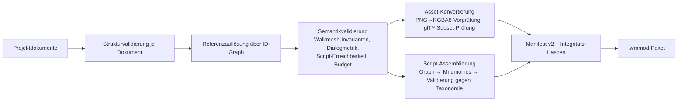
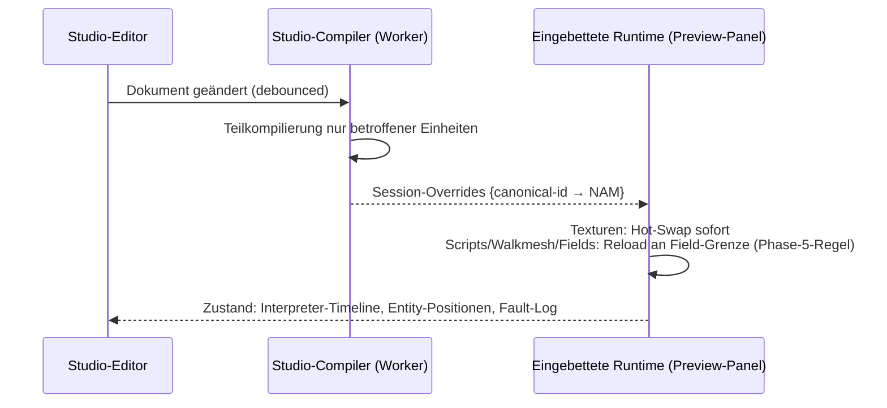
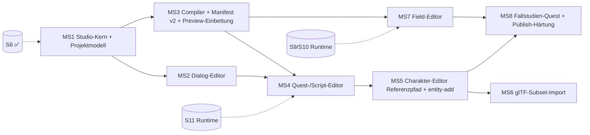

# WebMidgar Studio — Masterplan der Modding-Suite

**Projekt:** Browserbasierte Authoring-Suite („Creation-Kit-Klasse") für WebMidgar-Mods — Story-Mods, neue Charaktere, neue Fields, Dialoge und Quest-Logik per GUI, ohne dass Modder je Binärformate oder Bytecode anfassen.
**Rolle dieses Dokuments:** Verbindliche Architekturreferenz für den Studio-Strang, analog zu [WEBMIDGAR-MASTERPLAN.md](WEBMIDGAR-MASTERPLAN.md). Es erweitert dessen Phase 5 (deklaratives Mod-System) um die **Erzeugungsseite**; es ersetzt sie nicht. Alle dort getroffenen Entscheidungen (insb. ADR-007: kein Runtime-Code in Mods) bleiben in Kraft.
**Rechtsrahmen:** Mod-Pakete enthalten **niemals** Originalassets, Originaldialogtexte oder Original-Bytecode. Neue Inhalte sind nutzererstellt; Bezüge auf Originalinhalte erfolgen ausschließlich referenziell (kanonische IDs, guardHashes). Das Studio erzwingt das strukturell (s. B.7 Provenienzmodell).

**Aussagenklassen** wie im Masterplan: 🟢 Formatfakt · 🔵 Architekturentscheidung · 🟡 Annahme/`Zu validieren` · 🔴 Offene Forschungsfrage.

---

# Leitbild

Was das Bethesda-Creation-Kit für Skyrim ist, ist WebMidgar Studio für FF7-PC — mit zwei bewussten Unterschieden:

1. **Alles im Browser.** Studio ist eine zweite App (`apps/studio`) neben dem Spiel, teilt sich sämtliche Pakete (Parser, NAM, Interpreter, Renderer, Walkmesh) und arbeitet auf derselben lokalen Installation via FSA — nichts verlässt den Rechner.
2. **Deklarativ statt Skriptsprache.** Modder bauen Logik in einem visuellen Script-Editor; das Ergebnis sind taxonomie-basierte Mnemonics (Phase-5-Patch-Schema), die der **Engine-Assembler** in Bytecode übersetzt. Es gibt keinen Punkt, an dem ein Mod eigenen Code ausführt (ADR-007 gilt unverändert).

**Ein Satz-Test für jede Studio-Funktion:** *„Kann eine Person ohne Hex-Editor-Wissen damit eine neue Nebenquest mit eigenem NPC in Midgar bauen, im Spiel testen und als Paket teilen?"* Funktionen, die diesem Ziel nicht dienen, sind Post-MVP.

## Säulen der Suite

| Säule | Editor | Erzeugt (Projektdokumente) | Kompiliert zu (Manifest v2) |
|---|---|---|---|
| **Text** | Dialog-Editor | Dialogdokumente, Lokalisierungstabellen | `dialogues[]` (replace + add) |
| **Logik** | Quest-/Script-Editor (visuell) | Script-Graphen je Entität/Slot | `patches[]`, `scripts[]` |
| **Figuren** | Charakter-Editor | Charakterdefinitionen (Modellbezug, Animationen, Platzierung) | `entities[]`, `assets[]` (`gltf-subset`) |
| **Welt** | Field-Editor | Field-Dokumente (Trigger, Gateways, Walkmesh, Hintergrund, Kameras) | `fields[]` (`field-add`), `patches[]` |
| **Auslieferung** | Paket-/Publish-Ansicht | Manifest, Integrität, Kompatibilität | fertiges `.wmmod`-Paket |

---

# Teil A: Abgrenzung zum bestehenden Phase-5-System

Phase 5 des Masterplans definiert die **Konsumseite**: Manifest-Schema, Override-Kette, Capability-Modell, Validierung, Fehlerisolation. Das bleibt der einzige Weg, wie Mods ins Spiel gelangen. WebMidgar Studio ist ein **Compiler mit GUI**, dessen Ausgabeformat exakt dieses Manifest ist:

```text
Studio-Projekt (deklarative Quelldokumente, versioniert, editierbar)
  → Studio-Compiler (Validierung, ID-Auflösung, Asset-Konvertierung, Script-Assemblierung)
  → Mod-Paket (.wmmod = Manifest v2 + Inhaltsdateien + Integritäts-Hashes)
  → Import im Spiel über die unveränderte Phase-5-Kette
```

Konsequenzen:

- 🔵 **Das Spiel kennt kein „Studio-Format".** Es importiert ausschließlich Mod-Pakete. Damit bleiben handgeschriebene Mods (ohne Studio) vollwertig möglich — das Studio ist Komfort, nie Voraussetzung.
- 🔵 **Das Studio kennt keinen eigenen Runtime-Pfad.** Vorschau läuft über die echte Engine (Session-Override-Stufe der Phase-5-Kette, s. B.6) — was im Studio funktioniert, funktioniert im Spiel, weil es dieselbe Ausführung ist.
- Das Manifest-Schema wird von v1 auf **v2** erweitert (neue Capabilities für additive Inhalte, s. Teil D); die dokumentierte Migrationsregel aus Phase 5.3 greift (Engine liest n und n−1).

---

# Teil B: Architektur

## B.1 Projektmodell — Quelle der Wahrheit

🔵 **Entscheidung:** Ein Studio-Projekt ist ein Verzeichnis (FSA-Handle, alternativ IndexedDB-gestützt für Browser ohne FSA) aus **rein deklarativen, diff-freundlichen Dokumenten** (JSON, ein Dokument pro fachlicher Einheit). Kein Binärzustand, keine Datenbank als Wahrheit — das Projekt ist git-tauglich und von Hand inspizierbar.

```text
projekt/
├─ project.json          Metadaten, Ziel-engineCompat, Manifest-Zielversion
├─ dialogues/            ein Dokument je Field × Sprache
├─ scripts/              ein Dokument je Entität × Slot (Graph-Repräsentation)
├─ characters/           Charakterdefinitionen (Modellbezug, Animationen, Kollision)
├─ fields/               Field-Dokumente (neu) und Field-Deltas (Änderungen an Originalen)
├─ assets/               nutzereigene Quelldateien (PNG, glTF, …)
└─ build/                Compiler-Ausgabe (.wmmod) — generiert, nie editiert
```

Verbindliche Regeln:

- **Delta vs. Neu:** Änderungen an Original-Fields werden als **Delta-Dokumente** gespeichert (Anker + Operation, spiegelbildlich zum Patch-Record aus Phase 5.2) — nie als Vollkopie eines Original-Fields (Rechtsrahmen + Versionstoleranz). Neue Fields sind Volldokumente im eigenen Namensraum.
- **Dokumentversionierung:** Jedes Dokument trägt `schemaVersion`; Migrationen laufen beim Projektöffnen einmalig und explizit (Bericht an Nutzer), nie still beim Speichern.
- **Referenzen als IDs, nie als Pfade:** Dokumente referenzieren einander und Originalassets ausschließlich über den ID-Namensraum aus B.2. Der Compiler löst auf und meldet tote Referenzen als Fehlerliste (nicht als Absturz).

## B.2 ID- und Namensraummodell

Originalinhalte behalten ihre kanonischen IDs aus Phase 1 (`lgp:char/…`, `field:<id>/…`). Neue Inhalte leben in einem Mod-Namensraum:

```text
mod:<modId>/<typ>/<name>
Beispiele:
  mod:de.example.midgarquest/field/slumchurch_ext
  mod:de.example.midgarquest/char/lina
  mod:de.example.midgarquest/dlg/lina_intro
```

Regeln:

- 🔵 Kollision mit kanonischen Original-IDs ist strukturell unmöglich (unterschiedliche Präfixe). Kollisionen **zwischen Mods** sind durch die `modId` (reverse-DNS, Phase 5.2) getrennt.
- Mod-übergreifende Referenzen (Mod B erweitert Mod A) sind erlaubt und laufen über `dependencies[]` des Manifests; der Compiler prüft, dass jede Fremdreferenz durch eine deklarierte Dependency gedeckt ist.
- Gateways dürfen in beide Richtungen zeigen (Original-Field ↔ Mod-Field). Ein Original→Mod-Übergang ist immer ein **Delta-Patch** auf die Triggersektion des Original-Fields; die Field-Verzeichnistabelle der Runtime (Phase 1.4) wird beim Mod-Import um Mod-Field-IDs erweitert.

## B.3 Studio-Compiler

Der Compiler ist ein reines, seiteneffektfreies Paket (`packages/studio-compiler`), lauffähig im Worker **und** in Node (CI von Mod-Projekten!):



- 🔵 **Kompilieren ist total:** Jeder Fehler ist ein strukturierter Befund `{dokument, pfad, klasse, meldung, fixHint}`; der Compiler bricht nie beim ersten Fehler ab, sondern liefert die vollständige Befundliste (Editor zeigt sie als klickbare Problemliste).
- 🔵 **Determinismus:** Gleicher Projektstand → byteidentisches Paket (sortierte Schlüssel, stabile Reihenfolgen, keine Zeitstempel im Inhalt). Damit sind Paket-Hashes reproduzierbar und Projekt-CI trivial.
- Der **Script-Assembler** wird aus `tools/fixture-gen` in ein eigenes Paket promoviert (`packages/script-assembler`) und von drei Nutzern geteilt: Fixture-Generierung (Tests), Studio-Compiler (Mods), Engine-Import (Patch-Payloads aus Phase 5.2). 🔵 Eine Implementierung, drei Nutzer — wie bei der Namensnormalisierung.

## B.4 Wiederverwendung und Writer-Promotion

| Bestand | Heutiger Ort | Studio-Rolle |
|---|---|---|
| Alle Parser + NAM | `packages/formats-*`, `packages/nam` | Lesen der Originaldaten im Editor (Field öffnen, Modell betrachten) |
| Field-Composer | `tools/fixture-gen` | 🟡 Vorbild, **nicht** direkte Wiederverwendung: fixture-gen ist absichtlich codegetrennt von den Parsern (Zweitimplementierungs-Prinzip für Tests). Das Studio braucht einen dritten Weg: es erzeugt **kein** Binär-Field, sondern deklarative Field-Dokumente, die die Engine beim Mod-Import direkt in NAM übersetzt (s. u.) |
| Script-Assembler | `tools/fixture-gen` | Promotion zu `packages/script-assembler` (s. B.3) |
| Interpreter + Debug | `packages/interpreter[-debug]` | Vorschau-Ausführung, Timeline/Breakpoints im Quest-Editor |
| Renderer + Walkmesh | `packages/render-*`, `packages/walkmesh` | Viewports der Editoren |

🔵 **Zentrale Formatentscheidung — Mod-Fields sind NAM-nah, nie binär:** Neue Fields werden im Paket als deklaratives Dokument ausgeliefert und beim Import in `FieldBundle`-NAM übersetzt. Es wird **kein** Binär-Field-Container und **kein** LGP geschrieben. Begründung: (a) das Binärformat ist verlustbehaftet gegenüber unseren NAM-Invarianten und voller 🟡-Unsicherheiten — ein Writer würde jede Unsicherheit doppelt bezahlen; (b) die Override-Kette arbeitet ohnehin auf NAM-Ebene; (c) der Rechtsrahmen bleibt sauber (keine Werkzeuge, die Originalarchive modifizieren). Konsequenz: Mod-Fields existieren nur in WebMidgar — Export in Fremdtools (Makou Reactor) ist **Nicht-Ziel** (bewusst, s. Risiko RS4).

## B.5 Studio-App-Architektur

🔵 **Kern/GUI-Trennung:** Ein UI-frameworkfreier Kern (`packages/studio-core`) trägt Dokumentmodell, Validierung, Command-Bus und Selektionsmodell; die GUI (`apps/studio`) ist eine austauschbare Schale darüber. Die Framework-Wahl der Schale ist eine M1-Entscheidung (ADR-S1) nach den Kriterien: Tabellen-/Baumleistung bei 10⁴ Zeilen, Canvas/Three-Integrationsreibung, Bundle-Disziplin.

| Baustein | Vertrag |
|---|---|
| **Dokumentmodell** | Immutable Snapshots + strukturelle Teilung; jede Mutation ist ein benanntes Command mit `apply/invert` |
| **Undo/Redo** | Command-Log je Dokument, gruppiert in Nutzer-Gesten (Drag = 1 Eintrag); Log-Obergrenze mit Byte-Budget |
| **Command-Bus** | Einziger Mutationsweg — auch Werkzeuge/Viewports mutieren nur über Commands. Damit sind Makros, Tests und kollaborative Erweiterungen (Post-MVP) strukturell vorbereitet |
| **Autosave** | Debounced Write ins Projektverzeichnis + Crash-Journal in IndexedDB (Wiederherstellungsdialog nach Absturz) |
| **Validierung** | Inkrementell: Dokumentänderung invalidiert nur abhängige Befunde (Abhängigkeitsgraph aus B.3-Referenzauflösung) |
| **Worker-Nutzung** | Compiler, Validierung, Asset-Konvertierung und Original-Parsing laufen in Workern über die bestehende Pipeline (Phase 2); die Studio-UI unterliegt denselben Long-Task-NFRs wie das Spiel |

## B.6 Live-Preview über Session-Override

Die Phase-5-Kette beginnt mit „Session Override (Entwickler-/Debug-Ersetzung, flüchtig)" — genau dieser Haken wird zum Studio-Feature:



- 🔵 Das Preview-Panel ist die **echte Spiel-Runtime** als eingebettete Komponente mit eigenem Zustand (eigene Interpreter-Instanz, eigene GPU-Registry-Generation) — kein Editor-„Nachbau" der Engine. Determinismus des Interpreters macht das belastbar: „Vorschau ab Tick 0 mit Startzustand X" ist reproduzierbar.
- Der Quest-Editor koppelt an `packages/interpreter-debug`: Breakpoints auf Graph-Knoten werden auf Bytecode-Spannen abgebildet (Assembler liefert die Source-Map Graph-Knoten ↔ Span), Timeline und Variablenansicht kommen unverändert aus dem Debug-Paket.
- **Testzustände:** Das Studio kann Spielzustände (Variablenbänke, Party, Position) als benannte **Testszenarien** im Projekt speichern und die Preview damit starten — das Pendant zum „coc"-Konsolenbefehl der Bethesda-Welt, aber deklarativ und versioniert.

## B.7 Provenienzmodell (Rechtsrahmen technisch erzwungen)

Der kritischste Unterschied zu Desktop-Modtools: Das Studio hat via FSA Lesezugriff auf Originaldaten und **darf trotzdem nie** Originalbytes in ein Paket leiten.

| Mechanismus | Regel |
|---|---|
| **Typsystem der Quellen** | Projektdokumente können Originalinhalte nur als **Referenz** (ID) aufnehmen; es existiert kein Dokumentfeld, das Rohbytes aus dem Originalpfad transportiert. Asset-Payloads kommen ausschließlich aus `assets/` (Nutzerdateien) |
| **Import-Schleuse** | Dateiimport nach `assets/` berechnet Hashes und vergleicht gegen den Archiv-Index der lokalen Installation: Byte-identische Treffer → Import verweigert mit Erklärung („Referenziere stattdessen `lgp:…`") 🟡 `Zu validieren`: sinnvolle Behandlung trivialer Umkodierungen (z. B. Original-`.tex` als PNG re-exportiert) — MVP: dokumentierte Warnung + Eigenverantwortung, kein Ähnlichkeits-Fingerprinting |
| **Dialog-Deltas** | Ersetzte Originaltexte speichern nur den **neuen** Text + `guardHash` des Originals — Originaltext erscheint nie im Projekt oder Paket |
| **Paket-Audit** | Compiler-Schlussphase listet jede Paketdatei mit Herkunft (`user-asset` / `generated`); alles andere ist ein Kompilierfehler |

---

# Teil C: Die Editoren

## C.1 Dialog-Editor (Säule Text)

- **Fachmodell:** Dialogdokument = geordnete Liste von Einträgen `{id, sprecher?, seiten[] (Text mit Steuerelementen: Farbe, Pause, Variable, Auswahlmenü), fensterMetrik}`. Originaldialoge erscheinen als referenzierte, schreibgeschützte Zeilen; Ersetzung erzeugt ein Delta.
- **Metrik-Vorschau:** Die Zeichentabelle (Clean-Room, Phase 1.4) plus Fenstermetrik rendert den Text **pixelgenau als Dialogbox-Vorschau** — Umbruch-/Überlaufwarnungen live beim Tippen (dieselbe Prüfung wie Phase 5.2 `dialogues[]`, nur früher).
- **Lokalisierung:** Sprachen sind Spalten desselben Dokuments; das Paket trägt `locale`-Varianten. Fehlende Übersetzung → Fallback auf Primärsprache + Compilerbefund (Warnung).
- **Auswahlmenüs** (Dialog-Choices) sind hier nur Text; ihre Sprungziele bindet der Script-Editor (ein Dialog-Knoten referenziert Einträge per ID).

## C.2 Quest-/Script-Editor (Säule Logik)

🔵 **Graph statt Textsprache:** Ein Script ist ein gerichteter Graph aus typisierten Knoten, die 1:1 auf die Opcode-Taxonomie aus Phase 4.1 abbilden (Kontrollfluss, Entity-Bewegung, Dialog, Variablen/Flags, Kamera, Übergänge). Es gibt **keinen** Knotentyp außerhalb der Taxonomie — der Editor kann nichts ausdrücken, was der Assembler nicht validieren kann.

| Aspekt | Festlegung |
|---|---|
| Blockierend/nicht-blockierend | Formatgegebene Semantik (Phase 4.1) ist **visuell** unterscheidbar (z. B. Knotenform); der Graph-Fluss macht Wartepunkte explizit statt sie zu verstecken |
| Trigger-Modell | Ein Script hängt an Entität × Slot mit deklariertem Auslöser (Init, Interaktion, Berührung, Timer — Slot-Semantik 🟡 aus R1-Notiz übernehmen, nicht neu raten) |
| Variablen | Projektweite **benannte** Variablen; der Compiler weist Bank/Adresse deterministisch zu und reserviert einen Mod-Bereich der Variablenbänke. 🔴 Kollisionsvermeidung zwischen Mods im selben Save (Bankbereichs-Registry oder Save-seitige Mod-Namespaces) — vor MS5 entscheiden |
| Quest-Sicht | „Quest" ist eine Projektionsansicht über Scripts: benannte Meilensteine = Variablenzustände, mit Fortschrittsgraph. Keine eigene Runtime-Entität (die Engine kennt nur Scripts + Variablen) |
| Fehlerbild | Erreichbarkeitsanalyse (tote Zweige), Wartezyklen-Heuristik (zwei Entitäten warten aufeinander), Budgetprüfung je Field (Phase 5.3 Ressourcenlimits) |

## C.3 Charakter-Editor (Säule Figuren)

Ein „neuer Charakter" ist ein Bündel: **Modell** + **Animationssatz** + **Kollision/Skalierung** + **Auftritte** (Platzierungen in Fields mit Scripts).

| Modellquelle | Weg | Status |
|---|---|---|
| Original wiederverwenden | Referenz auf `lgp:char/<id>` — kostenlos, rechtlich sauber, deckt „NPC mit neuem Verhalten/Text" vollständig ab | 🔵 MVP-Pfad |
| Umfärben/Varianten | Palettenvariante bzw. Ersatztextur als `texture-override` auf referenziertes Modell — Textur ist Nutzerasset | 🔵 MVP-Pfad |
| Eigenes Modell | glTF-Subset-Import (Skelett + Skinning + Keyframe-Animationen) → Konvertierung in NAM-`Skeleton`/`MeshSource`/`AnimationClipSource`. Subset-Definition (keine Morphs, keine Shader, Bone-Limit 🟡 an Original-Obergrenzen kalibrieren) wird als eigene Spezifikation gepflegt | 🟡 MS6 |
| Modell im Studio modellieren | — | Nicht-Ziel (dafür gibt es Blender; das Studio importiert) |

Der Editor zeigt das Modell im Actor-Viewer (S10-Bestand), spielt Animationen ab und validiert die Animationskompatibilität über `topologyHash` — dieselbe Regel wie die Runtime.

## C.4 Field-Editor (Säule Welt)

Der anspruchsvollste Editor; er arbeitet auf drei Ebenen:

1. **Original-Field annotieren (Delta):** Trigger/Gateways hinzufügen oder umbiegen, Entitäten platzieren, StateGroups schalten — alles als Delta-Dokument mit Ankern + guardHash. Der Editor rendert das echte Field (S9/S11-Bestand) und legt Editier-Overlays darüber (Walkmesh-Drahtgitter, Trigger-Volumen, Gateway-Pfeile, begehbare Vorschau per Klick).
2. **Neues Field bauen:** Hintergrund = nutzereigenes Bild (gerendert/gezeichnet, PNG) + im Editor gezeichnete **Tiefen-/Layermasken** (die per-Tile-Depth-Pipeline aus ADR-005 wird gefüttert, nicht umgangen); Walkmesh = im Editor gezeichnetes Dreiecksnetz mit Live-Prüfung der S5-Invarianten (Adjazenzsymmetrie, keine degenerierten Dreiecke — dieselben Property-Checks wie die Tests); Kamera = im Viewport gesetzte Pose, gespeichert in der normalisierten Kamerabeschreibung aus Phase 3.2.
3. **Verknüpfen:** Gateways zwischen Original- und Mod-Fields (B.2), Encounter-Zonen (geparst vorhanden; MVP: nur Aus/Übernahme, kein eigenes Balancing).

🟡 `Zu validieren` vor MS7: Autoren-Ergonomie des Tiefenmalens (Tile-Raster vs. Freiform-Maske mit Quantisierung) — Prototyp mit zwei Testautoren, Entscheidung dokumentieren.

## C.5 Paket- und Publish-Ansicht (Säule Auslieferung)

- Manifest-Formular (Metadaten, `engineCompat`, Dependencies/Conflicts) mit Live-Validierung; Capability-Liste wird **abgeleitet** aus dem Projektinhalt, nie von Hand gepflegt (Verstoß unmöglich statt verboten).
- Kompilieren → `.wmmod` (Container: ZIP; 🔵 Endung eigen, damit Betriebssysteme keine Auto-Entpack-Erwartung wecken) → lokaler Testimport-Knopf (führt exakt den Phase-5-Import aus, zeigt den Mod-Doktor-Report).
- **Verteilung ist Nicht-Ziel des Studios:** kein Hosting, kein Marktplatz, kein Auto-Update. Das Paket ist eine Datei; wo sie geteilt wird, ist Sache der Community. (Bewusste Scope- und Rechtsentscheidung; Risiko RS5 beobachtet die Community-Erwartung.)

---

# Teil D: Manifest-Erweiterung v2

Neue Capabilities (zusätzlich zu v1: `texture-override`, `model-override`, `background-override`, `script-patch`, `dialogue-replace`, `field-add`):

| Capability | Erlaubt | Neuer Record |
|---|---|---|
| `entity-add` | Neue Entitäten in Original- oder Mod-Fields | `entities[]`: `{id (mod-ns), field, modellRef, platzierung {dreieck, position, richtung}, kollision, scripts{slot → scriptRef}}` |
| `script-add` | Vollständige neue Scripts (statt nur Patches) | `scripts[]`: `{id (mod-ns), payload (Mnemonics), quelle: source-map-Digest}` |
| `dialogue-add` | Neue Dialogeinträge (statt nur Ersetzung) | Erweiterung `dialogues[]` um `mode: replace \| add` |
| `model-add` | Neue Modelle aus glTF-Subset | `assets[]`-Format `gltf-subset` wird scharfgeschaltet (in v1 reserviert) |
| `variable-claim` | Reservierung eines Variablenbank-Bereichs | `variables`: `{bereich, benannteSlots[]}` — Engine prüft Überschneidung aktiver Mods bei Aktivierung (🔴 s. C.2) |

Regeln unverändert aus v1: Capability muss deklariert sein, sonst Import-Fehler; `integrity` deckt alle Dateien; `field-add`-Fields nutzen das NAM-nahe Field-Dokument aus B.4. Alle v2-Records tragen dieselbe Validierungsdisziplin (Schema beim Import, mod-lokale Fehler, Fehlerisolation je Asset).

---

# Teil E: Architekturentscheidungen (Fortschreibung des ADR-Registers)

| ADR | Entscheidung | Alternativen | Konsequenzen | Status |
|---|---|---|---|---|
| ADR-013 | Studio ist Compiler mit GUI; einziges Austauschformat mit dem Spiel ist das Phase-5-Mod-Paket | Eigenes Studio-Runtime-Format; Direktkopplung Studio↔Spielzustand | Handgeschriebene Mods bleiben gleichwertig; klare Testgrenze (Compiler ist pur) | Vorgeschlagen |
| ADR-014 | Mod-Fields als deklarative NAM-nahe Dokumente; kein Binär-Field-Writer, kein LGP-Writer im Produktpfad | Binär-Roundtrip für Fremdtool-Kompatibilität | Keine doppelte Formatunsicherheit; Makou-Reactor-Interop ist Nicht-Ziel | Vorgeschlagen |
| ADR-015 | Script-Authoring als typisierter Graph über der Opcode-Taxonomie; Assembler als geteiltes Paket (fixture-gen, Studio, Engine-Import) | Textuelle DSL; freie Bytecode-Eingabe | Nichts Ausdrückbares ist unvalidierbar; Source-Map ermöglicht Graph-Debugging | Vorgeschlagen |
| ADR-016 | Preview = echte eingebettete Runtime über Session-Override-Stufe | Editor-seitige Simulation der Engine | Verhaltensgleichheit garantiert; Studio erbt Engine-NFRs | Vorgeschlagen |
| ADR-017 | Provenienz-Schleuse: Originalbytes strukturell nicht in Pakete transportierbar; Import-Hashabgleich gegen lokalen Archiv-Index | Nur AGB/Warnhinweis | Rechtsrahmen technisch gestützt; Umkodierungs-Grauzone bleibt dokumentierte Nutzerverantwortung | Vorgeschlagen |
| ADR-018 | Studio-Kern UI-frameworkfrei (Dokumentmodell, Command-Bus, Undo); GUI als austauschbare Schale | Framework-gekoppelte Architektur | Kern in Node testbar (Compiler-CI); Framework-Wahl wird revidierbar | Vorgeschlagen |

# Teil F: Risiken (Fortschreibung)

| Priorität | Risiko | Auswirkung | Verifikation | Frist |
|---|---|---|---|---|
| P0 | RS1: Ausdrucksstärke des Graph-Editors reicht Story-Moddern nicht (verschärftes R10) | Suite wird ignoriert, Community bleibt bei Desktop-Tools | Frühe Fallstudie: eine echte Nebenquest (3 Fields, 2 NPCs, 10 Dialoge) komplett im Studio bauen — vor MS4-Abschluss | MS4 |
| P0 | RS2: Variablenbank-Kollisionen zwischen Mods im selben Save 🔴 | Save-Korruption bei Mod-Kombinationen | Bankbereichs-Registry vs. Save-Namespaces entwerfen; Entscheidung als ADR | vor MS5 |
| P1 | RS3: Preview-Panel + Editor überschreiten gemeinsam die NFR-Budgets (zwei Three-Kontexte, Interpreter, UI) | Studio unbenutzbar auf Mittelklasse-Hardware | NFR-Messung mit eingebetteter Runtime ab MS3; ggf. Preview-Auflösung drosseln | MS3 |
| P1 | RS4: Community erwartet Makou-Reactor-Interop (Import bestehender Mod-Arbeit) | Adoptionshürde | Beobachten; ggf. Post-MVP Import-Konverter (nur Richtung Studio) evaluieren — nie Binär-Export | Post-MVP |
| P2 | RS5: Erwartung eines Mod-Portals/Auto-Updates | Frustration trotz funktionierender Pakete | Community-Kommunikation; Paketformat hält Metadaten für spätere Kataloge bereit | Post-MVP |
| P2 | RS6: glTF-Subset zu eng (DCC-Exporte fallen durch) oder zu weit (Runtime-Überlast) | Frust beim Modell-Import | Subset gegen Blender-Referenzexporte testen; Budgetgrenzen aus NFR ableiten | MS6 |

# Teil G: Roadmap MS1–MS8

Gleiche Regeln wie S1–S12 (Fixtures selbst erzeugt, Strukturproben vor Implementierung, 🟡 vor der Session auflösen). Abhängigkeit zum Runtime-Strang: **MS1–MS3 brauchen nur S6-Bestand**; MS4+ setzen schrittweise S8–S12 voraus. Die Stränge sind parallelisierbar.



### MS1 — Studio-Kern, Projektmodell, App-Gerüst

| Feld | Inhalt |
|---|---|
| Ziel | `packages/studio-core` (Dokumentmodell, Command-Bus, Undo/Redo, inkrementelle Validierung) + `apps/studio`-Schale (Projektöffnen via FSA, Dokumentliste, Problemliste); ADR-S1 (GUI-Framework) entschieden |
| Voraussetzungen | ADR-013/018; B.1/B.2/B.5 |
| Betroffene Module | `packages/studio-core`, `apps/studio` |
| Akzeptanzkriterien | Projekt anlegen/öffnen/speichern (FSA + IndexedDB-Fallback); 1000 Commands apply/invert bitverlustfrei (Property-Test); Crash-Journal stellt ungespeicherte Änderungen wieder her; Autosave-Debounce nachweisbar; Long-Task = 0 bei Dokumentoperationen |
| Nicht-Ziele | Keine Fach-Editoren, kein Compiler, keine Preview |
| Prompt | „Implementiere gemäß MODDING-SUITE-MASTERPLAN.md B.1/B.5 den Studio-Kern: deklaratives Projektmodell mit Schemaversionen, Command-Bus mit apply/invert und Gesten-Gruppierung, inkrementeller Validierungsgraph, FSA-Projektverzeichnis mit Crash-Journal. GUI-Framework per ADR-S1 nach den drei Kriterien entscheiden. Property-Tests für Undo/Redo-Inversion sind Pflicht." |

### MS2 — Dialog-Editor

| Feld | Inhalt |
|---|---|
| Ziel | Dialogdokumente mit pixelgenauer Dialogbox-Vorschau (Zeichentabelle + Fenstermetrik), Original-Dialoge als schreibgeschützte Referenzen mit Delta-Ersetzung, Lokalisierungsspalten |
| Voraussetzungen | MS1; `FieldScriptSet`-Stringtabellen (S2-Bestand); Fenstermetrik 🟡 vorab gegen Realdaten kalibrieren |
| Betroffene Module | `apps/studio` (Dialog-Editor), `packages/studio-core` (Dialogdokument-Schema), Wiederverwendung Zeichentabelle aus `packages/formats-field` |
| Akzeptanzkriterien | Vorschau-Rendering == Runtime-Dialogbox (Golden-Vergleich über Fixture-Texte); Überlaufwarnung live; Delta speichert nie Originaltext (Audit-Test); Umlaut-/Sonderzeichenpfad der Zeichentabelle getestet |
| Nicht-Ziele | Keine Choice-Verdrahtung (MS4), keine Sprachaudio-Konzepte |
| Prompt | „Implementiere gemäß C.1 den Dialog-Editor: Dokumentschema, pixelgenaue Metrik-Vorschau über die Clean-Room-Zeichentabelle, Delta-Modell mit guardHash ohne Originaltextspeicherung, Lokalisierungsspalten mit Fallback-Befunden." |

### MS3 — Studio-Compiler, Manifest v2, Preview-Einbettung

| Feld | Inhalt |
|---|---|
| Ziel | `packages/studio-compiler` (total, deterministisch, Node-fähig) mit `.wmmod`-Ausgabe; Manifest-v2-Schema + Import-Erweiterung der Engine (add-Capabilities); eingebettete Runtime mit Session-Override-Zuführung |
| Voraussetzungen | MS1; Phase-5-Import (Engine-Seite) implementiert oder parallel beauftragt; ADR-016/017 |
| Betroffene Module | `packages/studio-compiler`, `packages/mod-manifest` (v1+v2-Schema, geteilt Engine↔Studio), `apps/studio` (Preview-Panel, Problemliste) |
| Akzeptanzkriterien | Gleicher Projektstand → byteidentisches Paket (Doppellauf-Digest); Befundliste vollständig statt First-Error; Provenienz-Audit verweigert byteidentische Originalimporte (Fixture-Test mit eigenem Mini-LGP); Dialog-Mod aus MS2 läuft im Preview-Panel und nach echtem Import identisch |
| Nicht-Ziele | Keine Script-/Field-Kompilierung (Stubs mit klarem Fehlerbild) |
| Prompt | „Implementiere gemäß B.3/B.6/B.7/Teil D: Compiler-Pipeline mit Referenzgraph und Totalfehlerliste, Manifest v2 mit abgeleiteten Capabilities, Provenienz-Schleuse mit Hashabgleich gegen den Archiv-Index, deterministische Paketierung, Preview-Panel als eingebettete Runtime über Session-Overrides. Determinismus per Doppellauf-Digest testen." |

### MS4 — Quest-/Script-Editor

| Feld | Inhalt |
|---|---|
| Ziel | Graph-Editor über der Opcode-Taxonomie; Assembler-Promotion zu `packages/script-assembler` mit Source-Map; Debugging (Breakpoints auf Knoten, Timeline, Variablen) via `packages/interpreter-debug`; benannte Projektvariablen mit deterministischer Bankzuweisung |
| Voraussetzungen | MS3; S6-Interpreter; R1-Notiz; S12-Opcode-Stand bestimmt den nutzbaren Knotenvorrat (Editor zeigt nicht implementierte Kategorien als gesperrt) |
| Betroffene Module | `packages/script-assembler` (Promotion aus fixture-gen), `apps/studio` (Graph-Editor), `packages/studio-compiler` (scripts[]/patches[]-Erzeugung) |
| Akzeptanzkriterien | Roundtrip Graph → Mnemonics → Bytecode → Disassembly-Vergleich stabil; Breakpoint auf Graph-Knoten hält an korrektem Tick (Source-Map-Test); Erreichbarkeits- und Wartezyklen-Befunde auf präparierten Fixture-Graphen; Fallstudienstart: Miniquest (1 NPC, Dialog mit Choice, Flag-Fortschritt) komplett im Studio gebaut und im Preview durchgespielt |
| Nicht-Ziele | Kamera-Knoten vor S12-Kamera-Ops; keine Battle-/Audio-Knoten (Stubs laut ADR-011/012) |
| Prompt | „Implementiere gemäß C.2/ADR-015 den Graph-Script-Editor: typisierte Knoten strikt aus der Opcode-Taxonomie, Blockierend-Semantik visuell, Assembler als geteiltes Paket mit Source-Map, Debug-Kopplung an interpreter-debug, benannte Variablen mit deterministischer Bankzuweisung (RS2-ADR vorher!). Die Miniquest-Fallstudie ist Akzeptanzkriterium, kein Nice-to-have." |

### MS5 — Charakter-Editor (Referenzpfad) + entity-add

| Feld | Inhalt |
|---|---|
| Ziel | Charakterdefinitionen über Original-Modellreferenzen + Palettenvarianten/Textur-Overrides; `entities[]`-Kompilierung; Platzierung im Field-Viewport (Dreieck, Richtung); Auftritts-Scripts verdrahtet |
| Voraussetzungen | MS4; S10 (Actor-Viewer, Manifest-Parsing), S11 (Platzierungs-Preview im echten Field) |
| Betroffene Module | `apps/studio` (Charakter-Editor), `packages/studio-compiler`, Engine-Import (`entity-add`-Pfad) |
| Akzeptanzkriterien | Neuer NPC (Originalmodell, eigene Textur, eigenes Script, eigener Dialog) erscheint nach Import im Original-Field und ist interagierbar; topologyHash-Validierung verhindert inkompatible Animationszuordnung (Fehlerbild getestet); Provenienz: Texturersatz nur aus `assets/` |
| Nicht-Ziele | Kein glTF-Import (MS6) |
| Prompt | „Implementiere gemäß C.3 (MVP-Pfade) den Charakter-Editor: Referenzmodell + Varianten, Platzierungswerkzeug auf dem Walkmesh, Script-Slot-Verdrahtung, entity-add-Kompilierung und Engine-Import. Akzeptanz ist der komplette NPC-Durchstich im echten Field." |

### MS6 — Eigene Modelle (glTF-Subset)

| Feld | Inhalt |
|---|---|
| Ziel | glTF-Subset-Spezifikation (eigenes Dokument, versioniert) + Import-Konverter glTF → NAM (`Skeleton`/`MeshSource`/`TextureSource`/`AnimationClipSource`) + Validierungsbefunde (Bone-/Polygon-/Texturbudgets) |
| Voraussetzungen | MS5; RS6-Kalibrierung (Blender-Referenzexporte als Fixtures — selbst erstellt) |
| Betroffene Module | `packages/formats-gltf-subset` (Parser+Konverter, Node-fähig), `apps/studio` (Import-UI mit Befunden), `packages/mod-manifest` (`model-add`) |
| Akzeptanzkriterien | Referenz-Blender-Export (selbst modelliertes Testrigg) steht animiert im Actor-Viewer und im Spiel; Subset-Verstöße liefern benannte Befunde statt Kryptik; Budgets erzwungen; Roundtrip-Stabilität des Konverters (Doppelimport-Digest) |
| Nicht-Ziele | Keine Morph-Targets, keine PBR-Materialien (Subset-Doku listet Ausschlüsse normativ) |
| Prompt | „Spezifiziere zuerst das glTF-Subset als normatives Dokument (RS6-Fixtures vorab), implementiere dann den Konverter nach NAM mit Budget- und Topologie-Validierung und verdrahte den Studio-Import inklusive Fehlerbefunden." |

### MS7 — Field-Editor

| Feld | Inhalt |
|---|---|
| Ziel | Delta-Editing auf Original-Fields (Trigger, Gateways, Entitäten, StateGroups) + Neubau von Mod-Fields (Hintergrundbild + Tiefen-/Layermasken, Walkmesh-Zeichnen mit Live-Invarianten, Kameraposen) + Gateway-Verknüpfung Original↔Mod |
| Voraussetzungen | MS3; S9 (Background-Rendering), S11 (Field-Integration); Ergonomie-Prototyp Tiefenmalen (🟡 aus C.4) entschieden |
| Betroffene Module | `apps/studio` (Field-Editor, Overlays), `packages/studio-core` (Field-Dokument/Delta-Schema), `packages/studio-compiler` (`fields[]`, Trigger-Patches), Engine-Import (NAM-Übersetzung der Field-Dokumente) |
| Akzeptanzkriterien | Neues Mod-Field (eigenes Bild, gezeichnetes Walkmesh, gesetzte Kamera) ist vom Original-Field per Gateway erreichbar, begehbar, mit korrekter Verdeckung (Tiefenmaske wirkt); Walkmesh-Zeichnung kann die S5-Property-Tests nicht verletzen (Live-Invarianten blockieren Speichern nicht, markieren aber rot + Compiler-Fehler); Original-Field-Delta übersteht Versionswechsel-Simulation via guardHash-Mismatch-Pfad |
| Nicht-Ziele | Kein Encounter-Balancing, keine Palettenanimations-Autorenwerkzeuge |
| Prompt | „Implementiere gemäß C.4/ADR-014 den Field-Editor: Overlay-Editing auf der echten Renderpipeline, Delta-Dokumente mit Ankern, Field-Neubau als NAM-nahes Dokument (Bild + Tiefen-/Layermasken + gezeichnetes Walkmesh + Kamerapose), Engine-Import-Übersetzung. Verdeckungs- und Begehbarkeits-Akzeptanz im echten Spiel." |

### MS8 — Fallstudien-Quest & Publish-Härtung

| Feld | Inhalt |
|---|---|
| Ziel | Die RS1-Fallstudie in voll: eine Nebenquest (≥ 3 Fields davon ≥ 1 neu, ≥ 2 neue NPCs, Choice-Verzweigung, Quest-Meilensteine) ausschließlich im Studio gebaut; daraus abgeleitete Ergonomie-Korrekturen; Publish-Ansicht final (Manifest-Formular, Testimport, Mod-Doktor-Durchlauf); Dokumentation „Dein erster Mod" |
| Voraussetzungen | MS4–MS7 |
| Betroffene Module | alle Studio-Pakete (Korrekturen), `docs/` (Autorendoku) |
| Akzeptanzkriterien | Fallstudie von einer nicht am Code beteiligten Person nach Doku reproduzierbar (< 1 Tag); Paket läuft auf zweiter Maschine/Installation nur über `.wmmod`-Datei; alle während der Fallstudie gefundenen Blocker geschlossen oder als Risiken registriert; Compiler-CI des Fallstudienprojekts grün in Node |
| Nicht-Ziele | Kein Mod-Portal, kein Auto-Update (RS5 bleibt beobachtet) |
| Prompt | „Baue die Fallstudien-Quest komplett im Studio, protokolliere jede Reibung als Befund, priorisiere und schließe die Blocker, härte die Publish-Strecke und schreibe die Autorendokumentation. Fremdreproduzierbarkeit ist das Abnahmekriterium." |

---

*Reihenfolge-Empfehlung: MS1 → MS2 → MS3 → MS4 → MS5 → (MS6 ∥ MS7) → MS8. MS1–MS3 sind ohne S8–S12 startbar; MS4 profitiert von S12-Opcode-Fortschritt, MS5/MS7 brauchen S10/S11 bzw. S9/S11. Alle 🟡/🔴 vor der jeweiligen Session auflösen oder als Restrisiko registrieren.*
