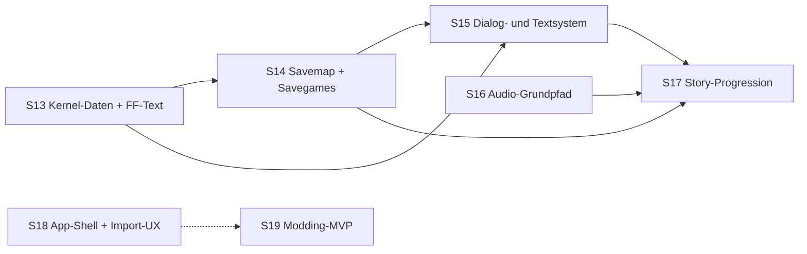

# WebMidgar — Fortsetzungs-Roadmap S13–S19

Fortschreibung der Roadmap (S1–S7 ✅ abgeschlossen, S8–S12 in Arbeit — siehe
[ROADMAP-S8-S12.md](ROADMAP-S8-S12.md) und [WEBMIDGAR-MASTERPLAN.md](WEBMIDGAR-MASTERPLAN.md)).
Gleiche Regeln: Golden Fixtures immer selbst erzeugt, Originaldaten nur lokal
beim Nutzer (Diagnose-Scan, aggregierte Reports), 🟡-Markierungen vor der
jeweiligen Session auflösen oder als Restrisiko dokumentieren.
**Methodik-Standard seit S7: Realdaten-Strukturproben VOR Parserbau.**

**Thema dieses Bogens:** Vom vertikalen Durchstich (S11/S12) zum spielbaren
Story-Kern — Dialoge lesbar, Spielstand speicherbar, Musik hörbar, Story
progressierbar (Battle-Stub, scriptgesteuerte Field-Wechsel) — plus die ersten
Öffnungen nach außen: App-Shell mit Import-UX und Modding-MVP.

**Zusatzregeln für alle Realdaten-Proben dieses Bogens:**

1. Die Nutzerinstallation trägt ein 7th-Heaven-Overlay: Jede Probe trennt
   Original- vs. Overlay-Zustand explizit und dokumentiert Fundpfade +
   Fingerprints in FINDINGS.md — sonst validiert der Sweep Mod-Daten
   (R5-Nachbarschaft).
2. Qhimm-Mirror-Familien (wiki.ffrtt.ru, ff7-flat-wiki, Fandom, davon
   abgeleitete Seiten) zählen als **eine** Quelle. 🟢 erfordert echte
   Unabhängigkeit — z. B. eine funktionierende Zweitimplementierung
   (Black Chocobo/ff7tk, WallMarket, q-gears, FFNx) plus die eigene Probe.
3. Dieses Dokument wurde erstellt, während S8 lief: Voraussetzungen
   referenzieren **Soll**-Ergebnisse aus S8–S12 — vor jedem Sessionstart den
   Ist-Stand gegenprüfen.

## Abhängigkeitsbild

S13 und S16 hängen an keinem S8–S12-Ergebnis (nur S1–S3/S6) und sind bei
Bedarf parallel zur Restarbeit des laufenden Bogens startbar. S15 braucht
S9 (Texturpfad) und S11 (field-viewer), S17 braucht S12, S18 braucht S11,
S19 braucht S9 und S11.

### S13 — Kernel-Datenbasis: `kernel.bin`/`kernel2.bin` + FF-Text-Dekoder

| Feld | Inhalt |
|---|---|
| Ziel | Neues Paket `packages/formats-kernel`: BIN-GZIP-Container-Scanner (27 Sektionen à 6-B-Header + gzip-Strom), typisierte Records für die Sektionen 4–9 (Initialisierungs-/Item-/Waffen-/Rüstungs-/Accessoire-/Materia-Daten), Sektionen 1–3 (Command/Attack/Growth) roh konserviert mit 🟡-Vermerk; **wiederverwendbarer FF-Text-Dekoder** (Clean-Room-Zeichentabelle, Steuercodes 0xFE/0xFF, Platzhalter 0xEA–0xF0, 0xF9-Textkompression) für die Textsektionen 10–27 — validiert gegen die **deutschen** Steam-Daten (Umlaute!); `kernel2.bin`-Pfad (LZS, Wiederverwendung `decompressLzs`) mit Kreuzvalidierung gegen die kernel.bin-Textsektionen; `KernelInitData` als typisierte Startwerte-Schnittstelle (Savemap-Seed) exportiert |
| Voraussetzungen | S1 (Verzeichnisquelle für lose Dateien — kernel liegt NICHT in einer LGP), S2 (Quarantäne-Muster, `decompressLzs`), S7-Methodik. Unabhängig von S8–S12 |
| Betroffene Module | `packages/formats-kernel` (neu: bin-gzip-Scanner, sections/records, sections/text, kernel2, kdiag), `tools/fixture-gen` (kernel-composer + FF-Text-Encoder als unabhängige Zweitimplementierung), `tools/realdata-scan` (kernel-probe/-sweep, neuer FINDINGS-Abschnitt) |
| Akzeptanzkriterien | Strukturprobe belegt 27 Sektionen mit exaktem Byte-Accounting (Σ(6 + kompLänge) == Dateigröße, gzip-Magic je Sektion, entpackte Länge == Header) und dokumentiert die deutsche Pfad-/Overlay-Lage; Roundtrip Composer↔Parser bitgenau; Record-Accounting Sektionen 4–9 exakt (n × Recordgröße == Sektionslänge, keine unerklärten Restbytes ohne 🟡); ≥ 99 % der deutschen Textstrings ohne unbekannte Codepunkte, Umlaut-Referenzliste korrekt; kernel2↔kernel-Abgleich quantifiziert; E-KRN-\*-Quarantäne-Fixtures (defekte Einzelsektion degradiert, Rest bleibt nutzbar); `KernelInitData` gegen Fixture-Startwerte getestet |
| Nicht-Ziele | Kein Menü-UI, keine menu-LGP-Assets (→ Ausblick); keine Battle-Semantik der Sektionen 1–3; keine MENU-/Party-Opcodes; kein Savegame-Format (→ S14) |
| Formatlage | BIN-GZIP-Struktur 27×(6 B + gzip) 🟢 (Qhimm-Doku + Editoren/q-gears als Zweitimplementierungen); Headerfelder u16 komp./entpackt/Typ, Byteorder 🟡; Sektion 4 = Charakter-Startwerte 🟡; FF-Text-Tabelle (Zeichen = ASCII − 0x20, 0xF9-Kompression) 🟡, deutsche Tabelle 🔴; kernel2.bin = Textsektionen LZS am Stück 🟡; deutsche Pfad-/Overlay-Lage 🔴 (Probe klärt) |
| Prompt | „Probe zuerst: BIN-GZIP-Accounting über kernel.bin + kernel2.bin der lokalen Installation (Headerfelder, Byteorder, deutsche Pfadlage, Overlay-Zustand → FINDINGS.md). Dann formats-kernel gegen die Fakten: Scanner mit E-KRN-Quarantäne, typisierte Records 4–9, FF-Text-Dekoder 10–27 inkl. 0xF9-Kompression, Sektionen 1–3 roh. Kernel-Composer als Zweitimplementierung, Sweep mit kernel2↔kernel-Kreuzvalidierung, KernelInitData exportieren." |

### S14 — Savemap-Modell & Savegame-Datenpfad

| Feld | Inhalt |
|---|---|
| Ziel | Spielzustand als typisiertes Datenmodell, headless: (a) **Bank-Modell des Interpreters korrigieren** — Bankpaare (1/2, 3/4, B/C, D/E, 7/F) als Aliase auf 5 persistente 256-B-Savemap-Regionen plus Temp-Region 5/6; GLOBAL_BANKS-🟡 aus S6 und Masterplan-🟡 „exakte Bank-Scopes" auflösen; (b) neues Paket `packages/formats-save`: Parser für originale PC-Saves (save00.ff7) mit Slot-Quarantäne E-SAVE-\* und Savemap-Records (CharacterRecords, Item-/Materia-Stock, Gil, Spielzeit, Modul-/Location-Block, Bänke) — unklare Regionen roh konserviert; (c) eigenes Savegame-Format nach Masterplan-Vertrag {schemaVersion, sourceFingerprint, globalState, fieldId, fieldState, contexts, tickCounter} als `SaveSlotStore` in IndexedDB (ADR-008-Keys) mit Restore-Migrationsregel (Script-Hash-Guard: ip-Reset + Warnung) |
| Voraussetzungen | S6 (Bänke, Snapshot/Restore, Replay-Digests, 702/702-Determinismuslauf), S11 (fieldId, Tab-Reload-Resume), S13 (`KernelInitData` als New-Game-Seed — nur Schnittstelle), `packages/io` (sourceFingerprint), `packages/cache` |
| Betroffene Module | `packages/interpreter` (state.ts: Regionen-Aliasing statt GLOBAL_BANKS, Schema-Versions-Bump), `packages/formats-save` (neu), `packages/cache` (SaveSlotStore), `tools/fixture-gen` (save-composer inkl. eigener CRC-Zweitimplementierung), `tools/realdata-scan` (save-probe/-sweep) |
| Akzeptanzkriterien | Strukturprobe über lokal gefundene save\*.ff7 (Fundpfade dokumentiert; „keine Saves gefunden" ist gültiger Befund, Testlast trägt der Fixture-Pfad); 100 % der gefundenen belegten Slots checksum-valide gegen die eigene CRC-Zweitimplementierung; Roundtrip save-composer↔Parser byteidentisch inkl. CRC (mind. 3 Varianten: leer/voll/korrupt → E-SAVE-CHECKSUM, Datei bleibt mit Rest-Slots nutzbar); Cross-Alias-Fixtures für alle Bankpaare (8-Bit schreiben → 16-Bit-Partner lesen u. u.), bestehende Interpreter-Suite grün, Realdaten-Doppellauf 702/702 weiter deterministisch; Save→Load→Save-Fixpunkt byteidentisch (kanonische Serialisierung); Hash-Guard-Migration als Fixture-Test; Import-Sweep 100 % der belegten Slots ohne Fault, Konsistenzchecks (curHP ≤ maxHP, Level 1–99), Reports asset-frei (Namens-/Textbytes nur als Digests) |
| Nicht-Ziele | Kein Save/Load-UI, keine Savepoint-Interaktion (→ S17); keine FF-Text-Dekodierung im Save-Pfad (Namen bleiben roh); kein Export ins Originalformat als Nutzerfeature (Composer schreibt nur Fixtures); kein PSX-Format, kein Cloud-Sync; keine Item-/Gil-/Party-Opcodes (→ S17/Ausblick) |
| Formatlage | Container 9-B-Header + 15 Slots à 4340 B (0x10F4) = 65109 B 🟢 (Savemap-Doku + ff7-save-checksum/Black Chocobo); Slot-CRC-16 Polynom 0x1021, invertiert, little-endian 🟢; 5 Script-Bänke à 256 B an dokumentierten Savemap-Offsets 🟢; Bank-Aliasing (Paar = 8/16-Bit-Zugriff auf dieselbe Region, 5/6 temporär) 🟡; CharacterRecord 132 B × 9 🟡; 16-Bit-Zugriff an Adresse 0xFF (Wrap vs. Übergriff — S6 wrappt derzeit) 🔴; Steam-/7th-Heaven-Speicherorte 🔴 (Probe klärt) |
| Prompt | „Strukturprobe zuerst: Header-/Slot-/CRC-Accounting über die lokal gefundenen save\*.ff7 (Steam- und 7th-Heaven-Pfade tolerant suchen, Fundorte dokumentieren). Dann formats-save gegen die Fakten (Slot-Quarantäne, unklare Regionen roh) plus save-composer mit eigener CRC-Implementierung. Bank-Aliasing im Interpreter korrigieren und mit Cross-Alias-Fixtures + 702er-Doppellauf absichern. SaveSlotStore mit Save→Load→Save-Fixpunkt und Hash-Guard-Migrationstest abschließen." |

### S15 — Dialog- und Textsystem

| Feld | Inhalt |
|---|---|
| Ziel | Vom Dialog-Stub (S6) und Overlay (S11) zum echten Dialogsystem: Font-/Fenster-Assets der PC-Version aus der Menü-LGP (deutsche Variante per Probe klären) über den S9-Texturpfad; neues Paket `packages/dialog` mit datengetriebenem, Node-testbarem Fenster-/Textlayoutmodell (Fenstermetrik, proportionale Glyphenbreiten, Umbruch/Pagination, Textgeschwindigkeit, Steuer- und Platzhaltercodes inkl. Charakternamen aus der S14-Savemap); Fenster-Rendering als Overlay-Ebene des 4:3-Kompositors (über der Letterbox, ohne Tiefenpuffer-Kontakt); Dialog-Opcodes von Stub auf Semantik (MESSAGE/ASK/WINDOW/WCLSE zuerst, dann Fenster-Parametrierungs-Ops), Auswahl-Cursor; der S6-Vertrag bleibt: waitState Dialogue(id), DialogueResolved über die Event-Queue, Wiederaufnahme am Tickanfang |
| Voraussetzungen | S6 (Dialog-waitState + Event-Queue-Vertrag), S9 (Textur-/Atlas-Pfad), S11 (field-viewer als Träger), S13 (FF-Text-Dekoder — dieselbe Zeichentabelle, kein Doppelbau), S14 (Namen/Variablen; Fensterfarbe aus dem Config-Block optional) |
| Betroffene Module | `packages/dialog` (neu), `packages/render-field` (Overlay-Ebene im Kompositor), `packages/interpreter` (Dialog-Ops), `tools/fixture-gen` (Font-/Fenster-Fixtures, Dialog-Sollverlauf-Scripts), `tools/realdata-scan` (Menü-LGP-Probe, Dialogtext-Sweep über 702 Fields) |
| Akzeptanzkriterien | Strukturprobe belegt Font-/Fenster-Assets und Glyphenmetrik-Quelle der deutschen Installation (FINDINGS.md); Fixture-Dialog trifft Golden-Screenshot im Kompositor (Fenster, Text, Cursor); Dialogtext-Sweep: ≥ 99,5 % aller Field-Strings dekodieren mit der deutschen Tabelle ohne unbekannte Codepunkte; ASK-Fixture-Sollverlauf schreibt die Auswahl in die Zielvariable; Replay mit aufgezeichneten Dialog-Auswahlen bitidentisch; Property-Tests Umbruch/Pagination gegen die Fenstermetrik; Fenstergeometrie bleibt bei Letterbox-Resize exakt erhalten |
| Nicht-Ziele | Kein Menü-Modul, keine Namenseingabe (New-Game-UX → Ausblick), keine Kampf-/Menütexte, keine Mod-Dialog-Ersetzungen (→ Modding II), Sonder-Textboxen (Shops, Tutorials, Zahleneingabe) nur diagnostiziert |
| Formatlage | Menü-/Font-Assets in data/menu (menu_us.lgp: Fonts in zwei Auflösungsstufen, Fenstertexturen als .TEX, Avatare) 🟡; deutsche Asset-/Pfadvariante 🔴 (Probe klärt); Dialog-Opcode-Familie (MESSAGE/ASK/WINDOW/WCLSE + WSIZW/WREST/WROW/MPNAM …) — Operandenlängen teils per Skip-Tabelle realdaten-erprobt, Semantik je Op zu verifizieren 🟡; Steuer-/Platzhaltercodes der Field-Texte (Pausen, Seitenwechsel, Farben, Namen) 🟡; Fensterfarben/-gradient aus dem Savemap-Config-Block 🟡 |
| Prompt | „Probe zuerst: Menü-LGP der deutschen Installation (Font-/Fenster-Assets, Glyphenmetrik) und Steuercode-Inventar über die Field-Stringtabellen. Dann packages/dialog als datengetriebenes, Node-testbares Layoutmodell (Metrik, Umbruch, Pagination, Platzhalter), Overlay-Rendering im 4:3-Kompositor, Dialog-Ops von Stub auf Semantik — jede Op mit Fixture-Sollverlauf; Replay-Determinismus mit aufgezeichneten Auswahlen nachweisen." |

### S16 — Audio-Grundpfad: Formate + WebAudio-Engine (ADR-012-Ablösung)

| Feld | Inhalt |
|---|---|
| Ziel | ADR-012 (Audio Post-MVP) kontrolliert aufheben: `packages/formats-audio` (neu) mit audio.fmt/audio.dat-Parser (Eintragstabelle + MS-ADPCM-Decoder als reiner TS-Code, Node-testbar) und OGG-Vorbis-Comment-Reader (Loop-Tags LOOPSTART/LOOPLENGTH sample-genau, ohne Audiodekodierung), quarantänefähig (E-SFX-\*/E-OGG-\*); `packages/audio` (neu) mit WebAudio-Engine: Musik-Loop sample-exakt, SFX-One-Shots mit Pan (0x00–0x7F, Mitte 0x40), Kanal-Lautstärken, Autoplay-Gate als explizites Zustandsmodell (suspended → Nutzergeste → running), alle Engine-Kommandos als serialisierbare Daten (deterministisch testbar ohne Browser); **Strukturprobe zum 🔴 Musikindex→OGG-Dateiname-Mapping** (flevel-Sektion 5 vs. globale Tabelle) gehört in diese Session; Demo-Seite apps/demo/audio.html; Folge-ADR dokumentiert die Architekturentscheidung (kein eigener Audio-Worker im MVP, decodeAudioData dekodiert intern off-thread) |
| Voraussetzungen | S1 (Verzeichnisquelle für lose Dateien: music_ogg/, audio.dat/.fmt), S3 (Pipeline/Cache, ADR-008-Keys), S6 (Event-Timeline loggt Audio-Trigger bereits), S7-Methodik. Unabhängig von S8–S12 |
| Betroffene Module | `packages/formats-audio` (neu), `packages/audio` (neu), `tools/fixture-gen` (audio-composer: fmt/dat-Writer + ADPCM-Encoder als Zweitimplementierung, minimale Ogg-Seiten mit Comments), `tools/realdata-scan` (audio-probe: Dateilage, fmt-Accounting, OGG-Tag-Sweep, Mapping-Probe), `apps/demo` (audio.html), Masterplan (ADR-Register fortschreiben) |
| Akzeptanzkriterien | Probe dokumentiert die Dateilage der Nutzerinstallation (music_ogg-Bestand, audio.dat/.fmt-Größen, Original vs. Overlay getrennt); fmt-Parser: 100 % der Einträge mit exaktem Offset/Size-Accounting gegen audio.dat, defekte Einträge degradieren einzeln; OGG-Tag-Sweep auf 100 % der Titel ohne Absturz, Loop-Tag-Quote dokumentiert (Fallback-Politik bei fehlenden Tags: Ganzdatei-Loop, definiert + getestet); Roundtrip ADPCM-Encoder↔Decoder rekonstruiert bekannte PCM-Rampen in Quantisierungstoleranz; AudioEngine-Kommandofolgen als Golden-Datensätze, Loop-Punkte sample-exakt per Unit-Test; Sicht-/Hörprüfung: Referenztitel loopt ≥ 3 Zyklen ohne hörbaren Sprung, SFX links/Mitte/rechts unterscheidbar; Autoplay-Gate als abfragbarer Zustand ohne Exception vor der Geste; Mapping-Probe liefert Befund (auch ein Negativbefund ist ein Ergebnis) |
| Nicht-Ziele | Keine Opcode-Semantik — MUSIC/SOUND/AKAO-Familie bleibt in der Skip-Tabelle (→ S17); kein MIDI-/DirectMusic-Pfad (1998-Release); kein AKAO-Sequenzer; kein FMV-Audio; keine 3D-Spatialisierung; kein AudioWorklet-DSP (nur als dokumentierte Option); kein Safari-Vorbis-Fallback (→ Browser-Matrix im Ausblick); Speicherbudget beachten: nur aktueller Titel + wenige SFX-Puffer resident (PCM ≈ 20–40 MB/Titel vs. Heap-NFR ≤ 256 MB) |
| Formatlage | Steam-Release streamt Musik als OGG Vorbis aus data/music_ogg 🟢 (PCGamingWiki + FFNx); Loop-Konvention LOOPSTART/LOOPLENGTH in Vorbis-Comments 🟢 (FFNx/VGMStream/Tool-Landschaft); Loop-Tag-Qualität der Stock-OGGs zweifelhaft 🟡 (Community-Loop-Fixes); audio.fmt-Eintragslayout (Size/Offset/12 B unbekannt/WAVEFORMATEX/Koeffizienten → MS-ADPCM in audio.dat) 🟡 (Einzelquelle Qhimm-Forum, Accounting-Probe ist Gate); MUSIC = 0xF0 (1 Operand, feldlokaler Index) 🟢; SOUND = 0xF1 (4 Operanden inkl. Pan) 🟢; Musikindex→Dateiname-Abbildung 🔴 (Probe in dieser Session); Autoplay-Policy (AudioContext startet suspended) 🟢 |
| Prompt | „Probe zuerst: Dateilage der Steam-Installation (music_ogg-Bestand + Vorbis-Tags, audio.fmt/dat-Accounting, Musikindex→Dateiname-Frage), Original- vs. Overlay-Pfade trennen. Dann formats-audio gegen die Fakten (fmt-Tabelle, MS-ADPCM-Decoder, Ogg-Comment-Reader, Quarantäne) mit audio-composer als Zweitimplementierung. AudioEngine als datengetriebenen Kommandopfad (Node-testbar, Loop-Punkte sample-exakt, Autoplay-Gate als Zustandsmodell) bauen und per Demo-Seite hörbar machen. ADR-012 per Folge-ADR kontrolliert aufheben." |

### S17 — Interpreter-Ausbau II: Story-Progression (Battle-Stub, Field-Wechsel, Audio-Ops, Savepoint)

| Feld | Inhalt |
|---|---|
| Ziel | Die Story wird durchspielbar: (a) Battle-Op nach **ADR-011-Stub-Vertrag** — FieldRuntime-Snapshot, sofortige Rückkehr mit konfigurierbarem Ergebnis, Ergebnis-Injektion als Variablen laut Vertragstabelle (auf dem S14-Bankmodell, ID-Auflösung über S13-Tabellen), waitState 'battle' wird bedient; (b) **scriptgesteuerter Field-Wechsel**: Transition-Fence, regelgeleitete Kontextbeendigung, Init-/Main-Slot-Startreihenfolge des Ziel-Fields klären und dokumentieren (Masterplan-🟡), über die S3/S11-Pipeline; (c) **Audio-Ops auf Wirkung**: MUSIC/SOUND zuerst (S16-Engine + Mapping-Befund), MULCK/BMUSC-Zustände im FieldRuntime, Warteformen als Daten (ADR-006), AKAO-Familie diagnostiziert; (d) **Savepoint-Fluss**: SAVE-Angebot über das S15-Dialogsystem in den S14-SaveSlotStore; MENU-Op bleibt dokumentierter Stub mit Länge. Realdaten-Fault-Rate weiter senken — Top-Fault-Opcodes nach S12 neu erheben und zuerst angehen |
| Voraussetzungen | S12 (Opcode-Ausbau-Methodik, Bewegungs-/Kamera-Ops), S13 (ID-Auflösung), S14 (Bankmodell, SaveSlotStore), S15 (Dialogfluss), S16 (AudioEngine) |
| Betroffene Module | `packages/interpreter` (Opcode-Tabelle: Battle-, Transition-, Audio-, Savepoint-Kategorien; waitState-Bedienung), `packages/pipeline`/`apps/field-viewer` (scriptgetriebener Wechselpfad), R1-Notiz fortschreiben, `tools/fixture-gen` (Sollverlauf-Scripts je Kategorie), `tools/realdata-scan` (Fault-Statistik vorher/nachher) |
| Akzeptanzkriterien | Fixture-Sollverlauf je neuer Op-Kategorie; Battle-Stub: Snapshot → Ergebnis-Injektion → Restore als Fixture-Test, Replay bitidentisch; scriptgesteuerter Field-Wechsel auf Referenzfields warm < 500 ms mit Determinismus-Digest; Init-Slot-Startreihenfolge dokumentiert (🟡 → 🟢/korrigiert); Referenzfield mit Musik + SFX hörbar korrekt (dokumentierte Sicht-/Hörprüfung); Savepoint-E2E im field-viewer: Save → Reload → Weiterspielen; Realdaten-Fault-Rate < 10 % der Kontexte (S12-Ziel war < 20 %), Statistik vorher/nachher |
| Nicht-Ziele | Kein echtes Battle-Modul (ADR-011-Status unverändert — der Stub IST das Ziel), kein Menü-Modul, keine Weltkarte, keine Minigames, keine AKAO-Feinsemantik (nur diagnostiziert), kein Save/Load-UI über den Savepoint-Dialogfluss hinaus |
| Formatlage | BATTLE-Op-Operanden (Encounter-ID) und Ergebnis-Variablen-Vertrag 🟡; Init-/Main-Slot-Startreihenfolge nach Transition 🟡 (sichtbare Auswirkung auf Türen/Spawns); MAPJUMP-/Gateway-Op-Familie 🟡; blockierende Warteformen einzelner Audio-Ops 🟡 |
| Prompt | „Kategorie für Kategorie wie in S12: erst Battle-Stub-Vertrag (Snapshot/Injektion/Restore als Fixtures), dann Transition-Opcode mit Fence und Startreihenfolgen-Klärung, dann MUSIC/SOUND auf die AudioEngine, dann Savepoint-Fluss über Dialog + SaveSlotStore. Jede Kategorie mit Fixture-Sollverlauf und Realdaten-Fault-Statistik vorher/nachher; Replays bleiben bitidentisch." |

### S18 — App-Shell & Import-UX (R3-Berechtigungslebenszyklus)

| Feld | Inhalt |
|---|---|
| Ziel | Aus apps/demo + apps/field-viewer wird eine echte App-Shell: Import-Wizard mit FSA-Verzeichniswahl, Handle-Persistenz in IndexedDB und Re-Grant-Flow (löst die uneingelöste ADR-001-Konsequenz, adressiert R3); Feature-Detection-Gate (WebGL2, FSA-oder-Fallback, IndexedDB, Module-Worker) mit benannter Nutzerdiagnose je fehlender Fähigkeit; Fallback-Import über `<input webkitdirectory>` (Read-once) für Firefox/Safari mit identischem SourceFile-Vertrag; Diagnose-UI aus den bestehenden typisierten Diagnosen (diag/fdiag/mdiag, Fingerprints) mit **beweisbar asset-freiem** JSON-Export als Vorstufe des Beta-Diagnose-Scans; Service Worker für App-Shell-Caching (Allowlist: nur eigene Assets, nie Spieledaten); storage.persist()/estimate() angebunden und sichtbar. Import-Ablauf als Node-testbare Statusmaschine, DOM nur dünne Schale |
| Voraussetzungen | S1 (IndexService, io-worker, Fingerprints), S3 (PipelineClient), S11 (field-viewer als Wizard-Endzustand „erstes Field sichtbar"). Methodik-Analogon: **Browser-Verhaltensprobe VOR UI-Bau** — R3-Verhalten (queryPermission/requestPermission nach Reload, Persistenz-Prompt) je lokal verfügbarem Browser empirisch protokollieren, dann die Statusmaschine gegen die Fakten entwerfen |
| Betroffene Module | `packages/app-shell` (neu: Import-Statusmaschine, Feature-Detection, Report-Schema — rein, Node-testbar), `packages/io` (Handle-Persistenz-Wrapper, WebkitDirectorySource), `packages/cache` (Handle-/Quellmetadaten-Store), `apps/field-viewer` (Wizard/Gate/Diagnose-Ansichten, Service Worker), `tools/fixture-gen` (Fake-Installation: Verzeichnisbaum mit Mini-LGPs für E2E), `docs/R3-BERECHTIGUNGEN.md` (Testmatrix-Notiz analog CALIBRATION.md) |
| Akzeptanzkriterien | Statusmaschine 100 % pfadgetestet in Node (kein Handle → Auswahl → Cold Scan → bereit; Re-Grant; Read-once-Fallback; Gate-Abbruch je Fähigkeit); Wizard-E2E gegen die Fake-Installation: Verzeichniswahl → Index → erstes Field ohne Konsolenfehler, Wiedereinstieg nach Reload in ≤ 1 Nutzergeste; FSA- und webkitdirectory-Pfad liefern identischen sourceFingerprint + identische Diagnosen; Feature-Gate-Testmatrix 4×: je einzeln simuliert abgeschaltetes Pflicht-Feature → spezifische Diagnose; Diagnose-Export per Schema-Test asset-frei (nur IDs, Fehlerklassen, Zähler, Fingerprints); Service Worker: Allowlist-Test cached nur App-Assets, „kein Cache-Eintrag für Spieledaten-Reads" als Assertion, Offline-Start bis zum Import-Gate, SW-Update-Pfad getestet; R3-Matrix mit ≥ 2 Chromium-Browsern + Firefox dokumentiert, Restlücken (Brave, Safari) explizit 🟡 |
| Nicht-Ziele | Keine NFR-Messläufe/Soak-Tests/TTFF-Zahlen und kein Beta-Programm (→ Härtungs-Session im Ausblick); keine Cross-Browser-Replay-Digests (R9, → Ausblick); keine COOP/COEP-SW-Injektion (ADR-003: SAB-optional genügt — nur als Option dokumentieren); kein Save/Load-UI, kein Mod-UI, kein Mobile-/Touch-Pfad, keine Telemetrie-Uploads (alles lokal, Export nur als Datei durch den Nutzer) |
| Formatlage | FSA nur in Chromium-Browsern, Firefox/Safari brauchen den Fallback 🟢 (MDN/Spec); Handle structured-clonebar + persistierbar, nach Neustart queryPermission()='prompt', requestPermission() braucht Nutzergeste 🟢; persistente FSA-Berechtigungen ab Chromium ~122 („Allow on every visit"), Verhalten in Derivaten versionsabhängig 🟡 (= genau die R3-Matrix); webkitdirectory = Read-once-FileList mit slice()-Zugriff (Lazy-Slice bleibt) 🟢; Enumerations-/RAM-Verhalten bei tausenden Dateien 🔴 (Messung → Härtungs-Session); storage.persist(): Firefox promptet, Chromium heuristisch, Safari widersprüchlich 🟡 |
| Prompt | „Browser-Probe zuerst: R3-Verhalten (Handle-Persistenz, queryPermission/requestPermission nach Reload, Persistenz-Prompt) je lokalem Browser protokollieren und als docs/R3-BERECHTIGUNGEN.md fixieren. Dann die Import-Statusmaschine als reines, Node-testbares Paket — Gate → Quellwahl (FSA oder Read-once) → Cold Scan → bereit — und die Shell-UI als dünne Schale darüber; E2E gegen eine selbst erzeugte Fake-Installation. Diagnose-UI speist sich nur aus vorhandenen typisierten Diagnosen und exportiert einen beweisbar asset-freien Report; der Service Worker cached per Allowlist nur App-Assets." |

### S19 — Modding-MVP: Manifest, Override-Kette, Textur-/Background-Overrides

| Feld | Inhalt |
|---|---|
| Ziel | Deklaratives Mod-System als MVP (Masterplan 5.1–5.3, ADR-007): mod.json-Manifest mit vollständiger Schema-Validierung beim Import (mod-lokale, typisierte Fehler E-MOD-\* mit Datei + Feld); fünfstufige Override-Kette Session Override → aktivierte Mods → Mod-Cache (Key {modId}/{modVersion}/{assetHash}/{engineCompatVersion}) → Originalindex → Fallback, jede Auslieferung mit Herkunfts-Tag; explizite, persistierte Load-Order (keine implizite Alphabetik); Capability-Modell mit MVP-Capabilities **texture-override + background-override** — übrige Enum-Werte schema-bekannt, Aktivierung wird mit Diagnose verweigert (forward-kompatibel); Auflösungs-Registry **generationsbasiert** (resolverGeneration strikt getrennt von der fieldGeneration aus S3): Umschalten ohne Neustart, wirksam an Field-Grenzen; Fehlerisolation auf Asset-Ebene (defektes Mod-Asset → Kette ab nächster Stufe, Mod bleibt aktiv). Replay-/Digest-Metadaten tragen ab jetzt die Mod-Lage (aktive Mods, Load-Order, Resolver-Generation) |
| Voraussetzungen | S1 (kanonische IDs — dieselbe Normalisierungsfunktion, „eine Implementierung, zwei Nutzer"), S3 (Pipeline, ADR-008-Keys, Generationssemantik), S9 (Textur-/Atlas-Pfad, damit Overrides sichtbar wirken), S11 (field-viewer, Field-Wechsel als Generationsgrenze). Leitplanken: ADR-007 (kein Runtime-Code), ADR-008 |
| Betroffene Module | `packages/mods` (neu: Manifest-Schema, Validator, Load-Order, OverrideResolver, Diagnose-Datenmodell), `packages/cache` (ModStore), `packages/pipeline` (Auflösungshaken vor dem Originalindex, Herkunfts-Tag im NAM-Ergebnis, injizierbare Decoder-Schnittstelle: Resolver liefert Bytes + Format-Tag, Dekodierung bleibt im Texturpfad — Node-Testbarkeit), `tools/fixture-gen` (mod-composer: gültige + gezielt defekte Fixture-Mods), `apps/field-viewer` (minimale Dev-Leiste: Aktivierung, Herkunfts-Tag-Anzeige) |
| Akzeptanzkriterien | Validator-Fixture-Suite: jede Validierungsregel aus Manifest-Wurzel und Override-Record mindestens einmal verletzt (≥ 12 Defekt-Manifeste), jeweils mod-lokaler E-MOD-\*-Fehler mit Datei + Feld; Auflösungs-Matrixtest vollständig (5 Stufen × Treffer/Fehler, Masterplan-Testmatrix), korrekte Herkunfts-Tags; Load-Order-Permutationstests: gleiche Order ⇒ bitidentischer Ergebnis-Digest, Konflikte deterministisch + Konfliktreport; Mod-Update (geänderter assetHash) invalidiert exakt die geänderten Assets (Cache-Hit/Miss-Zählung); Generationstest: laufendes Field bleibt bis zur Field-Grenze unverändert (Digest vor/nach), danach neue Auflösung; Fehlerisolation: Hash-Mismatch ⇒ Asset deaktiviert, Original geliefert, Mod bleibt aktiv; Golden-Sichtnachweis: Fixture-Background-Override im field-viewer, Deaktivierung stellt Original an der Field-Grenze wieder her; Import-Hashing (SHA-256) im Worker, kein Main-Thread-Long-Task > 50 ms |
| Nicht-Ziele | script-patch, dialogue-replace, field-add, model-override (→ Modding II — nur Enum-Reservierung + Aktivierungs-Verweigerung); Mod-Doktor-UI (nur Datenmodell); Load-Order-Nutzer-UI und Mod-Import-Wizard (→ App-Shell-Ausbau); IRO-/7th-Heaven-Import; ZIP-Verteilformat (Mod = Verzeichnis via FSA/Memory-Source); KTX2-/HD-Texturpfad inkl. Seitenverhältnis-🟡; Manifest-Migration; Hot-Swap innerhalb der laufenden Szene (bewusst nur Field-Grenzen) |
| Formatlage | Manifest/Capabilities/Kette sind Clean-Room-Eigenentwurf ohne fremdes Binärformat 🟢 (Masterplan Phase 5); 7th Heaven bestätigt das Modell „kanonische IDs + explizite Load-Order" als community-anschlussfähig 🟢; 7th-Heaven-RuntimeVar-Mechanik per ADR-007 ausgeschlossen 🟡 (nur Erwartungs-Referenz); IRO-Containerformat öffentlich nicht verlässlich dokumentiert 🔴 (irrelevant für MVP) |
| Prompt | „Zuerst Manifest-Schema + Import-Validator als typisierte, mod-lokale Fehlerklassen, dann OverrideResolver als generationsbasierte Registry vor dem Originalindex — jede Auflösung trägt ein Herkunfts-Tag. Mod-Composer erzeugt gültige und gezielt defekte Fixture-Mods; Auflösungs-Matrix und Load-Order-Permutationen als Kerntests. Sichtnachweis im field-viewer: Fixture-Background-Override an der Field-Grenze aktivieren/deaktivieren, Golden-Vergleich. ADR-007 strikt: nicht unterstützte Capabilities werden mit Diagnose verweigert, nie still ignoriert." |

---

## Reihenfolge und Parallelisierung

*Empfehlung: S13 → S14 → S15 → S16 → S17 → S18 → S19.* Kritischer Pfad zum
spielbaren Story-Kern ist S13 → S14 → S15 → S17 (S16 speist S17 seitlich zu).
S13 und S16 sind von S8–S12 unabhängig und können vorgezogen oder parallel
laufen; S18 ist ab S11 startbar und läuft parallel zu S14–S17 (Überschneidung
nur `packages/io`); S19 ist ab S9/S11 startbar und mit S15–S17 parallelisierbar
(disjunkte Module).

## ADR-Pflege in diesem Bogen

- **ADR-012** (Audio Post-MVP): wird in S16 per Folge-ADR kontrolliert
  abgelöst; der Architekturentscheid (kein eigener Audio-Worker,
  decodeAudioData off-thread) wird dokumentiert.
- **ADR-011** (Battle Post-MVP): Status unverändert — S17 implementiert
  erstmals den definierten Stub-Vertrag; ein echtes Battle-Modul bleibt ein
  eigener späterer Bogen.
- **ADR-010** (WASM, Status „Vorgeschlagen"): Entscheid fällig vor der
  Härtungs-/NFR-Session (Ausblick) — nach S12 liegen Realdaten-Lastprofile vor.
- **ADR-008**: Savegames (S14) und Mod-Cache (S19) übernehmen das Key-Schema;
  Replay-/Digest-Metadaten tragen ab S19 die Mod-Lage.

## Ausblick — Bogen S20+ (unpriorisiert)

- **Menü-Grundmodul** (Menü-LGP-Assets als UI, lesende Status-/Party-/
  Item-Ansichten; nach S13/S14/S15)
- **Save/Load-UI & New Game** (Slot-UI mit Preview-Block, KernelInitData-Start,
  Namenseingabe; nach S14/S15)
- **Modding II**: Script-Patches + Dialog-Ersetzungen (engine-seitiger
  Mnemonic-Assembler, guardHash, Anker-Matching, Mod-Doktor; adressiert R10)
- **Audio-Feinsemantik**: AKAO-Familie, Kanal-/Lock-Zustände vollständig
- **Härtung & Beta-Gate**: NFR-Messkampagne (TTFF cold/warm, GPU-Upload-Budget,
  Heap, Soak-Test 500 Field-Wechsel), R5-Fingerprint-Matrix via Community-Beta
  mit dem asset-freien S18-Diagnose-Export, R9-Cross-Browser-Replays,
  ADR-010-Entscheid, Mobile-Profiling (R7)
- **Eigene Bögen danach**: Weltkarte, echtes Battle-Modul
