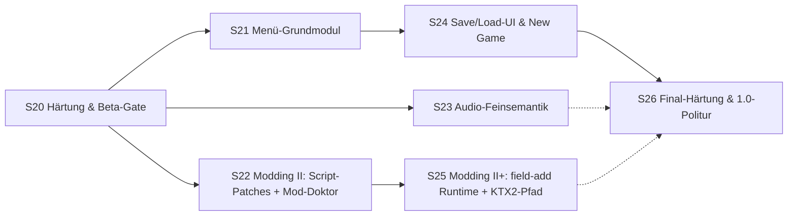

# WebMidgar — Fortsetzungs-Roadmap S20–S26

Fortschreibung der Roadmap (S1–S7 ✅ abgeschlossen; S8–S12 und S13–S19 siehe
[ROADMAP-S8-S12.md](ROADMAP-S8-S12.md) bzw.
[ROADMAP-S13-S19.md](ROADMAP-S13-S19.md); Architekturreferenz:
[WEBMIDGAR-MASTERPLAN.md](WEBMIDGAR-MASTERPLAN.md)). Gleiche Regeln: Golden
Fixtures immer selbst erzeugt, Originaldaten nur lokal beim Nutzer
(Diagnose-Scan, aggregierte Reports), 🟡-Markierungen vor der jeweiligen
Session auflösen oder als Restrisiko dokumentieren. **Methodik-Standard seit
S7: Realdaten-Strukturproben VOR Parserbau.**

**Thema dieses Bogens:** Von „spielbar mit Story-Kern und Modding-MVP" zu
„öffentlich nutzbar" — Härtung (NFRs, Cross-Browser, Beta), dann die ersten
großen Feature-Bögen jenseits des MVP-Kerns: Menü-Grundmodul, Save/Load-UX,
Modding II (Script-Patches, Dialog-Ersetzungen, Mod-Doktor), Audio-
Feinsemantik und Save/Load- & New-Game-UX. Ein eigener Bogen ist die
**Härtungsphase** (S20) — sie ist nicht „Polish", sondern Voraussetzung für
jede Beta.

**Zusatzregeln für diesen Bogen:**

1. S20 ist die **Gate-Session**: Kein Feature-Bogen S21+ beginnt, bevor die
   Härtungskriterien erfüllt oder der Verzicht auf ein Kriterium per ADR
   dokumentiert ist (inkl. Nummer des bewussten Restrisikos).
2. Alle Realdaten-Proben behalten die Regeln aus ROADMAP-S13-S19
   (Original-/Overlay-Trennung, Qhimm-Familie = eine Quelle, FINDINGS.md-
   Pflicht).
3. Dieses Dokument wurde erstellt, während S13–S19 liefen:
   Voraussetzungen referenzieren **Soll**-Ergebnisse — vor jedem
   Sessionstart den Ist-Stand gegenprüfen.

## Abhängigkeitsbild

S21, S22 und S23 sind nach S20 weitgehend parallelisierbar (disjunkte Module).
S24 braucht S21 (Fenster-/Textsystem ist schon aus S15 vorhanden — S21
liefert die Menü-Ansichten, in denen die Slot-UI lebt). S25 ist der
härteste Modding-Schritt und bewusst nach S22 angesetzt.

### S20 — Härtung & Beta-Gate ✅ abgeschlossen (2026-08-10)

**Stand:** Alle Desktop-NFRs gemessen und eingehalten
([NFR-Bericht](NFR-BERICHT-S20.md)); Soak über 500 Field-Wechsel leckfrei;
R9 gemessen, ein echter Fund behoben ([R9-Bericht](R9-CROSSBROWSER.md));
R5-Matrix über 57 Archive ([R5-Matrix](R5-FINGERPRINT-MATRIX.md));
**ADR-010 verworfen**. Nicht erfüllbare Kriterien sind als Restrisiko
geschlossen: **ADR-019** (kein Mobile-Referenzgerät), **ADR-020**
(Firefox/WebKit ungeprüft), **ADR-022** (keine Community-Beta als
Fingerprint-Quelle), **ADR-023** (GPU-Registry nur als Messmodell) —
alle mit benanntem Nachhol-Auslöser in
[ADR-S20-HAERTUNG.md](ADR-S20-HAERTUNG.md). **Das Gate ist offen:
S21 ff. dürfen starten.**

| Feld | Inhalt |
|---|---|
| Ziel | Das Produkt wird beta-reif: vollständige **NFR-Messkampagne** gegen alle Sollwerte aus Masterplan-Phase 2.4 (TTFF cold/warm, Field-Wechsel warm, Einzelasset-Latenzen, Long-Tasks, GPU-Upload-Budget, Heap- und VRAM-Budgets) auf Desktop **und** Mobile-Referenzgerät; **R5-Fingerprint-Matrix** über die Community-Beta mittels des asset-freien S18-Diagnose-Exports (bekannte Releases ↔ unbekannte Varianten dokumentiert); **R9-Cross-Browser-Replay-Gleichheit** (Chromium × 2 Versionen, Firefox, ggf. WebKit-Stand dokumentiert); **ADR-010-Entscheidung** (WASM ja/nein — mit dem jetzt vorliegenden Realdaten-Lastprofil); **Mobile-Profiling** (R7: Quota/Eviction-Verhalten, Touch-Bedienbarkeit ist explizit Nicht-Ziel — nur Performance); **Soak-Test** 500 Field-Wechsel mit Heap-/VRAM-Rückkehr auf Baseline; Beta-Release-Prozess (Versionsschema, Diagnose-Export-Anleitung, bekannte-Einschränkungen-Seite) |
| Voraussetzungen | S18 (Diagnose-Export, Browser-Matrix), S11/S12 (spielbarer Kern), S16 (Audio), S19 (Modding-MVP, falls in Beta enthalten); Realdaten-Lastprofile aus S12 liegen vor |
| Betroffene Module | `tools/realdata-scan` (Fingerprint-Matrix-Aggregation), `packages/telemetry` (NFR-Marker, Budget-Messung), `tools/nfr-run` (neu: automatisierte Messläufe), `docs/` (Beta-Release-Prozess, R5-Matrix, R9-Bericht, ADR-010-Folge) |
| Akzeptanzkriterien | NFR-Tabelle komplett abgehakt: jede Metrik aus Phase 2.4 gemessen, Ergebnis im Dokument, Abweichungen > 20 % mit Begründung oder Fix; Soak-Test: Heap- und GPU-Registry-Buchführung kehrt nach 500 Wechseln auf Baseline ± 5 % zurück; R9: identische Replay-Digests über alle unterstützten Browser (Abweichung → entweder Fix oder dokumentierter Fixpoint-Härtungsplan); R5: Matrix mit ≥ 3 bekannten Release-Fingerprints + Verhalten im „best effort"-Pfad nachgewiesen; ADR-010 als Akzeptiert/Verworfen dokumentiert (kein „Vorgeschlagen" mehr); Mobile-Referenzgerät-Profil liegt vor (auch wenn Zielwerte verfehlt werden — dann dokumentiert); Beta-Seite + Diagnose-Export-Anleitung live |
| Nicht-Ziele | Kein Touch-UI, kein Mobile-Feature-Ausbau (nur Messung); keine Performance-Optimierung über das Erfüllen der NFRs hinaus; kein Hosting/Portal |
| Formatlage | Keine neuen Formate — ausschließlich Messung, Härtung, Dokumentation |
| Prompt | „Messe zuerst, bevor du härst: automatisierte NFR-Läufe gegen die synthetische Fake-Installation und gegen die echte lokale Installation, Soak-Test, Cross-Browser-Replay-Vergleich, R5-Fingerprint-Matrix aus den Beta-Diagnose-Reports. Dann ADR-010-Entscheidung anhand des Lastprofils treffen und alle Ergebnisse im Dokument verankern. Keine neue Funktionalität — nur Messung, Fix der eklatanten Verletzungen, Dokumentation." |

### S21 — Menü-Grundmodul (lesend)

| Feld | Inhalt |
|---|---|
| Ziel | Das originale Menü (Pausenmenü) als **lesende** Ansicht: Status (HP/MP/Level/Limit-Anzeige je Charakter), Party-Übersicht, Item-Liste (Inventar), Gil, Spielzeit, aktueller Ort. Aufbau ausschließlich aus den in S13/S14/S15 vorhandenen Daten (Kernel-Records, Savemap-Records, Dialog-/Textsystem); Menü-LGP-Assets (Fenster, Icons, Fonts) über denselben Texturpfad wie S15; **keine Eingriffe** in Inventar, Ausrüstung, Materia, Konfiguration — reine Anzeige mit korrekter Formatierung (Zahlen, Balken, Namen). Menü-Op-Kategorie im Interpreter von Stub auf Semantik (Aufruf öffnet die Ansicht, Rückkehr wie formatgegeben) |
| Voraussetzungen | S20 (Beta-Qualität steht), S13 (Kernel-Item-/Charakterdaten), S14 (Savemap: Party, Inventar, Gil, Spielzeit, CharacterRecords), S15 (Textsystem, Fenster), S17 (Menu-Op war dokumentierter Stub) |
| Betroffene Module | `packages/menu` (neu: Menü-View-Model, Node-testbar), `packages/render-field` (Overlay-Ebene erweitern oder dedizierte Menü-Composite), `packages/interpreter` (Menü-Ops: Stub → Semantik), `tools/fixture-gen` (Menü-Sollbild-Fixtures, CharacterRecord-Varianten), `tools/realdata-scan` (Menü-LGP-Probe Icon-/Layout-Bestand, falls nicht schon aus S15 vorliegend) |
| Akzeptanzkriterien | Menü öffnet sich per Tastendruck und per Menu-Op und zeigt korrekte Werte aus einem Fixture-Savegame (Golden-Screenshot je Ansicht: Status, Party, Items, Gil/Zeit); Änderung des Savemaps (Fixture-Variante) ändert die Anzeige ohne Codeänderung; Item-Namen kommen aus S13-Kernel-Records, Charakternamen aus der Savemap (nicht aus Kernel-Defaults); Replay-Determinismus unverändert (Menü ist reines Overlay ohne Zustandswirkung — Digest vor/nach identisch); Menü-LGP-Probe dokumentiert Icon-/Asset-Bestand der deutschen Installation |
| Nicht-Ziele | Kein Schreiben in Inventar/Ausrüstung/Materia; keine Konfigurations-Menüs; keine Bestell-/Sortierfunktionen; kein Worldmap-Modul; kein Shop-Modul |
| Formatlage | Menü-LGP-Inhalte 🟡 (Icons, Fenster, Layout-Konstanten — deutsche Variante per Probe); CharacterRecord-Felder für Statusanzeige 🟡 (S14-Formatlage); Menu-Op-Operanden (welche Ansicht, Rückkehrverhalten) 🟡 |
| Prompt | „Probe zuerst: Menü-LGP der lokalen Installation (Icons, Fenster, eventuell Layout-Tabellen). Dann packages/menu als Node-testbares View-Model: liest ausschließlich S13-Records + S14-Savemap + S15-Textsystem, keine Schreibpfade. Golden-Screenshots je Ansicht gegen Fixture-Savegames; Menu-Op von Stub auf Semantik. Keine Interaktion außer Öffnen/Schließen/Blättern." |

### S22 — Modding II: Script-Patches + Dialog-Ersetzungen + Mod-Doktor

| Feld | Inhalt |
|---|---|
| Ziel | Die in S19 bewusst ausgelassenen Capabilities `script-patch` und `dialogue-replace` werden scharfgeschaltet: (a) **Engine-seitiger Mnemonic-Assembler** (`packages/script-assembler` — Promotion aus fixture-gen, eine Implementierung, drei Nutzer: Fixtures, Studio, Engine-Import); Patch-Records der Phase-5.2-Spezifikation (Anker, Operation, Payload als Mnemonics, guardHash) werden beim Mod-Import validiert (Anker eindeutig, guardHash-Match, Spans in `PreparedScript`-Grenzen) und zur Laufzeit an Field-Grenzen appliziert; (b) **Dialog-Ersetzungen**: `dialogues[]`-Records (replace-Modus) gegen die S15-Fenstermetrik validiert (Umbruch-Warnung), zur Laufzeit an Stelle des Originalstrings ausgeliefert; (c) **Mod-Doktor-Ansicht** in der App-Shell: je Mod Kompatibilitätsstatus (engineCompat, guardHash-Trefferquote, Konflikte, Budget), je Asset Herkunfts-Tag und letzte Fehler; adressiert R10 (Ausdrucksstärke) und liefert die Diagnose für Mod-Kombinationen |
| Voraussetzungen | S19 (Manifest, Override-Kette, generationsbasierte Registry), S15 (Dialogsystem, Fenstermetrik), S6/S12 (Interpreter, PreparedScript), S20 (Beta-Qualität); Studio-Strang ist **nicht** Voraussetzung (handgeschriebene Mods sind gleichwertig) |
| Betroffene Module | `packages/script-assembler` (neu bzw. Promotion aus fixture-gen), `packages/mods` (Import-Validierung + Laufzeit-Applikation der neuen Records), `packages/interpreter` (Patch-Applikation an Field-Grenzen, Patch-Invalidierung im PreparedScript-Cache), `apps/field-viewer` (Mod-Doktor-Ansicht), `tools/fixture-gen` (Fixture-Mods mit gültigen und gezielt defekten Patches/Dialogen), `tools/realdata-scan` (Anker-Stabilitäts-Probe über Realdaten-Fields) |
| Akzeptanzkriterien | Assembler: Roundtrip Mnemonic → Bytecode → Disassembly-Vergleich stabil (Fixture-Suite); Patch-Fixtures: jede Phase-5.2-Operation (replace-span, insert-before, insert-after, disable-span) mit Soll-Zustandsverlauf; guardHash-Mismatch-Pfad getestet (Patch inaktiv + Diagnose, Mod bleibt aktiv); Anker-Mehrdeutigkeit → Patch inaktiv + Diagnose (nie „ungefähr"); Dialog-Replace: Golden-Screenshot der ersetzten Dialogbox, Umbruch-Warnung bei Überlänge dokumentiert; Mod-Doktor: Fixture-Szenarien (Kompatibel / Version-Mismatch / guardHash-Teiltreffer / Konflikt) als Golden-UI-Tests; Determinismus: gepatchter Script-Verlauf ist replay-bitidentisch bei gleicher Mod-Lage |
| Nicht-Ziele | Kein `field-add`-Runtime-Pfad (→ S25); kein `model-override`/`model-add` (→ Studio-Strang); keine Source-Map/Debug-UX für gepatchte Scripts (→ Studio-Strang); kein IRO-Import; keine Hot-Patches mitten im laufenden Field (nur an Field-Grenzen, wie S19) |
| Formatlage | Mnemonic-Taxonomie: sauber aus Phase-4.1-Tabelle ableitbar 🟢; Anker-Stabilität über Original-Fields (wie eindeutig sind {entity, slot, ipOffset}-Anker in der Praxis) 🟡 (Probe in dieser Session); guardHash-Algorithmus (welche Bytes in den Hash fließen) 🔵 (zu definieren); Dialog-Replace-Validierung gegen Fenstermetrik 🟢 (S15-Bestand) |
| Prompt | „Probe zuerst: Anker-Eindeutigkeit über die Realdaten-Fields (wie viele {entity,slot,ipOffset}-Anker sind mehrdeutig?). Dann packages/script-assembler als geteiltes Paket mit Fixture-Suite, Patch-Validierung + Laufzeit-Applikation an Field-Grenzen, Dialog-Replace über die Override-Kette, Mod-Doktor als UI. Jede Defekt-Klasse (Mehrdeutigkeit, guardHash-Mismatch, Span-Verletzung) als Fixture-Test mit benannter Diagnose." |

### S23 — Audio-Feinsemantik: AKAO-Familie & Kanalzustände

| Feld | Inhalt |
|---|---|
| Ziel | Die in S16/S17 diagnostizierten AKAO- und Kanal-Opcodes bekommen Semantik: AKAO/AKAO2 (Operandenlängen-Varianten) als Parametrierung des aktuellen Musiktitels (Lautstärke, Pan, Tempo, ggf. Effekt-Klassen — tatsächlicher Umfang per Probe), Kanal-spezifische Lock-/Unlock-Zustände (welche Ops welche Kanäle schützen), blockierende Warteformen als waitState-Daten (ADR-006 konform), CMUSC/BMUSC-Verhalten vollständig, FADE-Ops als zeitgesteuerte WebAudio-Rampen im Engine-Kommandopfad. Ziel: Realdaten-Fields klingen nicht nur ungefähr, sondern strukturell korrekt (Übergänge, SFX-Layering, Lautstärkeverläufe) |
| Voraussetzungen | S16 (Engine, Kommandopfad), S17 (MUSIC/SOUND auf Wirkung), S20 (Beta steht); Methodik: AKAO-Operanden-Inventar-Probe über die 702 Fields VOR Semantikbau (welche AKAO-Parameter-Kombinationen kommen real vor) |
| Betroffene Module | `packages/audio` (AKAO-Parameter-Modell, Fades, Kanalzustände), `packages/interpreter` (AKAO/CMUSC/BMUSC/FADE-Ops: Stub → Semantik, waitState-Varianten), `tools/fixture-gen` (AKAO-Sollverlauf-Scripts), `tools/realdata-scan` (AKAO-Parameter-Inventar-Probe, Fault-Statistik vorher/nachher) |
| Akzeptanzkriterien | AKAO-Parameter-Inventar dokumentiert (FINDINGS.md); jede scharfgeschaltete Op mit Fixture-Sollverlauf; Kanal-Lock-Fixtures (gesperrter Kanal ignoriert MUSIC, nicht SOUND, und umgekehrt je nach Op — tatsächliches Verhalten aus Probe dokumentiert); FADE-Rampe sample-genau per Unit-Test der Engine-Kommandos; Realdaten-Fault-Rate für Audio-Kategorie auf < 5 % der Audio-Kontexte gesenkt (Statistik vorher/nachher); Referenzfield mit AKAO-Übergängen hörbar korrekt (dokumentierte Hörprüfung) |
| Nicht-Ziele | Kein AKAO-Sequenzer (MIDI-artige Wiedergabe); keine FMV-Audio-Synchronisation; kein 3D-Audio; kein Safari-Vorbis-Fallback (Browser-Matrix-Entscheid aus S20 gilt) |
| Formatlage | AKAO-Op-Nummern und Grundwirkung 🟢 (Qhimm); AKAO-Parameterbelegung (was jeder Parameterbyte tut) 🟡; Kanal-Lock-Semantik 🟡; FADE-Ops (Zeitverhalten, Kurvenform) 🟡 — jeweils per Probe + Zweitimplementierung (FFNx-Audio-Code als Referenzverhalten, nicht als Copy) zu klären |
| Prompt | „Probe zuerst: AKAO-Parameter-Inventar über alle 702 Fields (welche Byte-Kombinationen real vorkommen). Dann jede Op-Kategorie einzeln mit Fixture-Sollverlauf: AKAO-Parametrierung, Kanal-Locks, FADE-Rampen. Engine-Kommandos bleiben Daten (S16-Vertrag); Fault-Statistik vorher/nachher ist Pflicht." |

### S24 — Save/Load-UI & New Game

| Feld | Inhalt |
|---|---|
| Ziel | Vollständige Spielstand-UX: (a) **Save/Load-Dialog** über das S15-Dialogsystem/S21-Menü-Overlay: Slot-Liste mit Preview-Block (Charaktere + Level, Spielzeit, Ort — alles aus dem eigenen S14-Format lesbar), Speichern nur an Savepoints (S17-Fluss) oder überall im Menü je nach Original-Verhalten (per Probe klären), Laden aus dem Hauptmenü und aus dem Spiel; (b) **New Game**: KernelInitData als Startzustand anwenden (Charakter-Startwerte, Start-Inventar, Start-Gil aus S13), Start-Field fest verdrahtet (erstes Field der Story als Konstante, dokumentiert), **Namenseingabe** für Charaktere über das Dialogsystem (Zeichentabelle deutsch, Längenbegrenzung, Platzhalter-Substitution in Dialogen funktioniert damit end-to-end); (c) Original-Save-Import als eigener Wizard-Schritt (save\*.ff7 aus S14 direkt laden, nicht nur Fixture-Pfad) |
| Voraussetzungen | S21 (Menü-Overlay als Träger der Slot-UI), S14 (SaveSlotStore, Original-Save-Parser, KernelInitData), S15 (Dialogsystem, Platzhalter), S17 (Savepoint-Fluss), S20 (Beta) |
| Betroffene Module | `packages/menu` (Slot-UI als Menü-Ansicht), `packages/dialog` (Namenseingabe-Fluss), `packages/formats-save` (Preview-Block-Leser), `apps/field-viewer` (Hauptmenü-Zustand: New Game / Load / Import), `tools/fixture-gen` (Save-Preview-Fixtures, Namenseingabe-Fixtures) |
| Akzeptanzkriterien | E2E: New Game → Namenseingabe → erstes Field mit korrekten Startwerten (Golden-Vergleich gegen KernelInitData-Fixture); Namen erscheinen korrekt in Dialogen (Platzhalter-Substitution End-to-End-Test); Save → Reload → Slot-Preview zeigt korrekte Daten; Load aus Hauptmenü stellt den exakten Zustand wieder her (Digest vor Save == Digest nach Load+Resume); Original-Save-Import über den Wizard lädt einen gefundenen Slot spielbar (gegen Fixture-Save, da Original-Saves nur lokal); Speichern an Nicht-Savepoint-Positionen verhält sich wie das Original (Probe dokumentiert das Verhalten — entweder erlaubt oder blockiert mit Hinweis) |
| Nicht-Ziele | Kein Cloud-Sync; kein PSX-Save-Import; kein Save-Kompatibilitäts-Layer zwischen Engine-Versionen über die dokumentierte Migrationsregel hinaus; kein Auto-Save-System über das S3-Tab-Reload-Resume hinaus |
| Formatlage | Preview-Block des Original-Saveformats 🟢 (S14-Formatlage); Speicherort-Beschränkung des Originals (nur Savepoints oder überall) 🟡 (Probe); Namenseingabe-Constraints (Zeichensatz, Länge) 🟢 (aus Zeichentabelle); Start-Field-ID der Story 🟢 |
| Prompt | „Baue die Slot-UI als Menü-Ansicht mit Preview-Block aus dem eigenen Save-Format, New Game mit KernelInitData + Namenseingabe über das Dialogsystem, und den Original-Save-Import als Wizard-Schritt. Probe zuerst: Speicherort-Beschränkung des Originals. Alle Flüsse als Node-testbare Statusmaschinen, UI dünne Schale; Digest-Gleichheit vor Save / nach Load ist Pflichtnachweis." |

### S25 — Modding II+: `field-add`-Runtime + KTX2/HD-Texturpfad

| Feld | Inhalt |
|---|---|
| Ziel | Die härteste noch ausstehende Modding-Fähigkeit: (a) **`field-add` Runtime-Pfad** — Mod-Fields als NAM-nahe deklarative Dokumente (Format aus MODDING-SUITE-MASTERPLAN B.4) werden beim Import direkt in `FieldBundle`-NAM übersetzt (kein Binär-Writer, ADR-014 gilt), die Field-Verzeichnistabelle der Runtime wird um Mod-Field-IDs erweitert, Gateways in Mod-Fields funktionieren in beide Richtungen (Original↔Mod); (b) **KTX2/HD-Texturpfad**: `texture-override` akzeptiert KTX2-Quellen, GPU-seitige Transcodierung über die drei.js-KTX2Loader-Kette, Seitenverhältnis-Regel (ganzzahliges Vielfaches des Originals — das in Phase 5.2 markierte 🟡 wird per Kalibrierlauf entschieden), VRAM-Budget-Buchführung für HD-Texturen in der GPU-Registry; (c) **Manifest-Migration n−1 → n** beim Import einmalig in den Mod-Cache (Phase-5.3-Regel implementieren, falls bis hierhin nur definiert) |
| Voraussetzungen | S22 (Modding II steht), S19 (Override-Kette, ModStore), S11 (Field-Wechsel, Field-Verzeichnis), S20 (Beta); Studio-Strang nicht Voraussetzung |
| Betroffene Module | `packages/mods` (field-add-Import + NAM-Übersetzung), `packages/pipeline` (Field-Verzeichnis-Erweiterung, Mod-Field-Ladepfad), `packages/render-field` (KTX2-Transcodierung im Texturpfad, VRAM-Budget-Buchführung), `packages/mod-manifest` (Migrationsregeln), `tools/fixture-gen` (Mod-Field-Fixture-Dokumente, KTX2-Testtexturen selbst erzeugt), `tools/realdata-scan` (nicht zentral — kein Originaldaten-Bezug) |
| Akzeptanzkriterien | Fixture-Mod-Field (eigenes Bild als Hintergrund, gezeichnetes Walkmesh, Kamera) ist vom Original-Fixture-Field per Gateway erreichbar und begehbar (Verdeckung korrekt); Mod-Field mit defektem Walkmesh → Field nicht betretbar statt Crash (gleiche Degradierung wie Original-Pfad); KTX2-Override: Fixture-Textur mit 2×/4×-Auflösung wird angezeigt, VRAM-Budget-Buchführung schlägt zu, Budget-Überschreitung verweigert mit Diagnose; Seitenverhältnis-🟡 als Kalibrierentscheidung dokumentiert (CALIBRATION.md); Manifest-Migration: n−1-Fixture-Manifest wird einmalig konvertiert, zweiter Import liest Cache ohne Migration (Test); Determinismus unverändert (Mod-Field-Replay bitidentisch bei gleicher Mod-Lage) |
| Nicht-Ziele | Kein Studio (eigener Strang); keine Encounter-Balancing-Autorenwerkzeuge; kein Palettenanimations-Authoring; kein IRO-Import; kein Hot-Swap von Mod-Fields mitten in der Szene |
| Formatlage | Mod-Field-Dokument-Schema (NAM-nah) 🔵 (Eigenentwurf, aus Studio-Plan übernehmen); KTX2-Transcodierung im Browser 🟢 (drei.js-KTX2Loader, Basis-Universal-Transcoder); VRAM-Budget-Heuristik für HD-Texturen 🟡 (NFR-Ableitung); Manifest-Migrationsregeln 🔵 (zu schreiben) |
| Prompt | „Implementiere den field-add-Runtime-Pfad: NAM-nahes Field-Dokument-Schema (aus Studio-Plan B.4), Import-Übersetzung direkt in FieldBundle-NAM, Field-Verzeichnis-Erweiterung, Gateway-Funktion in beide Richtungen. Dann KTX2/HD-Texturpfad: Transcodierung im Textur-Worker, Seitenverhältnis-Regel per Kalibrierlauf, VRAM-Budget. Abschließend Manifest-Migration n−1→n. Fixture-Mod-Field als E2E-Nachweis." |

### S26 — Final-Härtung & 1.0-Politur

| Feld | Inhalt |
|---|---|
| Ziel | Letzte Qualitätsphase vor dem „1.0"-Label: (a) **Regression gegen alle bisherigen Akzeptanzkriterien** — jede Golden-Fixture-Suite (Parser, Interpreter, Dialog, Audio, Modding, Menü, Save) läuft im CI-ähnlichen Lauf vollständig grün; (b) **bekannte-Einschränkungen-Dokument final** (was nicht geht und warum — ADR-011 Battle, Weltkarte, Touch, etc.); (c) **Cross-Browser-Matrix final** (R9-Stand + Safari-Status explizit); (d) **R6-Auflösung**: Renderstate-Bitbelegung in `.p`/`.tex` — die konservativen Defaults aus S7/S10 werden durch den jetzt möglichen Realdaten-Vergleich (Blending-Artefakte über große Field-Stichprobe) entweder bestätigt oder korrigiert; (e) **Replay-Portabilität** als öffentliches Feature (Digest-Austausch-Format dokumentiert, asset-frei); (f) Versionspolitik (Semver, engineCompat-Kommunikation, Mod-Kompatibilitätsversprechen) |
| Voraussetzungen | S20–S25 abgeschlossen; Studio-Fallstudie (MS8) kann parallel laufen und speist Ergonomie-Befunde ein |
| Betroffene Module | alle (nur Fixes, keine neuen Features), `docs/` (Einschränkungen, Browser-Matrix, Versionspolitik, Replay-Digest-Format), `tools/nfr-run` (Final-Lauf) |
| Akzeptanzkriterien | Vollständige Test-Suite grün ohne Skip-Listen; R6 in der Masterplan-Risikotabelle auf 🟢 oder als dokumentiertes Restrisiko mit ADR geschlossen; Browser-Matrix-Dokument final (jede Zelle: unterstützt / mit Einschränkung / nicht unterstützt + Grund); Replay-Digest-Austauschformat spezifiziert (asset-frei, versioniert); 1.0-Release-Notes mit vollständiger Feature-Liste und allen ADR-Querverweisen; keine offenen 🟡 ohne ADR-Verweis mehr in der Masterplan-Risikotabelle (Restrisiken haben ADR-Nummern) |
| Nicht-Ziele | Keine neuen Features; keine Weltkarte, kein Battle, kein Touch — die bleiben eigene Bögen nach 1.0 |
| Formatlage | Keine neuen Formate |
| Prompt | „Regression zuerst: alle Suites laufen lassen, Befundliste erstellen, nur Fixes. Dann R6-Auflösung per Realdaten-Vergleich, Browser-Matrix final, Replay-Digest-Format spezifizieren, Versionspolitik und 1.0-Release-Notes schreiben. Kein neues Feature in dieser Session." |

---

## Reihenfolge und Parallelisierung

*Empfehlung: S20 → (S21 ∥ S22 ∥ S23) → S24 → S25 → S26.* S20 ist das Gate.
S21, S22 und S23 sind disjunkt (Menü / Modding / Audio) und parallelisierbar.
S24 braucht S21. S25 ist der komplexeste Modding-Schritt und bewusst nach
S22 gesetzt. S26 ist bewusst „nur Fixes" — keine Feature-Versuchung.

## ADR-Pflege in diesem Bogen

- **ADR-010** (WASM): wird in S20 final entschieden (Akzeptiert oder
  Verworfen) — das Realdaten-Lastprofil liegt nach S12/S20 vor.
- **ADR-011** (Battle-Stub): Status bleibt — S21/S24 ändern nichts am
  Stub-Vertrag; echtes Battle ist ein eigener Bogen nach 1.0.
- **ADR-014** (kein Binär-Field-Writer): wird in S25 bestätigt (Mod-Fields
  nur als NAM-nahe Dokumente).
- **R6, R7, R9, R10**: werden in diesem Bogen entweder aufgelöst oder mit
  ADR-Nummer als bewusstes Restrisiko geschlossen (S20/S23/S26).

## Ausblick — Bögen nach 1.0 (unpriorisiert)

- **Weltkarte** (Worldmap-Modul: Terrain, Fahrzeuge, World-Script-System)
- **Echtes Battle-Modul** (battle.lgp-Formate, Battle-Szenen, ATB-System,
  Battle-Kamera, Battle-Interpreter — ein eigener, sehr großer Bogen)
- **Minigames** (Fort Condor, Gold Saucer-Module, Chocobo-Rennen)
- **FMV-Wiedergabe** (Video-Container-Format, Synchronisation mit Field-State)
- **Studio-Strang MS1–MS8** (eigenständig, parallel — siehe
  [MODDING-SUITE-MASTERPLAN.md](MODDING-SUITE-MASTERPLAN.md))
- **Mod-Portal / Katalog** (nur wenn Community-Bedarf nachgewiesen, RS5)
- **Mobile-Feature-Ausbau** (Touch-UI, adaptives Layout — erst nach R7-Stand)
- **IRO-/7th-Heaven-Import-Konverter** (nur Richtung WebMidgar, Post-MVP)

---

*Die offenen Forschungsposten (audio.fmt, Musikindex, Kampf-Opcode,
LGP-Check-Code, R1-Prioritäten, 0xFF-Wrap, Mod-Variablenbänke) sind mit
Methode und Ziel-Session in
[ROADMAP-OFFENE-POSTEN.md](ROADMAP-OFFENE-POSTEN.md) eingeplant.*

*Rückverweis: [ROADMAP-S13-S19.md](ROADMAP-S13-S19.md) ·
[ROADMAP-S8-S12.md](ROADMAP-S8-S12.md) ·
[WEBMIDGAR-MASTERPLAN.md](WEBMIDGAR-MASTERPLAN.md) ·
[MODDING-SUITE-MASTERPLAN.md](MODDING-SUITE-MASTERPLAN.md)*
