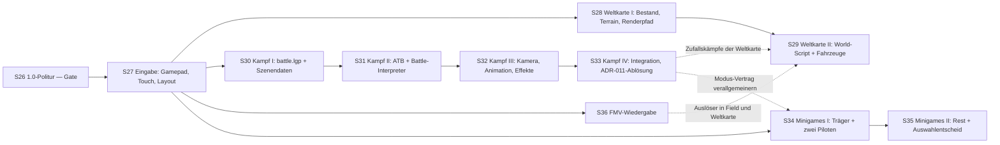

# WebMidgar — Fortsetzungs-Roadmap S27–S36

Fortschreibung der Roadmap (S1–S19 ✅ abgeschlossen; S20–S26 siehe
[ROADMAP-S20-S26.md](ROADMAP-S20-S26.md), davor
[ROADMAP-S13-S19.md](ROADMAP-S13-S19.md) und
[ROADMAP-S8-S12.md](ROADMAP-S8-S12.md); Architekturreferenz:
[WEBMIDGAR-MASTERPLAN.md](WEBMIDGAR-MASTERPLAN.md)). Gleiche Regeln: Golden
Fixtures immer selbst erzeugt, Originaldaten nur lokal beim Nutzer
(Diagnose-Scan, aggregierte Reports), 🟡-Markierungen vor der jeweiligen
Session auflösen oder als Restrisiko dokumentieren. **Methodik-Standard seit
S7: Realdaten-Strukturproben VOR Parserbau.**

**Thema dieses Bogens:** Die fünf Themen, die S20–S26 bewusst als „Ausblick
nach 1.0" geführt hat, werden geplant: **Weltkarte**, **echtes Kampfsystem**,
**Minigames**, **FMV-Wiedergabe** und **Touch-/Controller-UI**. Das ist der
Weg von „die Geschichte ist durchspielbar, weil der Kampf ein Stub ist" zu
„das Spiel läuft ohne Ersatzteile" — mit der ausdrücklichen Einschränkung,
dass mehrere dieser Bereiche **keine Formatfrage** sind, sondern eine
Verhaltensfrage (s. Zusatzregel 3).

**Ehrliche Vorbemerkung zur Formatlage.** Dieser Bogen betritt vier Gebiete,
über die das Projekt heute **nichts Eigenes** weiß: Weltkarten-Terrain,
`battle.lgp`-Innenleben, Minigame-Regelwerk und FMV-Codecs. Anders als bei
`flevel` oder `char.lgp` gibt es hier keine Vorarbeit, gegen die man messen
könnte. Entsprechend steht in den Formatlage-Zeilen dieses Dokuments deutlich
mehr 🔴 als in allen bisherigen Roadmaps zusammen. Das ist kein Pessimismus,
sondern der Ausgangsstand — und die Bögen sind so geschnitten, dass die
Probenphase jeweils **vor** dem Bau liegt und ein Negativbefund ein zulässiges
Sessionergebnis ist.

**Zusatzregeln für diesen Bogen:**

1. **S26 (1.0) ist das Gate.** Kein Bogen dieses Dokuments startet, bevor die
   Regressionslage aus S26 grün ist. Grund: Alle folgenden Module hängen die
   Determinismuszusicherung an den bestehenden Replay-Digest an — ein
   wackeliger Digest macht jede Abnahme dieses Bogens wertlos.
2. Alle Realdaten-Proben behalten die Regeln aus ROADMAP-S13-S19:
   **Original-/Overlay-Trennung** (die Nutzerinstallation trägt ein
   7th-Heaven-/FFNx-Overlay — bei FMV und Battle-Assets ist das besonders
   wahrscheinlich), Qhimm-Mirror-Familie = **eine** Quelle, FINDINGS.md-Pflicht.
3. **Wo kein Format existiert, wird das ausgesprochen.** ATB-Konstanten,
   Schadensformeln, Minigame-Physik und die Fahrzeug-/Geländematrix liegen
   vermutlich ganz oder teilweise **in der EXE, nicht in Daten**. Die Engine
   bekommt dann eine **eigene, dokumentierte** Regel (🔵), niemals eine
   geratene „Original"-Regel (🟢-Anmaßung). Der Unterschied gehört in die
   Release-Notes, nicht in eine Fußnote.
   **Präzisierung durch [ROADMAP-S37-EXE-ANALYSE.md](ROADMAP-S37-EXE-ANALYSE.md):**
   „liegt in der EXE" heißt *nicht* automatisch „nicht zugänglich". Der
   Datenabschnitt einer PE-Datei enthält Tabellen wie jeder andere Container.
   Zugänglich sind damit die **Zahlen** (Grundwerte, Modifikatoren, Kurven,
   Namen) — nicht die **Verknüpfungsregel**. Letztere bleibt 🔵, wird aber
   gegen belegte Konstanten kalibrierbar und damit erstmals falsifizierbar.
4. **Clean-Room bleibt Clean-Room.** Kein Disassemblieren der Original-EXE —
   diese Regel bleibt uneingeschränkt in Kraft. Sie verbietet **Codeanalyse**
   (Instruktionen lesen, Algorithmen ableiten), nicht das Lesen statischer
   **Datentabellen** aus derselben Datei; die Grenze ist in
   [ROADMAP-S37-EXE-ANALYSE.md](ROADMAP-S37-EXE-ANALYSE.md) gezogen und
   begründet.
   Community-Beschreibungen von EXE-Verhalten (FFNx, Qhimm, Kujata, Black
   Chocobo) sind *Beschreibung* und Hypothesengeneratoren — belegt wird gegen
   die eigenen Daten oder gegen **beobachtbares Verhalten des laufenden
   Originals beim Nutzer** (dokumentierte Sichtprüfung). Was so nicht belegbar
   ist, wird 🔵 Eigenentwurf.
5. Dieses Dokument wurde geschrieben, während S20–S26 noch offen waren:
   Voraussetzungen referenzieren **Soll**-Ergebnisse — vor jedem Sessionstart
   den Ist-Stand gegenprüfen.

**Die vier Messinstrumente dieses Projekts** (in jedem Bogen unten konkret
instanziiert, nicht als Floskel):

- **Kontrollhypothese.** Jede Trefferquote wird gegen eine bewusst falsche
  Gegenhypothese gemessen. Zwei Grenzen, beide teuer gelernt:
  *falsche Suchmenge* (liegt die Antwort nicht in der durchsuchten Menge,
  misst die Kontrolle dasselbe Rauschen wie der Kandidat und sieht dabei
  gesund aus — der erste Kampf-Opcode-Anlauf) und *blinde Gütefunktion* (ist
  die Messgröße gegenüber der gesuchten Eigenschaft invariant, liefern
  richtige und falsche Hypothese identische Zahlen — eine Bounding-Box ändert
  sich unter 180°-Drehung nicht). Schutz gegen die erste: die Annahme hinter
  der Suchmenge **aussprechen**.
- **Accounting als Wahrheitstest.** Ein Layout gilt erst als richtig, wenn es
  die Datei bzw. Sektion **byteexakt** aufbraucht.
- **Nullwert-Fallstrick.** Nullwerte sind trivial monoton, trivial
  rahmenkonform und trivial überlappungsfrei. Jede Quote wird **ohne** die
  Nullfälle zweitgerechnet.
- **Determinismus.** Alles Neue passt in ADR-006: waitState als Daten,
  Wirkungen nach außen als `HostRequest`-Daten, Replay-Digests. Für ATB,
  Minigames und FMV ist das die zentrale Entwurfsfrage, nicht ein Nachtrag.

## Abhängigkeitsbild

S27 ist das zweite Gate: Es liefert die Eingabe-Abstraktion, auf die S31, S34
und S29 aufsetzen. Danach laufen **vier unabhängige Stränge** — Weltkarte
(S28→S29), Kampf (S30→S31→S32→S33), Minigames (S34→S35) und FMV (S36). Der
Kampfstrang ist der kritische Pfad.

### S27 — Eingabe-Abstraktion: Gamepad, Touch und adaptives Layout

| Feld | Inhalt |
|---|---|
| Ziel | Eine einzige Eingabeschicht `packages/input` (DOM-freier Kern, Node-testbar): (a) **Quellen** Tastatur, Gamepad API und Touch/Pointer werden auf **einen** semantischen Aktionsstrom abgebildet (`ok, cancel, menu, up/down/left/right, run, pageUp/Down, switch`), Belegung als Daten (umbelegbar, persistiert über die App-Shell); (b) **Abtastung am Takt** — Quellen werden pro Tick genau einmal abgetastet, Flanken (`pressed/held/released`) entstehen aus dem Vergleich zweier Tick-Abtastungen, **nie** aus Event-Handlern; Analogachsen werden auf eine dokumentierte **ganzzahlige** Stufung quantisiert (Float-Achswerte sind geräte- und treiberabhängig und damit replayfeindlich); (c) **Touch-Layout** — virtuelles Steuerkreuz und Aktionsknöpfe als adaptives Overlay über der Letterbox (Safe-Area-Insets, Orientierungswechsel, Größenklassen), Layout als **Daten**, nicht als CSS-Sonderfallsammlung; (d) **modusabhängige Belegungstabellen** (Field, Dialog, Menü; Plätze für Battle/Weltkarte/Minigame reserviert, aber leer), damit spätere Bögen keine eigene Eingabelogik erfinden; (e) Eingabeaufzeichnung trägt `inputSourceKind` als **Metadatum**, nie als Zustand |
| Voraussetzungen | S26 (1.0-Gate), S11 (Eingabe-Replay, Fixed-Tick-Sitzung), S15 (Dialog), S21/S24 (Menü- und Slot-UI als zweiter Eingabekontext), S20 (R7-Mobilprofil — Touch war dort ausdrücklich Nicht-Ziel, hier wird es eingelöst) |
| Betroffene Module | `packages/input` (neu), `packages/field-runtime` (Eingabequelle austauschen, Vertrag unverändert), `packages/render-field` (Overlay-Ebene für das Touch-Layout, über der Letterbox), `packages/app-shell` (Belegungs-/Layout-Persistenz, Gamepad-Fähigkeitsanzeige), `apps/field-viewer`, `tools/fixture-gen` (Eingabeaufzeichnungen je Quelle, Gerätewechsel-Sequenzen) |
| Akzeptanzkriterien | **Kontrollhypothese „die Quelle ist irrelevant":** Dieselbe semantische Eingabefolge wird einmal aus Tastatur-, einmal aus Gamepad-, einmal aus Touch-Ereignissen erzeugt — die Replay-Digests müssen identisch sein, **und** ein absichtlich um einen Takt verschobener Gamepad-Strom muss einen *anderen* Digest liefern. *Grenze — blinde Gütefunktion:* Enthält der Digest die Eingabewirkung gar nicht (etwa weil er nur den Endzustand hasht), ist er gegen Quelle **und** Verschiebung invariant und wird trivial grün; die Gegenprobe „verschoben ⇒ anders" ist deshalb Pflichtbestandteil, nicht Kür. *Grenze — falsche Suchmenge:* Der Test erfasst nur Quellen, die abgetastet werden — ein Controller, der erst nach `gamepadconnected` Werte liefert, liegt außerhalb; Verbindung, Trennung und Wiederverbindung mitten im Lauf werden deshalb eigens getestet. **Nullwert-Zweitrechnung:** „keine Eingabe" ist trivial deterministisch — die Digest-Gleichheit wird zusätzlich nur über die Takte mit tatsächlicher Eingabe gerechnet. Ferner: Achsen-Quantisierung als Property-Test (1000 zufällige Float-Werte ⇒ dieselbe Stufe, keine Rundungsdrift, keine Plattformabhängigkeit); Belegungsänderung wirkt sofort und ist im Replay **wirkungsfrei** (Aufzeichnung enthält Aktionen, nicht Tasten — Test: Replay mit geänderter Belegung bleibt bitidentisch); Touch-Layout als Golden-Screenshots in vier Größen-/Orientierungsklassen inklusive Safe-Area; Long Tasks 0 (Polling im rAF, Auswertung am Tick); Bedienbarkeitsnachweis auf dem R7-Referenzgerät (Field begehbar, Dialog und Menü vollständig bedienbar) als dokumentierte Sichtprüfung |
| Nicht-Ziele | Keine Gestensteuerung; keine Bildschirmtastatur über die S24-Namenseingabe hinaus; keine Haptik/Vibration; keine Belegungen für Module, die es noch nicht gibt (nur Tabellenplätze); kein vollständiges Remapping-UI (Minimalansicht genügt); keine Maus-Direktsteuerung der Figur; keine Mobile-Performance-Arbeit (die gehört zu R7/S20) |
| Formatlage | Gamepad API mit Standard-Mapping 🟢 (Spec/MDN); tatsächliche Verfügbarkeit des Standard-Mappings über Browser × Controller 🟡 (Messmatrix in dieser Session); Pointer-/Touch-Events und Safe-Area-Insets 🟢; ob das PC-Original im Field überhaupt analoge Eingabe verarbeitet 🟡 (Sichtprüfung am Original, sonst 🔵-Setzung); Deadzone- und Wiederholraten sind **kein** Formatgegenstand, sondern 🔵 Eigenentwurf |
| Prompt | „Baue `packages/input` als reine, Node-testbare Schicht: Quellen → semantischer Aktionsstrom, Abtastung **einmal pro Tick**, Flanken aus der Tick-Differenz, Analogachsen ganzzahlig quantisiert. Belegungen und Touch-Layout sind Daten, keine Sonderlogik. Der zentrale Nachweis ist ein Dreifach-Replay (Tastatur/Gamepad/Touch) mit identischem Digest **plus** der Gegenprobe, dass ein um einen Takt verschobener Strom den Digest ändert — ohne diese Gegenprobe ist die Gleichheit wertlos, weil sie auch ein blinder Digest liefert. Reserviere Belegungsplätze für Battle/Weltkarte/Minigame, aber fülle sie nicht." |

### S28 — Weltkarte I: Bestandsaufnahme, Terrainformat, Renderpfad

| Feld | Inhalt |
|---|---|
| Ziel | (a) **Bestandsprobe** über das Weltkartenverzeichnis der lokalen Installation: Dateiinventar, Größen, Archiveinträge, Fingerprints, Original-/Overlay-Trennung — vor der ersten Parserzeile. Ein „Datei X existiert in der deutschen Installation nicht" ist ein vollwertiges Ergebnis; (b) **Terrainformat erschließen**: Blockgliederung der Weltkarten-Meshes, Dreiecke, Höhenmodell, Texturverweise, Gelände-/Attributbits; (c) `packages/formats-world` (neu) mit NAM-Typen `WorldTerrain` {blocks[], triangles[], attributes[], regions[]} und `WorldTextureSet`, Quarantäne je Block statt Abbruch (Analogie zur sektionsweisen Degradierung des Field-Containers); (d) `packages/render-world` (neu): blockweises Streaming (nur die Nachbarschaft ist resident), **eigener** Kamerapfad (Verfolgerkamera statt fester Field-Kamera), Höhenabfrage für Objektplatzierung. Die Weltkarte ist ausdrücklich **kein** Field: eigener Renderpfad, eigene Generationsachse, eigenes Streaming-Budget — aber dieselbe GPU-Registry und dieselbe zentrale Koordinatenkonvertierung (ADR-009 gilt unverändert; ein weltkartenlokaler Achsen-Flip ist verboten) |
| Voraussetzungen | S26 (Gate), S27 (Eingabe — die Weltkarte ist der erste neue Eingabekontext), S1 (LGP-Index, kanonische IDs), S3 (Pipeline, Generationen, Abbruch), S7/S9 (Modell- und Texturpfad), S20 (NFR-Messanlage — ohne Budgets ist Streaming nicht abnehmbar) |
| Betroffene Module | `packages/formats-world` (neu), `packages/render-world` (neu), `packages/pipeline` (Weltkarten-Ladepfad, eigene Generationsachse), `packages/convert` (unverändert genutzt — Nachweis, dass keine neue Flip-Stelle entsteht), `tools/fixture-gen` (World-Composer: eigener Writer für Terrainblöcke, bewusst code-getrennt vom Parser), `tools/realdata-scan` (world-probe, neuer FINDINGS-Abschnitt), `packages/telemetry` |
| Akzeptanzkriterien | **Accounting:** Die Blockzerlegung gilt erst als richtig, wenn Σ(Kopf + Blocklängen + Rest) die Datei **byteexakt** aufbraucht — nicht, wenn die ersten Blöcke plausibel aussehen. **Kontrollhypothese:** Jede Blockgrenzen-Auslegung wird gegen eine um wenige Bytes verschobene Zerlegung und gegen eine falsche Blockgröße gemessen. *Grenze — blinde Gütefunktion:* „Dreiecksanzahl plausibel", „Bounding-Box gefüllt" und „Höhen im Wertebereich" sind gegenüber Vertexreihenfolge, Achsenvertauschung und 180°-Drehung **invariant** — sie können den häufigsten Portierungsfehler nicht sehen. Tragende Messgröße ist deshalb die **Nahtstetigkeit**: benachbarte Blöcke müssen an der gemeinsamen Kante identische Randhöhen tragen (Analogon zum Bildkohärenztest aus S9); Kontrolle = dieselbe Messung gegen einen zufällig gewählten, nicht benachbarten Block. *Grenze — falsche Suchmenge:* Die Annahme „die Begehbarkeit steht in den Dreiecksattributen des Terrains" wird ausgesprochen und mitgeprüft — liegt sie in einer separaten Tabelle oder in der EXE, misst jede Attributprobe nur Rauschen (das ist exakt der Fehler des ersten Kampf-Opcode-Anlaufs). **Nullwert-Zweitrechnung:** Wasser- und Leerblöcke sind trivial nahtstetig und trivial rahmenkonform; jede Quote wird ohne sie zweitgerechnet und die Anzahl der Nullblöcke berichtet. Ferner: Lochzählung — Anteil unbedeckter Blockzellen über die gesamte Karte, Zielwert 0, Abweichungen namentlich; Rundfahrt über die Karte hält Heap und VRAM in den S20-Budgets und die GPU-Registry kehrt danach auf Baseline ± 5 % zurück; 0 Long Tasks beim Blockwechsel; Roundtrip World-Composer ↔ Parser bitgenau; `E-WLD-*`-Quarantäne-Fixtures (defekter Block ⇒ Loch mit Diagnose, nicht Absturz) |
| Nicht-Ziele | Kein World-Script, keine Fahrzeuge, keine Begegnungen, keine NPCs/Objekte auf der Karte (→ S29); keine Field↔World-Übergänge; kein Wasser-/Wolken-/Himmel-Effektpfad über eine dokumentierte Minimaldarstellung hinaus; keine Weltkarten-UI (Minimap, Ortsnamen); kein Weltkarten-Modding |
| Formatlage | Wiederverwendung des LGP-Containers für die Weltkarten-Archive 🟢 (S1 realdaten-validiert); Existenz und Inventar eines eigenen Weltkarten-Datenbestands 🟡 (die **deutsche** Installation ist ungeprüft — Probe klärt); Blockstruktur der Terrain-Meshes 🔴; Kodierung von Höhe, Geländetyp und Begehbarkeit 🔴; Texturzuordnung/Atlas der Weltkarte 🔴; Regionsgliederung (welche Datei trägt welchen Weltausschnitt) 🟡. Kujata und verwandte Werkzeuge sind **Beschreibung**, keine Autorität: Jede übernommene Aussage wird gegen die eigene Probe gemessen, bevor sie 🟢 wird |
| Prompt | „Probe zuerst, Parser später: Inventar des Weltkartenverzeichnisses (Original vs. Overlay getrennt), dann Blockgliederung über Accounting — die Zerlegung muss die Datei byteexakt aufbrauchen. Nimm **nicht** Dreiecksanzahl oder Bounding-Box als Gütefunktion; die sind gegen Achsenvertauschung und Drehung invariant. Miss stattdessen die Nahtstetigkeit benachbarter Blöcke gegen die Kontrolle 'zufälliger Fremdblock'. Sprich die Annahme aus, wo Begehbarkeit stehen soll, und prüfe sie mit. Dann `formats-world` gegen die Fakten und `render-world` mit blockweisem Streaming — ADR-009 gilt, es entsteht keine zweite Konvertierungsstelle." |

### S29 — Weltkarte II: World-Script, Fahrzeuge, Übergänge

| Feld | Inhalt |
|---|---|
| Ziel | (a) **World-Script-System**: eigener Bytecode mit **eigener** Opcode-Menge — nicht der Field-Interpreter mit Zusatztabelle. Probenphase: das S12-Verfahren (Gütefunktion „jede Spanne muss beim linearen Durchlauf exakt auf ihrem Ende landen" + Koordinatenabstieg mit eingefrorenen bekannten Längen) auf den Weltkarten-Bytecode anwenden, um die Operandenlängen **aus den Daten** abzuleiten; Ausführung im selben Fixed-Tick-Modell (ADR-006): waitState als Daten, Wirkungen als `HostRequest`, Snapshot/Restore, Replay-Digest; (b) **Fahrzeuge** als Zustandsmodell (zu Fuß, Chocobo, Buggy, Flugzeug, Schiff, U-Boot …) mit Geländeklassen-Matrix, Höhenanbindung, Ein-/Ausstiegs- und Landepunkten; (c) **Objekte und Interaktion** auf der Karte (Ortsmarken, betretbare Punkte); (d) **Übergänge** Field→World und World→Field über den bestehenden Gateway-/`MAPJUMP`-Pfad; (e) **Begegnungen** auf der Karte über den S33-Kampfvertrag — bis S33 fertig ist, bleibt der ADR-011-Stub der Rückfallpfad |
| Voraussetzungen | S28 (Terrain, Renderpfad), S27 (Eingabekontext), S12 (Ableitungsmethodik für Operandenlängen), S17 (`HostRequest`-Wirkungsmodell, Transition-Fence), S14 (Savemap — Fahrzeugbesitz und Position sind persistenter Zustand), S33 für scharfe Zufallskämpfe (nicht blockierend) |
| Betroffene Module | `packages/world-runtime` (neu: World-Interpreter, Fahrzeug-Zustandsmaschine, Fixed-Tick-Sitzung), `packages/formats-world` (Script-/Tabellensektionen), `packages/render-world` (Fahrzeug- und Objektdarstellung), `packages/field-runtime` (Übergangsvertrag, unverändert im Kern), `tools/fixture-gen` (World-Script-Assembler als Zweitimplementierung, Fixture-Karte), `tools/realdata-scan` (Spannen-Abschluss-Sweep, Erreichbarkeitsprobe) |
| Akzeptanzkriterien | **Operandenlängen:** Spannen-Abschluss über alle Weltkarten-Skriptspannen ≥ 99 % mit eingefrorenen bekannten Längen. **Kontrolle:** Der freie Abstieg über alle Opcodes wird mitgerechnet und muss *gleich gut oder schlechter* sein — ist er besser, liegt Überanpassung vor (die S12-Lehre: 256 freie Parameter gegen eine Kennzahl lassen sich gegen die Kennzahl optimieren). *Grenze — falsche Suchmenge:* Die Annahme „der Weltkarten-Bytecode benutzt dieselbe Instruktionsgrammatik wie der Field-Bytecode" wird **zuerst** gemessen (Abschlussquote mit der Field-Tabelle gegen die eigene) und darf scheitern. *Grenze — blinde Gütefunktion:* Der Spannen-Abschluss ist gegenüber **falscher Semantik** vollständig invariant — er belegt, dass die Längen aufgehen, nicht dass ein Opcode das Richtige tut; deshalb je scharfgeschalteter Kategorie ein Fixture-Sollverlauf. **Fahrzeuge:** Geländeklassen-Matrix als vollständiger Fixture-Test (jedes Fahrzeug × jede Geländeklasse) plus Realdatenprobe „welcher Anteil der Karte ist mit dieser Matrix vom Startpunkt aus erreichbar"; **Kontrolle:** eine bewusst verdrehte Matrix muss eine deutlich andere Erreichbarkeit liefern — ist die Erreichbarkeit gegen die Matrix nahezu invariant, misst die Probe nichts und der Befund ist wertlos. **Nullwerte:** Ungenutzte Objekt-/Fahrzeugslots erkennt man erwartungsgemäß nicht am Sentinel, sondern an entarteten Daten (die S11-Lehre bei den Gateway-Slots) — Belegtheitsregel wird gemessen, nicht angenommen, und Quoten werden ohne die leeren Slots zweitgerechnet. **Determinismus:** 240 Takte Weltkartenfahrt mit aufgezeichneter Eingabe bitidentisch über zwei Läufe; Snapshot/Restore mitten in der Fahrt verlustfrei; Field→World→Field-Rundlauf endet an der Ausgangsposition (Digest-Vergleich vor/nach) |
| Nicht-Ziele | Kein echtes Kampfsystem auf der Karte (Stub bis S33); keine Minigames (Chocobo-Rennen, U-Boot — die gehören zu S34/S35); keine FMV-Auslösung (→ S36); kein Weltkarten-Editor und kein `world-add`-Modding-Pfad; keine Flugmechanik über das dokumentierte Höhenmodell hinaus; keine Ortsnamen-/Minimap-UI |
| Formatlage | Weltkarten-Bytecode als eigenständiges Instruktionsformat 🟡 (Existenz plausibel, Grammatik unbelegt); Opcode-Semantik 🔴; Ort der Fahrzeug-/Geländematrix (Datei vs. EXE) 🔴; Übergangsziele World↔Field 🟡 (vermutlich über dieselbe `maplist`-Indizierung wie der Field-Wechsel — prüfbar mit der Rückkantenprobe aus S11); Begegnungstabellen der Weltkarte 🔴; Fahrzeugmodelle als Wiederverwendung des Modellpfads 🟡 |
| Prompt | „Erst die Grammatikfrage entscheiden: Trägt der Weltkarten-Bytecode dieselbe Instruktionsgrammatik wie `flevel`? Miss den Spannen-Abschluss mit der Field-Tabelle gegen eine eigene Ableitung — und friere bekannte Längen ein, sonst überfittet der Abstieg. Dann `world-runtime` im ADR-006-Vertrag: waitState als Daten, Wirkungen als HostRequest, jede scharfgeschaltete Kategorie mit Fixture-Sollverlauf (der Spannen-Abschluss belegt keine Semantik). Fahrzeugmatrix über die Erreichbarkeitsprobe mit verdrehter Kontrollmatrix abnehmen. Zufallskämpfe bleiben Stub bis S33." |

### S30 — Kampf I: `battle.lgp` und Szenendaten — Bestand, Formate, Referenzschluss

| Feld | Inhalt |
|---|---|
| Ziel | Probe und Parser, **ausdrücklich keine Runtime**. (a) **Bestandsprobe** über das Kampfverzeichnis, `battle.lgp` und `magic.lgp` — S1 kennt die Archive bereits, und die 1798 `W-LGP-SHADOWED`-Warnungen (vor allem in `battle.lgp`) sind ein **Befund, kein Rauschen**: Die Namenskonvention dieses Archivs ist der erste zu erschließende Gegenstand; (b) **Szenendaten** (Gegnerdefinitionen und Formationen): Blockstruktur, Kompression, Record-Layout; (c) **Battle-Modelle**: eigenständige Skelett-/Geometrie-/Animationskonvention (der Masterplan sagt in 1.1 ausdrücklich, dass sie *nicht* mit `char.lgp` identisch ist) → dieselben NAM-Zieltypen, eigener Parser; (d) **kernel-Sektionen 1–3** (Command/Attack/Growth), die S13 bewusst roh konserviert hat, in typisierte Records überführen — ohne sie ist jede Formel in S31 geraten; (e) Kampfhintergründe/Stages inventarisieren |
| Voraussetzungen | S26 (Gate), S27 (nur mittelbar), S1 (LGP-Index inklusive Schattennamen), S7 (Modellketten-Methodik: erst Accounting, dann Referenzschluss), S13 (kernel-Container, Sektionen 1–3 roh), S2 (`decompressLzs`, Quarantänemuster), FINDINGS-Stand vom 2026-08-10 (Encounter-Tabelle, `BATTLE` 0x70) |
| Betroffene Module | `packages/formats-battle` (neu: Szenen-Container, Gegner-/Formations-Records, Battle-Modellkette), `packages/formats-kernel` (Sektionen 1–3 von roh auf typisiert), `tools/fixture-gen` (battle-composer + kernel-Erweiterung als Zweitimplementierungen), `tools/realdata-scan` (battle-probe/-sweep, neuer FINDINGS-Abschnitt) |
| Akzeptanzkriterien | **Strukturvorhersage als Vorabtest:** Die Encounter-Tabelle trägt Kampf-IDs in **10 Bit** (max 1023, Formatfakt seit 2026-08-10) und der `BATTLE`-Opcode liefert 169/173 Formationsnummern unter 1024. Daraus folgt die harte Vorhersage, dass der Szenenbestand **rund 1024 adressierbare Formationen** hält. Trifft die erschlossene Blockstruktur eine deutlich andere Zahl, ist sie falsch — dieser Test fällt, bevor der erste Record gedeutet wird. **Accounting:** Σ(Kopf + Blöcke + Rest) == Dateigröße byteexakt; je Block Σ(Szenenlängen) == Blocklänge. **Kontrollhypothese je Feldzuordnung** im Gegner-Record (HP, MP, Level, Element-/Statustabellen, Beute): Wertebereichs- und Teilmengentests gegen dieselbe Prüfung an einer um 1–2 Byte verschobenen Position **und** gegen den Nachbarrecord. *Grenze — Nullwerte:* Ungenutzte Formationen sind vollständig genullt und bestehen jeden Wertebereichstest trivial; jede Quote wird ohne genullte Records zweitgerechnet und deren Anzahl berichtet — ohne diese Trennung wiederholt sich exakt der Prüfsummen-Fehlschluss aus S14 (89 % Treffer, die alle leeren Slots waren). *Grenze — falsche Suchmenge:* Die Annahme „die Gegnerdaten stehen vollständig in den Szenendateien" wird ausgesprochen; Angriffs- und Formelparameter können in kernel 1–3 oder in der EXE liegen. Beide Orte werden geprüft, **bevor** irgendwo eine Quote gemeldet wird. **Referenzschluss** (das S10-Kriterium): 100 % der in der Encounter-Tabelle vorkommenden Kampf-IDs lösen auf eine existierende Formation auf, und 100 % der in Formationen referenzierten Gegnermodelle sind in `battle.lgp` auflösbar; **Kontrolle:** eine um 1 verschobene ID-Menge fällt messbar schlechter aus. Ferner: Roundtrip battle-composer ↔ Parser bitgenau; `E-BTL-*`-Quarantäne-Fixtures; ein Standbild-Sichtnachweis je Modellklasse (Gegner steht, Textur sitzt) — mehr Rendering ist Nicht-Ziel |
| Nicht-Ziele | Keine Battle-Runtime, kein ATB, keine Formeln, keine KI-Ausführung (nur Spannen + Längenprobe), keine Kamera, keine Effekte; keine Materia-/Zauberwirkung über die Inventarisierung hinaus; keine Balancing- oder Bestiarium-Werkzeuge; kein Mod-Zugriff auf Kampfdaten |
| Formatlage | `battle.lgp` als LGP-Container 🟢 (S1 realdaten-validiert, inklusive 1798 Schattennamen); Namenskonvention der Battle-Modelle (welches Suffix trägt Skelett, Geometrie, Animation) 🟡; Battle-Modell-Container als eigenständige binäre Konvention 🟡 (Masterplan 1.1 nennt sie, ohne sie zu belegen); Szenen-Blockstruktur und Kompression 🟡; Gegner-Record-Layout 🔴; KI-Skript-Grammatik 🔴; kernel-Sektionen 1–3 🟡 (S13 hat sie roh konserviert, Recordgrößen unbelegt); Stage-Format 🔴; Schadensformeln 🔴 — **und vermutlich gar nicht in Daten**, s. Zusatzregel 3 |
| Prompt | „Probe zuerst, und zwar in dieser Reihenfolge: Namenskonvention von `battle.lgp` (die 1798 Schattennamen sind der Einstieg), dann Blockstruktur der Szenendateien gegen die harte Vorhersage ≈1024 Formationen aus der 10-Bit-Kampf-ID, dann Record-Layout über Accounting und Wertevielfalt je Byteposition — das Verfahren, das bei `audio.fmt` die Eintragsgröße freigelegt hat. Rechne **jede** Quote ohne die genullten Records zweit; die genullten bestehen alles trivial. Sprich aus, dass Formelparameter womöglich gar nicht hier liegen, und prüfe kernel 1–3 mit. Abnahme ist der Referenzschluss: jede Kampf-ID löst auf eine Formation, jedes Formationsmodell auf einen Archiveintrag. Keine Runtime in dieser Session." |

### S31 — Kampf II: Battle-Runtime, ATB und Battle-Interpreter

| Feld | Inhalt |
|---|---|
| Ziel | `packages/battle-runtime` (neu, framework-frei, Node-testbar): (a) **Zeitmodell** — ATB als **ganzzahlige Akkumulatoren im Fixed-Tick**; keine Fließkommazeit, keine Wanduhr, keine rAF-Kopplung. Die Geschwindigkeitsformel wird als **austauschbare, dokumentierte Tabelle** modelliert (dieselbe Entwurfshaltung wie beim Musikindex in S16: austauschbar statt eingebaut — damit ist die Engine auch mit unvollständiger Kenntnis auslieferbar, sie ist dann eben unvollständig statt falsch); (b) **Aktionswarteschlange** mit streng stabiler Ordnung (Analogon zum Field-Scheduler); (c) **Battle-Interpreter** für die Gegner-KI-Skripte im selben Vertrag wie der Field-Interpreter: waitState als Daten, Instruktionsbudget, UNKNOWN-Politik, Ringpuffer-Trace, Fault statt Raten; (d) **Formelwerk** (Schaden, Trefferquote, Elemente, Status, Beute) als reine Funktionen mit Fixture-Tabellen; (e) **PRNG als Zustandsbestandteil** des Snapshots; (f) Party-Seite: Grundkommandos, Items, Materia-Wirkung im belegten Umfang |
| Voraussetzungen | S30 (Formate, Gegnerdaten, kernel 1–3 typisiert), S27 (Eingabekontext Battle), S6/S12 (Interpreter-Kern und Ableitungsmethodik), S13/S14 (Kernel-Records, Savemap-Bankmodell), S20/O6 (R1-Prioritätssemantik — der Battle-Scheduler erbt die Frage) |
| Betroffene Module | `packages/battle-runtime` (neu), `packages/interpreter` (geteilte Bausteine: Trace, Budget, waitState-Modell — **eine** Implementierung, zwei Nutzer), `packages/formats-battle`, `packages/formats-kernel`, `tools/fixture-gen` (Battle-Sollverlauf-Szenen, KI-Skript-Assembler), `tools/realdata-scan` (KI-Spannen-Abschluss, Fault-Statistik über den gesamten Szenenbestand) |
| Akzeptanzkriterien | **Determinismus zuerst, nicht zuletzt:** 10.000 Takte Kampf mit aufgezeichneter Eingabe ⇒ bitidentischer Digest über zwei Läufe; Snapshot/Restore mitten in einem ATB-Fenster verlustfrei; **Kontrolle:** ein um einen Takt verschobener Eingabestrom **muss** den Digest ändern — sonst hängt der Kampfverlauf gar nicht an der Eingabe und der Test ist blind. Der PRNG ist Teil des Snapshots: gleicher Seed + gleiche Eingabe ⇒ identisch, anderer Seed ⇒ nachweisbar verschieden. **Kontrollhypothese Formeln:** Jede Formel wird gegen bewusst falsche Varianten (vertauschte Operanden, fehlender Term, weggelassene Sättigung) an denselben Eingaben gemessen; Kriterium ist keine Einzelplausibilität, sondern eine **Rangordnung über den ganzen Parameterbereich**. *Grenze — blinde Gütefunktion:* „Der Kampf endet" und „HP werden kleiner" sind gegen praktisch jede Formel invariant und taugen ausdrücklich **nicht** als Abnahme. Beobachtbare Referenz ist allein die dokumentierte Sichtprüfung am Original beim Nutzer (Schadenszahlen bei bekannter Ausrüstung, Aktionsreihenfolge bei bekannter Geschwindigkeit) — nie ein Community-Zahlenwerk als Autorität. *Grenze — falsche Suchmenge:* Für jeden Formelparameter wird zuerst die Frage beantwortet „wo *kann* er überhaupt stehen?"; ein Negativbefund ist ein Ergebnis und führt zur 🔵-Setzung mit dokumentierter Abweichung, nicht zu einer geratenen Konstante. **Nullwerte:** Gegner mit genullten Element-/Statustabellen bestehen jede Tabellenprobe trivial — alle Quoten ohne sie zweitrechnen. Ferner: KI-Spannen-Abschluss ≥ 99 % (Verfahren S12, bekannte Opcodes eingefroren, freier Abstieg als Überanpassungskontrolle mitgerechnet); Fault-Rate über den gesamten Szenenbestand < 10 % der Kontexte mit Statistik vorher/nachher; ein vollständiger Kampf gegen eine Fixture-Formation läuft **ohne UI** im Node-Test bis zum Ende |
| Nicht-Ziele | Keine Darstellung (Kamera, Animation, Effekte → S32); keine Field-Anbindung, keine Zufallskämpfe, keine Ergebnisverbuchung (→ S33); keine Limit-Break-Feinsemantik über eine dokumentierte Minimalregel hinaus; keine Bosskampf-Sonderskripte außerhalb des allgemeinen Interpreters; keine Kampfarena; kein Balancing; keine Kampf-Mods |
| Formatlage | ATB als Zeitmodell 🟢 (Spielmechanik, unstrittig); ATB-Konstanten (Füllrate, Einfluss der Geschwindigkeitsstatistik, Kampfgeschwindigkeits-Einstellung) 🔴; Schadens- und Trefferformeln 🔴 (liegen aller Wahrscheinlichkeit nach in der EXE — 🔵-Eigenentwurf mit dokumentierter Abweichung ist der zu erwartende Ausgang); KI-Skript-Opcodes 🔴; Statuseffekt- und Elementtabellen 🟡 (kernel/scene, Zuordnung aus S30); Materia-Wirkungen 🟡 (S13-Records); PRNG des Originals 🔴 → 🔵 eigener, dokumentierter, seed-basierter PRNG. **Konsequenz, die in die Release-Notes gehört:** Kampfverläufe sind reproduzierbar und in sich stimmig, aber **nicht** zahlengleich mit dem Original |
| Prompt | „Zeitmodell zuerst: ATB als ganzzahlige Akkumulatoren im Fixed-Tick, PRNG im Snapshot, Aktionsreihenfolge streng stabil. Weise Determinismus mit der Gegenprobe nach (verschobener Eingabestrom ⇒ anderer Digest), sonst misst der Test nichts. Dann der KI-Interpreter im bestehenden Vertrag — Bausteine aus `packages/interpreter` wiederverwenden, nicht nachbauen. Formeln zuletzt und ehrlich: erst die Frage 'wo kann der Parameter stehen', dann die Messung gegen bewusst falsche Varianten, und wo nichts belegbar ist, eine als 🔵 markierte eigene Regel statt einer geratenen Originalregel. 'Der Kampf endet' ist keine Abnahme." |

### S32 — Kampf III: Präsentation — Szene, Kamera, Animationen, Effekte

| Feld | Inhalt |
|---|---|
| Ziel | `packages/render-battle` (neu): Kampfhintergrund/Stage, Aufstellung von Party und Gegnern **aus den Szenendaten** (keine handgesetzten Positionen), Battle-Kamera mit eigener Sequenzsteuerung (nicht die feste Field-Kamera), Animationssequenzen je Aktion (Anlauf, Treffer, Rückweg, Tod), Trefferzahlen und Statusanzeigen über das S15-Fenstersystem, Zauber- und Beschwörungseffekte aus `magic.lgp` mit **ehrlich begrenzter Abdeckung**: Was nicht belegt ist, bekommt eine dokumentierte Ersatzdarstellung — nie eine geratene |
| Voraussetzungen | S31 (Kampflogik läuft headless), S30 (Modelle, Stages, Effekt-Assets inventarisiert), S7/S9 (Modell- und Texturpfad), S15 (Fenster-/Textsystem), S20 (NFR-Budgets) |
| Betroffene Module | `packages/render-battle` (neu), `packages/render-actor` (Battle-Skelettvariante), `packages/formats-battle` (Kamera-/Sequenzdaten), `packages/dialog` (Kampfmeldungen im vorhandenen Fenstersystem), `tools/fixture-gen` (Sequenz-Fixtures), `tools/realdata-scan` (Effektabdeckungs-Statistik) |
| Akzeptanzkriterien | **Die Trennlinie, die dieser Bogen nicht verletzen darf:** Die Präsentation ist **wirkungsfrei** — der Digest des Kampfverlaufs ist mit und ohne Renderer identisch. Das ist das erste Abnahmekriterium, nicht das letzte. **Accounting** je Kamera-/Sequenzdatei; **Kontrolle** gegen eine um wenige Bytes verschobene Zerlegung. *Grenze — blinde Gütefunktion:* Eine Kamerabahn wird gern über die Bounding-Box ihrer Positionen geprüft — die ist **invariant gegen 180°-Drehung und gegen Zeitumkehr** und würde eine rückwärts gelesene Sequenz als korrekt durchwinken. Abnahme läuft deshalb über die **Blickrichtung auf das Ziel** (der handelnde Akteur muss über die Sequenz im Bild bleiben — messbar als Anteil der Frames, in denen seine projizierte Position im 4:3-Ausschnitt liegt) und über zeitliche Monotonie, nicht über Extremwerte. **Nullwerte:** Sequenzen, die nur aus einer statischen Kamera bestehen, erfüllen jedes Bahnkriterium trivial — Quoten ohne sie zweitrechnen. Ferner: Golden-Screenshots je Kampfphase (Aufstellung, Aktion, Sieg); Aufstellung reproduzierbar aus den Szenendaten (Fixture-Vergleich); **Effektabdeckung als berichtete Quote** — wie viele Zauber/Beschwörungen haben eine belegte Darstellung, wie viele die Ersatzdarstellung; diese Quote ist ein Ergebnis, kein Makel, und gehört in die bekannte-Einschränkungen-Seite; Kampf hält die S20-NFRs auf Desktop **und** Referenzgerät (Frame-Budget, GPU-Upload, VRAM) |
| Nicht-Ziele | Keine Änderung an der Kampflogik; keine Ergebnisverbuchung und keine Field-Anbindung (→ S33); keine FMV-Einspieler in Kämpfen (Beschwörungssequenzen bleiben bei der Ersatzdarstellung, bis S36 entschieden ist); keine Nachbearbeitungseffekte über das Nötige hinaus; keine Kampfarena-Sonderdarstellung |
| Formatlage | Fenster-/Textsystem 🟢 (S15); Modell-/Texturpfad 🟡 (Ergebnis von S30); Stage-Geometrie 🔴; Battle-Kamera-Sequenzdaten 🔴; Animations-Sequenzskripte je Aktion 🔴; `magic.lgp`-Effektformate 🔴 (heterogen — die Erwartung ist Teilabdeckung, nicht Vollständigkeit) |
| Prompt | „Erstes Kriterium: Der Renderer ist wirkungsfrei — Digest mit und ohne Darstellung identisch. Dann Stage und Aufstellung ausschließlich aus den Szenendaten. Für Kamerasequenzen keine Bounding-Box als Gütefunktion verwenden; sie ist gegen Drehung und Zeitumkehr invariant. Miss stattdessen, ob der handelnde Akteur über die Sequenz im 4:3-Ausschnitt bleibt. Effektabdeckung ist eine berichtete Quote mit dokumentierter Ersatzdarstellung — keine geratenen Effekte." |

### S33 — Kampf IV: Integration, Zufallskämpfe, Ergebnisverbuchung (ADR-011-Ablösung)

| Feld | Inhalt |
|---|---|
| Ziel | (a) **Modus-Vertrag scharfstellen**: Field friert ein (vollständiger `FieldRuntime`-Snapshot), Battle läuft in eigener Fixed-Tick-Sitzung, Rückkehr restauriert — der bereits verdrahtete Rückkanal `battle-finished` mit `outcome` bleibt der Vertrag und wird endlich vollständig bedient; (b) **Zielvariable des `outcome`** klären (heute 🟡; der Interpreter schreibt bewusst nichts, statt eine Adresse zu raten — diese Haltung wird nur gegen einen belastbaren Befund aufgegeben); (c) **Zufallskämpfe** aus der Encounter-Tabelle (Formatfakt seit 2026-08-10: `u8 enabled · u8 rate · 6 standard · 4 special`, im Wort 6 Bit Wahrscheinlichkeit + 10 Bit Kampf-ID über `& 0x03FF`), Schrittzähler-/Ratenmodell, `BTLON`-Schaltung (Operandenpolarität ist noch 🟡); (d) **Ergebnisverbuchung**: EXP/AP/Gil/Beute in die Savemap, Stufenaufstieg über die Growth-Daten, Flucht- und Game-Over-Pfade; (e) **ADR-011 ablösen** per Folge-ADR: Der Stub-Vertrag bleibt als **Testmodus** erhalten (er ist zu wertvoll für schnelle Story-Durchläufe), Standardpfad ist das echte Modul |
| Voraussetzungen | S32 (Kampf ist darstellbar), S31 (Logik), S17 (`HostRequest`, waitState `battle`, Rückkanal), S14 (Savemap-Bankmodell, SaveSlotStore), S13 (Growth-/Item-Records), O9 (Operandenlängen — vier der acht abweichenden Stichproben sind **genau** Kampf-Opcodes: `BTMD2`, `BTRLD`, `BTLTB`, `BTLMD`) |
| Betroffene Module | `packages/interpreter` (Battle-Kategorie von Stub auf Semantik, `outcome`-Spiegelung falls belegt), `packages/field-runtime` (Modus-Übergang, Encounter-Schrittzähler), `packages/battle-runtime` (Ergebnisvertrag), `packages/formats-save` (Verbuchung), `apps/field-viewer`, `tools/fixture-gen` (Kampf-Rückkehr-Sollverläufe), `tools/realdata-scan` (`outcome`-Probe, Ratenprobe) |
| Akzeptanzkriterien | **Die `outcome`-Frage — mit ausgesprochener Annahme:** „Das Original spiegelt `outcome` in eine Script-Variable." Diese Annahme **kann falsch sein** (Verzweigung über einen eigenen Opcode oder eine Sonderadresse), und die Messung darf sie widerlegen. Verfahren: über alle 702 Fields zählen, wie oft innerhalb von n Instruktionen nach `BATTLE` ein Lesezugriff auf dieselbe Bankadresse folgt; **Kontrollen:** dieselbe Statistik nach `MAPJUMP` (0x60) und an einer um k Instruktionen verschobenen Position. Ein Faktor unter ~3 ist nach Projektmaßstab **kein Befund** — dann bleibt die Zielvariable 🔴 und der Interpreter schreibt weiterhin nichts. *Grenze — falsche Suchmenge:* Fields, in denen `BATTLE` mit fest vorgesehenem Ausgang benutzt wird (Story-Kämpfe ohne Verzweigung), **können** die Antwort gar nicht enthalten; die Zählung wird auf Fields mit nachfolgender Verzweigung eingeschränkt und diese Einschränkung berichtet. **Zufallskämpfe:** Über eine lange Laufsimulation je Field entspricht die gemessene Begegnungshäufigkeit der aus `rate` vorhergesagten Ordnung; **Kontrolle:** eine Auslegung ohne die Maske `& 0x03FF` (Wahrscheinlichkeit und ID im selben Wort vermischt) muss messbar falsche Häufigkeiten liefern — dass sie es tut, ist bereits belegt und macht sie zur idealen Gegenhypothese. *Nullwerte:* Fields mit `enabled = 0` erzeugen trivial keine Kämpfe und dürfen nicht in die Quote; ohne diese Trennung sieht **jede** Ratenauslegung gut aus. **O9 mitziehen:** Die vier abweichenden Kampf-Opcode-Längen werden als Hypothese eingesetzt und gegen die Realdaten gemessen (steigt der Spannen-Abschluss über 99,73 %, sinkt die Overrun-Quote unter 0,22 %?) — jede Änderung, die beides verbessert, ist belegt; jede andere wird verworfen, auch gegen die Referenz. Ferner: Fixture-Kampf ⇒ EXP/AP/Gil/Beute exakt gegen eine Sollrechnung, Stufenaufstieg gegen die Growth-Records; E2E Field → Zufallskampf → Sieg → Rückkehr an dieselbe Position mit korrekt fortgeschriebener Savemap, Replay **über die Modusgrenze hinweg** bitidentisch; Save→Load nach dem Kampf digestgleich; Flucht und Game-Over als eigene Pfade; Folge-ADR zu ADR-011 dokumentiert |
| Nicht-Ziele | Keine Weltkarten-Begegnungen (S29 zieht den Vertrag nach); keine Minigame-Kämpfe (Fort Condor); keine Kampfarena; kein Balancing; keine Kampf-Mods; kein Bestiarium und keine Statistik-UI |
| Formatlage | Encounter-Tabelle (2 × 24 B, 6/10-Bit-Teilung) 🟢 (Formatfakt, vier unabhängige Vorhersagen halten); `BATTLE` 0x70 und `BTLON` 0x71 🟢; Polarität des `BTLON`-Operanden 🟡; Operandenlängen `BTMD2`/`BTRLD`/`BTLTB`/`BTLMD` 🟡 (O9); Zielvariable des `outcome` 🟡 → per Probe 🟢 **oder** 🔴; Schrittzähler-/Ratenmodell des Originals 🔴; EXP-/AP-/Gil-Verteilungsregeln 🟡 (kernel + Szenendaten) |
| Prompt | „Sprich die Annahme aus, bevor du misst: 'Ich nehme an, `outcome` landet in einer Script-Variable.' Dann miss sie gegen zwei Kontrollen (nach `MAPJUMP`, an verschobener Position) und schränke die Suchmenge auf Fields mit nachfolgender Verzweigung ein — anderswo kann die Antwort nicht liegen. Unter Faktor 3 bleibt die Variable ungeschrieben; das ist die richtige Haltung, kein Scheitern. Ratenmodell gegen die maskenlose Auslegung als Gegenhypothese abnehmen und Fields mit `enabled = 0` aus jeder Quote nehmen. O9 in derselben Session mitziehen — es sind genau die Kampf-Opcodes. Zum Schluss ADR-011 per Folge-ADR ablösen; der Stub bleibt als Testmodus." |

### S34 — Minigames I: Trägermodul und die zwei Pilotmodule

| Feld | Inhalt |
|---|---|
| Ziel | (a) `packages/minigame-host` (neu): der **gemeinsame Träger** — Modus-Vertrag wie beim Kampf (Field friert ein, das Modul läuft in eigener Fixed-Tick-Sitzung, Rückkanal `minigame-finished` mit typisiertem Ergebnis), dazu die geteilten Bausteine: Eingabekontext (S27), Punktestand/Abbruch/Pause, seed-basierter PRNG im Snapshot, Ergebnisabbildung in Savemap-Variablen; (b) **Einstiegs-Opcode(s) identifizieren** — dieselbe Methode wie bei `MAPJUMP` (0x60) und `BATTLE` (0x70): Kandidatenopcode + Verteilung des Operanden + Kontrollhypothese, **und** die ausgesprochene Annahme, ob die Minigame-Nummer feldlokal oder global ist (bei `BATTLE` war genau das der Fehlgriff); (c) **Bestandsprobe** über das Minigame-Datenverzeichnis: welche Archive existieren, welche Assets liegen darin — und die entscheidende Frage: **wie viel Regelwerk liegt überhaupt in Daten** statt in der EXE; (d) zwei **Pilotmodule** mit verwandter Struktur (Bahn-/Streckenverfolgung): die Motorrad-Verfolgung und die Snowboard-Abfahrt |
| Voraussetzungen | S27 (Eingabekontext — für Echtzeitmodule zwingend), S17 (`HostRequest`-Wirkungsmodell), S14 (Savemap für Ergebnisse), S33 empfohlen (der Modus-Vertrag ist dort scharfgestellt; ohne S33 muss S34 ihn selbst definieren und S33 zieht nach), S7/S9 (Modell- und Texturpfad) |
| Betroffene Module | `packages/minigame-host` (neu), `packages/minigame-track` (neu: geteilte Bahnverfolgung der beiden Piloten), `packages/interpreter` (Einstiegs-Opcode von Stub auf Semantik), `packages/formats-minigame` (neu, Umfang nach Probenergebnis), `tools/fixture-gen`, `tools/realdata-scan` (minigame-probe, Opcode-Probe) |
| Akzeptanzkriterien | **Zweigeteilte Abnahme — und der Grund dafür gehört ins Dokument.** *Datenteil* (Strecken, Modelle, Texturen): normales Accounting (byteexakte Zerlegung), Kontrolle gegen verschobene Zerlegung, Nullwert-Zweitrechnung. *Regelteil* (Physik, Punktzahl, Siegbedingung): **Accounting ist nicht anwendbar**, weil es vermutlich keine Datei gibt, die aufgehen könnte. Das übliche Wahrheitskriterium des Projekts fällt hier aus und muss ersetzt, nicht verschwiegen werden. Ersatzkriterium ist eine **beobachtungsgestützte Kalibrierung** gegen die dokumentierte Sichtprüfung am Original (Streckendauer, Punktzahlbereiche, Siegschwellen), alles Unbelegte ausdrücklich als 🔵 markiert. *Grenze — blinde Gütefunktion:* „Das Minigame ist spielbar und endet" ist gegen fast jede Parametrierung invariant und ist **keine** Abnahme; tragende Messgröße ist die **Verteilung der Ergebnisse über viele Läufe** gegen die am Original beobachtete Bandbreite. *Grenze — falsche Suchmenge:* Wird die Minigame-Nummer im falschen Namensraum gesucht (feldlokal statt global), misst die Opcode-Probe dasselbe Rauschen wie die Kontrolle und sieht dabei gesund aus — die S17-Lehre wörtlich. **Determinismus (die eigentliche Schwierigkeit):** gleiche Eingabefolge + gleicher Seed ⇒ bitidentischer Digest; Snapshot/Restore mitten im Lauf; und der Digest muss **die Modusgrenze überspannen** — Field → Minigame → Field in einem Replay, bitidentisch |
| Nicht-Ziele | Alle übrigen Minigames (→ S35); keine Bestenlisten und keine Belohnungssysteme über das Storynötige hinaus; kein Minigame-Modding; keine Gold-Saucer-Rahmenhandlung (Ticketkauf, Räume) über das für den Piloten Nötige hinaus; keine Physik-Genauigkeitsansprüche über die kalibrierte Bandbreite hinaus |
| Formatlage | Minigame-Datenbestand 🟡 (Inventar per Probe; die deutsche Installation ist ungeprüft); Streckengeometrie/Kursdaten 🔴; Physik- und Punktregeln 🔴 **und vermutlich nicht in Daten** → 🔵 Eigenentwurf mit dokumentierter Abweichung; Einstiegs-Opcode und Namensraum der Minigame-Nummer 🔴 (identifizierbar mit dem Verfahren aus S17); Modelle/Texturen 🟡 (voraussichtlich Wiederverwendung des vorhandenen Pfads) |
| Prompt | „Erst den Einstiegs-Opcode identifizieren — Verfahren wie bei 0x60/0x70, inklusive der ausgesprochenen Annahme, ob die Nummer feldlokal oder global ist. Dann die Bestandsprobe mit der Leitfrage: Wie viel Regelwerk liegt in Daten? Dann `minigame-host` als Träger (Modus-Vertrag, PRNG im Snapshot, Ergebnis als Daten) und zwei Piloten auf gemeinsamer Bahnlogik. Die Abnahme ist zweigeteilt: Datenteil per Accounting, Regelteil per Ergebnisverteilung gegen die am Original beobachtete Bandbreite. 'Spielbar und endet' ist keine Abnahme. Der Replay-Digest muss die Modusgrenze überspannen." |

### S35 — Minigames II: die restlichen storyblockenden Module — und der Auswahlentscheid

| Feld | Inhalt |
|---|---|
| Ziel | (a) Die verbleibenden Module, **ohne die die Geschichte nicht beendbar ist**: Chocobo-Rennen (Pflicht für den Ausbruch aus dem Gefängnis), Junon-Parade, U-Boot-Sequenz sowie die kurzen Pflicht-Interaktionssequenzen (Wiederbelebung, Kletter-/Drücksequenzen). Welche Module das tatsächlich sind, ist **Ergebnis einer Probe** über die Field-Scripts (Liste aller im Story-Verlauf erreichbaren Minigame-Einstiege), nicht Ergebnis einer Erinnerung; (b) ein **begründeter Auswahlentscheid** für die optionalen Module — Fort Condor, Wonder-Square-Automaten, Chocobo-Zucht und Rennkarriere, Achterbahn, Kampfarena: jedes einzeln mit „für 2.0 nötig: ja/nein" plus Begründung. **Die Vorgabe dieses Dokuments lautet: nein für alle optionalen.** Zwei Sonderfälle sind zu nennen: die Kampfarena hängt vollständig an S31–S33 (sie ist kein Minigame, sondern eine Kampfvariante), und Fort Condor ist faktisch ein eigenständiges Strategiespiel mit eigener KI — wenn überhaupt, ein eigener Bogen |
| Voraussetzungen | S34 (Träger, Piloten, Einstiegs-Opcode), S29 (die Weltkarte ist Träger einiger Einstiege), S33 (für die Kampfarena, falls sie doch gewollt ist) |
| Betroffene Module | `packages/minigame-host` (Erweiterung), je Modul ein eigenes Paket, `packages/formats-minigame`, `tools/fixture-gen`, `tools/realdata-scan` (Einstiegs-Inventar über alle Fields), `docs/` (Auswahlentscheid als ADR) |
| Akzeptanzkriterien | Je Modul dieselbe zweigeteilte Abnahme wie in S34 (Datenteil per Accounting mit Nullwert-Zweitrechnung, Regelteil per Ergebnisverteilung gegen die beobachtete Bandbreite, Kontrollhypothese je Feldzuordnung). **Vollständigkeitsnachweis als Messung, nicht als Behauptung:** Das Einstiegs-Inventar über alle 702 Fields (und die Weltkarte) listet jeden erreichbaren Minigame-Einstieg; jeder Einstieg ist entweder implementiert oder als bewusst ausgelassen mit definiertem Ersatzausgang dokumentiert. **Kein Softlock:** Jedes Modul hat einen definierten Verlust-Ausgang, der die Geschichte fortsetzt oder sauber wiederholbar ist — geprüft als eigener Fixture-Pfad je Modul, nicht als Nebenwirkung des Siegpfads. *Grenze — falsche Suchmenge:* Das Inventar erfasst nur Einstiege, die über den identifizierten Opcode laufen; wird ein Minigame anders gestartet (etwa über eine Sonderroutine des Field-Wechsels), fehlt es im Inventar und der „Vollständigkeitsnachweis" ist eine Selbsttäuschung — deshalb wird das Inventar gegen eine unabhängige zweite Quelle geprüft (Bestandsliste der Minigame-Assets: jedes Archiv ohne zugehörigen Einstieg ist ein Alarm). Ferner: Determinismus über die Modusgrenze wie S34; der Auswahlentscheid liegt als ADR vor, nicht als Absatz in den Release-Notes |
| Nicht-Ziele | Die als „nicht nötig" entschiedenen Module; Fort Condor (eigener Bogen, falls überhaupt); Kampfarena (hängt an S33, eigener Entscheid); keine Vollständigkeitsjagd; keine Sammel-/Zuchtmechaniken über das Storynötige hinaus |
| Formatlage | Wie S34, je Modul einzeln zu klären; das **Einstiegs-Inventar** selbst ist 🟡 und wird zum belegten Bestand, sobald es gegen die Assetliste gegengeprüft ist; Kursdaten des Chocobo-Rennens 🔴; Regelwerk aller Module 🔴 → 🔵 |
| Prompt | „Erst das Einstiegs-Inventar über alle Fields und die Weltkarte erheben und gegen die Assetliste gegenprüfen — ein Archiv ohne Einstieg ist ein Alarm, kein Zufall. Dann die storyblockenden Module in der Reihenfolge ihrer Story-Position. Jedes Modul braucht einen getesteten Verlustpfad; Softlock ist die eigentliche Gefahr, nicht Ungenauigkeit. Schreibe den Auswahlentscheid über die optionalen Module als ADR mit Begründung je Modul — Vorgabe ist 'nein', Abweichung braucht ein Argument." |

### S36 — FMV-Wiedergabe

| Feld | Inhalt |
|---|---|
| Ziel | (a) **Container- und Codec-Probe** der lokalen Installation: welches Containerformat, welcher Video- und welcher Audiocodec, Auflösung, Bildrate, Anzahl und Größen — **assetfrei** berichtet (nur Kopfdaten, Zähler, Histogramme, Digests; keine Einzelbilder, keine Rohbytefolgen über 16 Byte); (b) **Browser-Realität als Akzeptanzkriterium, nicht als Detail**: Für jeden gefundenen Codec wird gemessen, ob ein Browser ihn nativ dekodieren kann — und zwar durch einen **tatsächlichen Dekodierversuch** auf einem *selbst erzeugten* Testvideo desselben Codecs, nicht durch eine Fähigkeitsabfrage; (c) **Pfadentscheidung als ADR** aus vier Optionen: (1) nativ abspielbar ⇒ Video-Element in der Overlay-Ebene; (2) nicht nativ ⇒ WASM-Decoder — das ist die praktische Wiedervorlage von **ADR-010**, jetzt mit echtem Lastprofil; (3) **lokale Konvertierung durch den Nutzer** als ausdrücklich unterstützter Weg (die Dateien verlassen den Browser nie; die Konvertierung ist eine Nutzerhandlung außerhalb der Engine, die Engine erkennt das Ergebnis); (4) **Auslassen** mit definierter Ersatzdarstellung (Standbild/Überblendung + Hinweis), damit die Geschichte weiterläuft; (d) **Synchronisation mit dem Field-State**: Auslösung aus dem Script als `HostRequest`, waitState `fmv` als Daten, Wiederaufnahme am Tickanfang, Überspringen als reguläre Eingabe. Das Video läuft in Wanduhrzeit, der Interpreter in Takten — **die Kopplung ist die eigentliche Entwurfsfrage**: Der Interpreter wartet auf ein Ereignis, er misst keine Zeit |
| Voraussetzungen | S26 (Gate), S27 (Überspringen als Eingabeaktion), S16 (Audio-Engine — Musik muss definiert pausieren und definiert zurückkehren), S17 (`HostRequest`, waitState-Vertrag), S20 (**ADR-010-Entscheid liegt vor** — ohne ihn ist Option 2 nicht bewertbar), S18 (assetfreier Export als Vorbild für den Probenreport) |
| Betroffene Module | `packages/fmv` (neu: Wiedergabezustandsmaschine, Ersatzpfad, Ressourcenfreigabe), `packages/interpreter` (FMV-Op von Stub auf Semantik, waitState `fmv`), `packages/render-field` (Overlay-Ebene), `packages/audio` (Duck-/Pause-Verhalten), `packages/app-shell` (Diagnose: „diese Filme sind nicht abspielbar, hier ist warum"), `tools/realdata-scan` (fmv-probe), `tools/fixture-gen` (eigene Testvideos je Codec — **selbst erzeugt**, wie jede Fixture) |
| Akzeptanzkriterien | Probe berichtet Container, Codecs, Anzahl, Größen, Bildraten **assetfrei** und trennt Original- von Overlay-Bestand. **Kontrollhypothese in ungewohnter Form:** Ein Container, der *parst*, beweist nicht, dass der Codec *dekodierbar* ist — die Abnahme ist ein **tatsächlich dekodiertes Einzelbild**, nichts anderes. *Grenze — blinde Gütefunktion:* `canPlayType` liefert bekanntlich „maybe" und ist damit gegenüber der eigentlichen Frage nahezu invariant; als Messgröße gilt allein der Dekodierversuch. *Grenze — falsche Suchmenge:* Ein 7th-Heaven-/FFNx-Overlay kann die Filme **bereits ersetzt** haben — dann misst die Probe Mod-Dateien und behauptet etwas über das Original, das sie nie gesehen hat (die Regel aus S13–S19, hier besonders wahrscheinlich). Original- und Overlay-Bestand werden getrennt berichtet, und ein reiner Overlay-Befund wird als solcher gekennzeichnet. **Determinismus als harter Nachweis:** Der Replay-Digest bleibt über eine FMV-Stelle hinweg identisch, **unabhängig davon**, ob das Video abgespielt, übersprungen oder durch die Ersatzdarstellung ersetzt wurde. Das ist der Beweis, dass die Wiedergabe wirkungsfrei ist — und zugleich die Kontrolle gegen die naheliegende Fehlkonstruktion „Interpreter wartet auf `currentTime`". Ferner: Der **Ersatzpfad ist Pflichtbestandteil**, nicht Fallback-Kür — jede Auslegung muss ohne ein einziges abspielbares Video vollständig spielbar bleiben (Testlauf mit leerem Filmbestand); Audio-Übergabe definiert (Musik pausiert oder duckt, danach dokumentierter Zustand, kein Zombie-Kanal); Abbruch beim Field-Wechsel gibt Ressourcen frei (Heap und GPU-Registry zurück auf Baseline ± 5 %); ADR zur gewählten Option liegt vor, inklusive der ausdrücklichen Konsequenz für ADR-010 |
| Nicht-Ziele | Kein eigener Video-Codec; keine Transkodierung **in** der Engine (nur die dokumentierte Nutzerhandlung); keine Untertitel-/Lokalisierungsspur über einen Hinweistext hinaus; keine FMV in Kämpfen (Beschwörungen bleiben bei der S32-Ersatzdarstellung); kein Streaming aus dem Netz; keine Bildverbesserung/Upscaling |
| Formatlage | Filmbestand der Installation 🟡 (Inventar per Probe, Original-/Overlay-Trennung Pflicht); Containerformat 🟡; **Videocodec 🔴** — und release-abhängig, das ist unmittelbar R5 (1998-Retail und Re-Release können sich hier unterscheiden); native Browser-Dekodierbarkeit des tatsächlich gefundenen Codecs 🔴 (messbar, aber heute unbekannt — und die Antwort entscheidet den ganzen Bogen); Audiospur-Codec 🟡; Auslöse-Opcode im Field-Script 🟡 (Identifikation mit dem Verfahren aus S17); Verfügbarkeit eines geeigneten WASM-Decoders unter der eigenen Lizenz-/Größenschranke 🔴 |
| Prompt | „Probe zuerst und ohne Vermutung: Container und Codecs des lokalen Filmbestands (Original und Overlay **getrennt**), assetfrei berichtet. Dann die einzige Messung, die zählt — ein tatsächlicher Dekodierversuch je Codec auf einem selbst erzeugten Testvideo; `canPlayType` ist gegenüber der Frage fast invariant und taugt nicht. Erst danach die Pfadentscheidung als ADR (nativ / WASM / lokale Nutzerkonvertierung / Auslassen mit Ersatzdarstellung) und die ADR-010-Konsequenz benennen. Der Ersatzpfad wird zuerst gebaut, nicht zuletzt: Die Engine muss mit leerem Filmbestand vollständig spielbar sein. Beweise die Wirkungsfreiheit über den Digest — abgespielt, übersprungen und ersetzt müssen denselben Digest liefern." |

---

## Reihenfolge und Parallelisierung

*Empfehlung: S26 → S27 → (S28 ∥ S30 ∥ S36) → …* — mit vier weitgehend
disjunkten Strängen nach dem S27-Gate:

| Strang | Bögen | Anmerkung |
|---|---|---|
| Weltkarte | S28 → S29 | Zwei Bögen: erst Bestand/Terrain/Renderpfad, dann Skript/Fahrzeuge. Der Schnitt liegt dort, wo die Formatarbeit endet und die Semantikarbeit beginnt |
| Kampf | S30 → S31 → S32 → S33 | **Kritischer Pfad.** Vier Bögen, strikt sequenziell: Formate → Logik → Darstellung → Integration. Jeder Schnitt trennt eine Sorte Wahrheitstest von der nächsten |
| Minigames | S34 → S35 | Träger plus Piloten, dann Rest plus Auswahlentscheid |
| FMV | S36 | Vollständig unabhängig, aber an den ADR-010-Entscheid aus S20 gebunden |

S27 ist bewusst **vor** allen inhaltlichen Bögen platziert, obwohl Touch/
Controller inhaltlich das kleinste Thema ist. Grund: S29, S31, S34 und S36
führen jeweils einen neuen Eingabekontext ein. Wird die Eingabeabstraktion
erst danach gebaut, existieren vier Sonderlösungen, die nachträglich unter
ein Replay-Modell gezwungen werden müssen — und Determinismus nachträglich
herzustellen ist teurer als jede andere Nachbesserung in diesem Projekt.

Der Kampfstrang ist mit vier Bögen der längste und darf nicht verkürzt
werden. Die vier Bögen unterscheiden sich nicht in der Menge Arbeit, sondern
in der **Art des Wahrheitstests**: S30 wird per Accounting und Referenzschluss
abgenommen, S31 per Determinismus und Formelrangordnung, S32 per
Wirkungsfreiheit und Golden-Bild, S33 per Kontrollhypothese und E2E-Digest.
Zusammengelegt hätte ein Bogen vier unvereinbare Abnahmekriterien — und
erfahrungsgemäß gewinnt dann das schwächste.

## ADR-Pflege in diesem Bogen

Die Nummernvergabe ist vor Sessionstart zu prüfen: Das ADR-Register im
Masterplan endet bei ADR-012, ROADMAP-S20-S26 referenziert bereits ADR-014.
Die folgenden Nummern sind deshalb **Vorschläge ab der nächsten freien
Nummer**.

- **ADR-011** (Battle Post-MVP / Stub-Vertrag): wird in **S33** abgelöst.
  Folge-ADR hält fest, dass der Stub als *Testmodus* erhalten bleibt (er ist
  für schnelle Story-Durchläufe und für Regressionsläufe zu wertvoll), der
  Standardpfad aber das echte Modul ist.
- **ADR-010** (WASM, in S20 entschieden): wird in **S36** praktisch auf die
  Probe gestellt. Fällt die Codec-Messung ungünstig aus, ist FMV der erste
  echte WASM-Kandidat des Projekts — und die S20-Entscheidung muss entweder
  tragen oder begründet revidiert werden.
- **ADR-006** (Fixed-Tick, Waits als Daten): gilt unverändert und wird in
  **S29, S31, S34 und S36** jeweils neu belegt. Der Satz „der Interpreter
  wartet auf ein Ereignis, er misst keine Zeit" ist in diesem Bogen die
  meistgefährdete Regel — ATB, Minigame-Physik und Videowiedergabe laden alle
  drei zur Wanduhr ein.
- **ADR-009** (eine zentrale Koordinatenkonvertierung): **S28** ist der erste
  Bogen seit S4, der ein neues Koordinatensystem einführt. Der Nachweis, dass
  keine zweite Flip-Stelle entsteht, ist Teil der Abnahme.
- **Neu (S27): Eingabe-Abstraktion.** Eingaben bleiben taktgebundene Daten;
  Quellen (Tastatur/Gamepad/Touch) sind austauschbar, Analogachsen werden
  ganzzahlig quantisiert. Begründung: Replay-Portabilität (R9).
- **Neu (S31): Kampf-Determinismus und PRNG.** Eigener, dokumentierter,
  seed-basierter PRNG als Teil des Snapshots; **keine** Rekonstruktion des
  Original-PRNG (die läge nur in der EXE). Konsequenz: Kampfverläufe sind
  reproduzierbar, aber nicht zahlengleich mit dem Original — das gehört in die
  Release-Notes, nicht ins Kleingedruckte.
- **Neu (S28/S29): Weltkarte als eigenes Runtime-Modul.** Eigener
  Interpreter, eigener Renderpfad, eigene Generationsachse — statt einer
  Erweiterung des Field-Interpreters. Begründung: unterschiedliche
  Instruktionsgrammatik und unterschiedliches Streaming-Verhalten.
- **Neu (S34/S35): Nachbau statt Rekonstruktion.** Für Minigames (und für die
  unbelegten Teile des Formelwerks) wird die Abnahme von „byteexakt" auf
  „kalibriert gegen beobachtetes Verhalten" umgestellt. Das ist eine
  **Absenkung des Beweismaßstabs** und braucht deshalb einen eigenen ADR mit
  ausdrücklicher Begründung und Kennzeichnungspflicht (🔵 statt 🟢).
- **Neu (S36): FMV-Wiedergabepfad**, abhängig vom Messergebnis; der
  Ersatzpfad ist in jeder Variante Pflichtbestandteil.
- **R5** (Release-Varianz): wird durch **S36** und **S30** neu belastet —
  Filme und Battle-Assets sind die wahrscheinlichsten Stellen, an denen sich
  1998-Retail und Re-Release unterscheiden. Die Fingerprint-Matrix aus S20
  bekommt entsprechende Spalten.
- **R9** (Cross-Browser-Determinismus): S27 erweitert die Angriffsfläche um
  Gamepad-Achsen und Touch-Koordinaten. Die Quantisierungsregel ist die
  Gegenmaßnahme und gehört in den R9-Bericht.

## Was dieser Bogen bewusst offen lässt

> ⚠️ **ÜBERHOLT durch [ADR-028](ADR-028-EIGENE-CODEANALYSE.md) (2026-08-15).** Zusatzregel 4 ist
> **aufgehoben** — nicht abgeschwächt, nicht präzisiert. Der folgende Absatz gibt den Stand
> vor ADR-028 wieder und bleibt nur als Beleg der Entwicklung stehen.

- **Byte-Gleichheit mit dem Original** bei Schadenszahlen, ATB-Timing und
  Minigame-Physik. Sie ist ohne EXE-Analyse nicht erreichbar, und
  EXE-Analyse ist per Zusatzregel 4 ausgeschlossen. Wer sie will, ändert die
  Projektgrundlage, nicht die Roadmap.

  **Stand seit ADR-028:** Die Projektgrundlage *wurde* geändert — der
  Eigentümer hat den eigenen Analysebestand ohne Auflagen freigegeben. Dieser
  Punkt ist damit **nicht mehr versperrt**, sondern schlicht offen.
- **Fort Condor** und die **Kampfarena** — beide sind eigenständige
  Spielsysteme, keine Minigames im Sinne von S34/S35.
- **Modding-Zugriff** auf Weltkarte, Kampfdaten und Minigames. Der
  Studio-Strang und die Modding-Bögen kennen diese Assetklassen nicht; ihre
  Aufnahme ist ein eigener Entscheid nach 2.0.
- **Mehrsprachigkeit der neuen Module** über den vorhandenen Textpfad hinaus.

---

*Rückverweis: [ROADMAP-S20-S26.md](ROADMAP-S20-S26.md) ·
[ROADMAP-S13-S19.md](ROADMAP-S13-S19.md) ·
[ROADMAP-S8-S12.md](ROADMAP-S8-S12.md) ·
[ROADMAP-OFFENE-POSTEN.md](ROADMAP-OFFENE-POSTEN.md) ·
[WEBMIDGAR-MASTERPLAN.md](WEBMIDGAR-MASTERPLAN.md) ·
[FINDINGS.md](../tools/realdata-scan/FINDINGS.md)*
