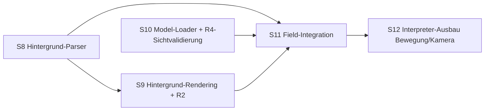

# WebMidgar — Fortsetzungs-Roadmap S8–S12

Fortschreibung der Masterplan-Roadmap (S1–S7 ✅ abgeschlossen, siehe
[WEBMIDGAR-MASTERPLAN.md](WEBMIDGAR-MASTERPLAN.md)). Gleiche Regeln: Golden
Fixtures immer selbst erzeugt, Originaldaten nur lokal beim Nutzer
(Diagnose-Scan, aggregierte Reports), 🟡-Markierungen vor der jeweiligen
Session auflösen oder als Restrisiko dokumentieren. **Methodik-Standard seit
S7: Realdaten-Strukturproben VOR Parserbau** (Formatfakten statt Annahmen).

**Stand 2026-08-09:** S8 ✅ · S9 ✅ · S10 ✅ (Parserteil; R4-Sichtvalidierung
zieht nach S11 um, weil sie das gerenderte Modell im Field voraussetzt) ·
S11 ✅ (Laufzeit, Determinismus und Field-Wechsel stehen; offen bleiben nur die
Sichtprüfungen) · S12 offen.

## Abhängigkeitsbild

### S8 — Field-Hintergrund-Parser (Sektionen 4 + 9) ✅

| Feld | Inhalt |
|---|---|
| Ziel | `FieldBackground`-NAM: Palettenseiten, Layer, Tile-Records (dst/src/Seite/Palette/Tiefe/Blend/StateGroup), Texturseiten — vollständig geparst und quarantänefähig |
| Voraussetzungen | S2 (Container-Quarantäne), S7-Methodik (Strukturprobe zuerst) |
| Betroffene Module | `packages/formats-field` (sections/palette, sections/background, NAM), `tools/fixture-gen` (Background-Composer), `tools/realdata-scan` (Probe + Sweep) |
| Akzeptanzkriterien | Strukturprobe belegt Marker-/Recordlayout über alle 702 Fields; Roundtrip Writer↔Parser; defekte Layer/Texturseiten degradieren sektionsintern (E-BG-*), Field bleibt begehbar; Realdaten-Sweep ≥ 99 % Parse-Rate mit Accounting-Nachweis |
| Nicht-Ziele | Kein Rendering, kein Atlas-Packing, keine Palettenanimation — nur normalisierte Daten |
| Prompt | „Probe zuerst: Marker/Record-Accounting der Sektionen 4/9 über flevel. Dann Parser gegen Fakten, Composer als unabhängige Zweitimplementierung, Degradierungsmatrix E-BG-*, Realdaten-Sweep." |

### S9 — Hintergrund-Rendering + R2-Kalibrierung ✅

| Feld | Inhalt |
|---|---|
| Ziel | Tiles → wenige Atlanten (≤ 4/Field), Tile-Depth-Komposition im FieldCompositor (S4-Pfad), Layer-/StateGroup-Schaltung als Daten; **R2-Entscheid: FOV-Basis 240 vs. 224 mit echten Kameras + Hintergründen** |
| Voraussetzungen | S4 (Depth-Quads, Letterbox), S8 |
| Betroffene Module | `packages/render-field` (Atlas, Tile-Mesh), `tools/calibration` (R2-Protokoll), `apps/demo` (Field-Viewer: echtes Field lokal laden) |
| Akzeptanzkriterien | Fixture-Field pixelgenau (Golden); echtes Referenz-Field deckungsgleich mit projizierten Walkmesh-Kanten (R2 dokumentiert als 🟢); Tile-Tiefen verdecken 3D-Marker korrekt |
| Nicht-Ziele | Palettenanimations-Effekte, Parallax-Sonderfälle (nur diagnostiziert) |
| Prompt | „Atlas-Packer + Tile-Mesh gegen die S4-Depth-Pipeline; Kalibrierszene mit echtem Field; R2 per Deckungsmessung entscheiden und in CALIBRATION.md fixieren." |
| Ergebnis | Tile-Semantik über 3 Probeniterationen erschlossen (Palette u8@24 **korrigiert**, Textur u8@34, UV-Regel `src2 vor src`, `z` als reiner Sortierschlüssel entlarvt); Abnahme per **Bildkohärenztest** statt Golden-Bild (1,097 gegen 1,189/1,124 der Gegenhypothesen); 1 Atlas je Field statt der erlaubten 4; **R2 = 240** über die bemalte Bildfläche entschieden. Offen geblieben: `layerControl`-Zweck, `flags`-Bits, metrische Eichung von `z` (→ S11) |

### S10 — Model-Loader-Sektion + R4-Sichtvalidierung ✅ (Parserteil)

| Feld | Inhalt |
|---|---|
| Ziel | Field-Sektion 3 parsen (`FieldModelManifest`: Modellcontainer, Animationszuordnung, Skalierung, Licht); echte hrc↔a-Paarungen laden; **R4-Annahmen B1–B8 klären** (Bone-Achse, Eulerorder, Wurzel-Bytes, BGRA) |
| Voraussetzungen | S7, S1 (char.lgp-Index); Strukturprobe Sektion 3 zuerst. **Neu aus S9:** die Tile-Depth-Pipeline steht, aber `z` ist keine Metrik — die Verdeckungsprobe der Figur gehört damit fest zu S11, nicht zu S10 |
| Betroffene Module | `packages/formats-field` (sections/model-loader), `packages/render-actor` (ggf. Konventionskorrekturen), `apps/demo` (Actor-Viewer mit lokalem Realmodell) |
| Akzeptanzkriterien | 702/702 Manifeste geparst, Referenzen in char.lgp auflösbar; ein Referenzmodell steht aufrecht in Idle-Pose (Sichtprüfung + Screenshot); R4-Tabelle vollständig 🟢/korrigiert |
| Nicht-Ziele | Battle-Modelle, Gesichts-/Sonderanimationen (unverändert Post-MVP) |
| Prompt | „Probe Sektion 3, dann Parser + Manifest-NAM; Actor-Viewer lädt lokales Realmodell; B1–B8 einzeln validieren und R4-Notiz fortschreiben." |
| Ergebnis | Grammatik über fünf Probeniterationen erschlossen (702/702 byteexakt); **Referenzen zu 100 % auflösbar** (5454 Modelle, 26.212 Animationen) nach der Korrektur „Animationsname = Stamm + Kennung, Datei = `<stamm>.a`"; Model-Loader-Parser, NAM, codegetrennter Composer und Demoseite stehen. **Nicht erledigt:** die eigentliche Sichtvalidierung von B1–B8 — sie braucht das Modell im gerenderten Field und wandert nach S11. Offen geblieben: Flag hinter dem Modellnamen, `tail`-Restwerte, Aufteilung des 30-B-Blocks |

### S11 — Field-Integration (vertikaler Durchstich) ✅

| Feld | Inhalt |
|---|---|
| Ziel | Ein echtes Field spielbar: Hintergrund + Kamera + Walkmesh + steuerbare Figur + Gateways (Field-Wechsel über Pipeline) + Trigger-Volumen (StateGroup-Schaltung); Interpreter läuft mit (Dialog-Stub als Overlay) |
| Voraussetzungen | S3 (Pipeline/Cache), S5, S6, S8–S10 |
| Betroffene Module | `apps/demo` → `apps/field-viewer` (neue App), `packages/pipeline` (Field-Wechselpfad, Generations-Abbruch scharf), Verdrahtungscode |
| Akzeptanzkriterien | Feld-Rundgang mit Verdeckung (Figur hinter Vordergrund-Tiles); Gateway wechselt das Field < 500 ms warm (NFR aus Masterplan); Snapshot/Resume überlebt Tab-Reload; Determinismus-Digest bei Replay der Eingaben |
| Nicht-Ziele | Menü/Save-UI, Audio, Battle-Übergang (Stub) |
| Prompt | „Vertikaler Durchstich auf 2–3 Referenzfields; Field-Wechsel über die S3-Pipeline; Replay-Digest als Regressionstest der Integration." |
| Ergebnis | **Erfüllt.** `packages/field-runtime` (Fixed-Tick-Sitzung, Dialogbrücke, Snapshot/Restore, Eingabe-Replay, Field-Wechsel) + Demoseite `apps/demo/field.html`. Realdaten: 702 Fields × 240 Takte mit 0 Digest-Abweichungen; Wechselbudget Median 5,1 ms (NFR 500 ms). Field-Wechsel: Zielfield über `maplist` (u16@14, per Rückkantenprobe belegt), Ankunft über das Gegen-Gateway — 510/1095 Kanten exakt platziert, 0 Sofort-Rückfeuern, Rest über den Meshschwerpunkt. Drei Fehler gefunden und behoben: die Sitzung startete den Interpreter nie; ungenutzte Trigger-/Gateway-Slots feuerten als Phantome am Weltursprung; der Gateway-Record war um zwei Bytes verschoben. **Offen:** (a) Verdeckungs-Sichtprüfung der Figur und damit die endgültige K7-Eichung; (b) R4-Sichtprüfungen B1–B8 (Automatisierungsversuch dokumentiert gescheitert) |

### S12 — Interpreter-Ausbau: Entity-/Bewegungs- und Kamera-Ops

| Feld | Inhalt |
|---|---|
| Ziel | Opcode-Kategorien Entity/Bewegung (0xA0-Block: PC/CHAR/VISI/XYZI/MOVE/ANIME…) gegen Solver + Actor; Kamera-Ops als Stufe 2; UNKNOWN-Fault-Rate auf Realdaten deutlich senken (Top-Faults 0xD0/0xC7/0xB3 zuerst) |
| Voraussetzungen | S6 (VM/Scheduler), S11 (sichtbare Wirkung) |
| Betroffene Module | `packages/interpreter` (Opcode-Tabelle, Movement-WaitState an Solver-Aufträge), `packages/render-actor` (Animationskommandos), R1-Notiz (A1–A9 validieren) |
| Akzeptanzkriterien | Referenzfield-Intro läuft sichtbar korrekt (Entitäten erscheinen, laufen, drehen); Fixture-Sollverläufe je neuem Op; Realdaten-Fault-Rate < 20 % der Kontexte; Replay bitidentisch |
| Nicht-Ziele | Battle-/Menü-/Audio-Ops (bleiben Stubs mit Länge) |
| Prompt | „Skip-Tabelle zu Semantik erheben: erst Bewegungskette (REQ→MOVE→Solver→waitState movement), dann Kamera; jede neue Kategorie mit Fixture-Sollverlauf + Realdaten-Fault-Statistik vorher/nachher." |

---

---

*Anschluss: [ROADMAP-S13-S19.md](ROADMAP-S13-S19.md) führt den Bogen von hier
aus weiter (Dialoge, Persistenz, Audio, Story-Kern, App-Shell, Modding-MVP),
danach [ROADMAP-S20-S26.md](ROADMAP-S20-S26.md) (Härtung, Menü, Modding II,
Audio-Feinsemantik, Save/Load-UX, 1.0). Achtung, dort notiert: Die Dokumente
entstanden, während frühere Sessions liefen, und referenzieren Soll-Ergebnisse
— vor Sessionstart den Ist-Stand gegenprüfen.*

*Reihenfolge-Empfehlung: S8 → S9 → S10 → S11 → S12. S8/S10 sind
parallelisierbar; S11 braucht beide.*

*Paralleler Strang: Die Modding-Suite (WebMidgar Studio, Sessions MS1–MS8) ist
in [MODDING-SUITE-MASTERPLAN.md](MODDING-SUITE-MASTERPLAN.md) spezifiziert;
MS1–MS3 sind ab S6-Bestand startbar, MS4+ koppeln an S9–S12.*
