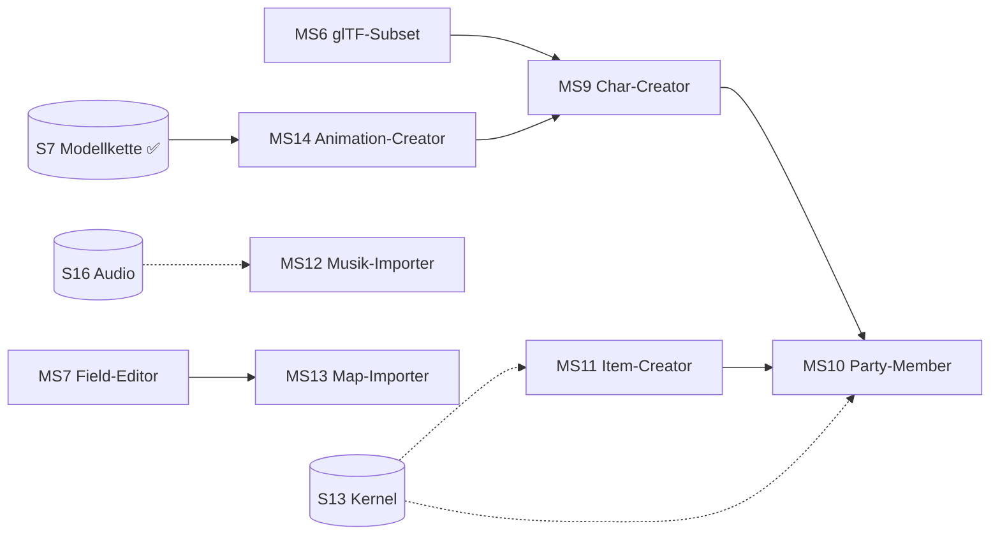

# WebMidgar Studio — Feature-Roadmap MS9–MS14 (Creator-Erweiterungen)

**Status:** Planungsdokument (Vorschlag), Branch `modding-suite`.
**Rolle:** Fortschreibung von [MODDING-SUITE-MASTERPLAN.md](MODDING-SUITE-MASTERPLAN.md)
(Roadmap MS1–MS8) um sechs Creator-Features. Verbindliche Grundlage bleiben
[STUDIO-ANNAHMEN.md](STUDIO-ANNAHMEN.md); dieses Dokument ergänzt sie um die
Annahmen A-ST-10 bis A-ST-15.
**Aussagenklassen** wie gehabt: 🟢 Formatfakt · 🔵 Architekturentscheidung ·
🟡 Annahme/`Zu validieren` · 🔴 Offene Forschungsfrage.

**Einordnung:** Alle sechs Features folgen dem Studio-Grundsatz — Modder sehen
nie Binärformate. Und alle sechs hängen an Engine-Zukunft (S13 Kernel, S16 Audio,
Battle-Modul, Menü-Modul): Die Suite erzeugt **deklarative Dokumente**, deren
Wirkung mit dem jeweiligen Engine-Meilenstein scharf geschaltet wird. Bis dahin
sind sie im Studio vollständig **baubar, validierbar und paketierbar** — die
Capability-Deklaration trägt den Engine-Stand sichtbar ein (Muster „gesperrt,
aber designed", vgl. A-ST-5).

---

## Übersicht

| # | Feature | Kernidee | Neue Dokumente | Manifest-Erweiterung (v3-Kandidaten) | Engine-Anker |
|---|---|---|---|---|---|
| MS9 | **Char-Creator** (Baukasten) | Figuren aus tauschbaren Körperteil-Slots zusammenbauen (Bethesda-Stil) | `characters/*.json` → `modell.art: 'baukasten'` | `model-compose` | S7 🟢, MS6 glTF, A-ST-10 |
| MS10 | **Party-Member-Creator** | Charakter wird spielbar: Werte, Wachstum, Limits, Ausrüstung | `party/<id>.json` | `party-member-add`, `kernel-patch` | S13/S14, Menü-Modul, Battle 🔴 |
| MS11 | **Item-Creator** | Items mit Field-/Battle-Typologie und Effekt-Taxonomie | `items/<id>.json` | `item-add` (+ `kernel-patch`) | S13 🟡, Battle 🔴 |
| MS12 | **Musik-Importer** | Nutzer-Audio mit Loop-Punkten, Feld-/Script-Zuordnung | `music/<id>.json` + Asset | `music-override`, `music-add` | S16 🟡 |
| MS13 | **Map-Importer** | Wizard: Bild → Tiefen-/Layermaske → Walkmesh-Vorschlag → Field | erzeugt `fields/*.json` | — (nutzt `field-add`) | S9/S11, MS7 |
| MS14 | **Animation-Creator** | Keyframe-Editor auf dem NAM-Skelett, Clips als Dokumente | `animations/<id>.json` | `animation-add` | S7/R4 🟢, MS6 |



---

## MS9 — Char-Creator (Bethesda-Stil-Baukasten)

**Vision:** Eine neue Figur entsteht nicht „am Stück", sondern aus **Slots**:
Kopf/Frisur, Torso, Arme, Beine, Accessoires (z. B. Schulterplatten, Umhang,
Kopfbedeckung). Wie bei Bethesda: Teile wählen, Farben variieren, sofort sehen.
Der Clou von WebMidgar: Der Baukasten kennt **zwei Teile-Quellen**.

### Teile-Quellen

| Quelle | Mechanik | Rechtsrahmen | Status |
|---|---|---|---|
| **Referenz-Baukasten** | Das Studio indiziert die lokalen Originalmodelle und zerlegt sie *logisch* in Slot-Teile; das Projekt speichert nur Referenzen `lgp:char/<id>#teil:<slot>` | Rein referenziell (B.7-konform): Kein Originalbyte im Paket; die Engine komponiert beim Import aus dem Originalindex | 🔵 MVP-Pfad, braucht A-ST-10 |
| **Nutzer-Teile** | Eigene Meshes per glTF-Subset (MS6) einem Slot zuordnen | Nutzerasset aus `assets/` | 🟡 mit MS6 |

### A-ST-10 — Engine komponiert Modelle aus Teilen 🟡

Annahme: Die Engine erhält eine Kompositionsstufe, die ein `model-compose`-Manifest
(`{skelettRef, teile: {slot → lgp:-Referenz | asset}, paletten?}`) zur Laufzeit zu
einem NAM-`Skeleton`/`MeshSource` zusammensetzt. Grundlage ist S7-Bestand
(Index-Flattening, Bindpose); neu ist lediglich das **Zusammensetzen über
Teil-Grenzen mit Kompatibilitätsregeln** (gleiche Skelett-Topologie je
Proportionsklasse). *Ersetzungspfad:* sobald `model-compose` engine-seitig
existiert, wird der Studio-Validator dagegen geschaltet.

### Fachregeln

- 🔵 **Proportionsklassen:** Field-Chibi und Battle-Realistic sind getrennte
  Skelett-Familien; Teile sind nur innerhalb einer Klasse kombinierbar
  (topologyHash-Regel der Runtime, keine Ausnahme).
- 🔵 **Slot-Schema ist fix:** `{kopf, frisur, torso, arm_l, arm_r, beine, acc1, acc2}`.
  Accessoire-Slots tragen eine Knochen-Anker-Referenz (z. B. `knochen: kopf`).
- 🟡 **Teil-Indexierung Original:** Heuristik über hrc-Knochengruppen
  (Submesh→Knochen-Zuordnung ist S7-Bestand); Grenzfälle (überlappende
  Verteiler-Meshes) werden als „nicht zerlegbar" markiert statt geraten.
- Palette/Textur-Varianten je Teil = `texture-override` (MS5-Bestand).

### UI/UX (`#/charaktere` → neuer Tab „Baukasten")

- **Slot-Leiste links:** vertikale Slot-Karten (Bethesda-Anmutung), jede mit
  Teil-Thumbnail, Quelle-Badge (`lgp:`-Ref = Engine-Blau, Nutzerasset = Mako),
  Kompatibilitäts-Punkt.
- **Mitte:** Actor-Viewer (Platzhalter bis A-ST-7, dann echte Vorschau);
  „Zufällig"-Würfel, Vor-/Zurück je Slot (Pfeil-Stepper wie bei Bethesda).
- **Rechts:** Teil-Browser mit Filtern (Proportionsklasse, Quelle, Suchfeld);
  Kartenraster mit Silhouetten-Thumbnails.
- **Unten:** Befundzeile: inkompatible Teile (Topology-Mismatch), fehlende
  Pflichtslots, „nicht zerlegbares" Originalteil.
- Kompiliert zu: `entities[]` + `model-compose`-Record + ggf. `texture-override`.

### Akzeptanz (Zielbild)

NPC „Lina" neu gebaut: Kopf+Torso aus je zwei Originalreferenzen, Umhang als
Nutzer-glTF, Palette gerostet — kompiliert, validiert, im Paket nur Referenzen
+ ein Nutzerasset. Audit zeigt Herkunft je Teil.

---

## MS10 — Party-Member-Creator

**Vision:** Ein Studio-Charakter wird **spielbar**: tritt der Party bei
(per Script), erscheint im Menü, hat Werte, Wachstum, Limits und Ausrüstung.

### Realismus-Staffelung (bewusst zweistufig)

| Stufe | Umfang | Engine-Voraussetzung |
|---|---|---|
| **P1 — Field-Party** 🟡 | Party-Beitritt/Entfernung per Script-Op (Kategorie Spezial — derzeit gesperrt, Freigabe mit der Party-Opcode-Semantik), Folge-Verhalten im Field, Dialoge mit Platzhalter-Name `{PARTY[x]}` | Party-Ops + S14-Savemap |
| **P2 — Vollwertig** 🔴 | Menü-Portrait, Statuswerte, Level-/Wachstumskurven, Limit-Breaks, Waffen-/Rüstungs-Kompatibilität, Battle-Modell | S13-Kernel, Menü-Modul (S20+), Battle-Modul (offen) |

Das Studio-Dokument deckt **beide** Stufen ab; P2-Daten werden heute schon
validiert und paketiert — ihre Aktivierung deklariert das Manifest als
`engineCompat`-Bedarf (Muster „schema-bekannt, aktivierungs-verweigert", vgl. S19).

### Dokument `party/<id>.json`

```text
{schemaVersion, charRef (mod:/lgp:-ID), identitaet {name, portraitAsset?},
 kampfwerte {basis {hp, mp, staerke, …}, wachstum {kurvenTyp | tabelle}},
 limits [{name, freischaltStufe, effekt (Effekt-Taxonomie aus MS11)}],
 ausruestung {kompatibel: itemRefs[], start: itemRefs[]},
 party {beitrittsSlot: auto|fest, battleModellRef?}}
```

### UI/UX

- **Identitätskarte:** Portrait-Upload (Nutzer-PNG, Provenienz user-asset),
  Name mit FF-Zeichensatz-Validierung (S13-Zeichentabelle — dieselbe wie Dialog-Editor).
- **Werte-Editor:** Kurven-Editor (Spline über Level 1–99, Presets „Krieger/
  Magier/Support"), Live-Graph; Basiswerte-Slider mit Budget-Hinweisen
  (Orientierung an Kernel-Startwertebereichen, S13 🟡).
- **Limit-Designer:** Liste mit Freischaltstufen, Effekt über die geschlossene
  Effekt-Taxonomie (MS11) — kein Freitext, ADR-007-konform.
- **Kompatibilitätsmatrix:** Zeilen = eigene Items (MS11) + referenzierte
  Original-Items (`kernel:item/<id>` 🔵 Referenzpfad), Häkchen-Grid.
- Befunde: Kurve monoton?, Limit-Stufen erreichbar?, Start-Item existiert?,
  Portrait im Budget?

### A-ST-11 — Kernel-Überschreibung als deklarativer Record 🟡

Party-Daten landen im Kernel-Adressraum (S13-Sektionen 4–9). Annahme: Manifest v3
erhält `kernel-patch`-Records (gleiche Disziplin wie `patches[]`: Anker +
guardHash + deklarative Payload), und die Engine schreibt sie beim Import in ihre
Kernel-NAM-Schicht — nie in Originaldateien. 🔴 Schnittstelle Battle-Modul
(Effekt-Ids, Limit-Auflösung) bleibt bis zum Battle-Modul eine Stub-Validierung.

---

## MS11 — Item-Creator

**Vision:** Items mit klarer **Typologie-Weiche Field ↔ Battle** und einer
geschlossenen, deklarativen Effekt-Taxonomie.

### Typologie

| Typ | Wirkbereich | Anpassungen |
|---|---|---|
| **Verbrauchbar** | Menü (Field) **und/oder** Battle — Flag `nutzbarIn: [field, battle]` | Ziel (einzeln/Gruppe/Party), Effekt(e) aus Taxonomie, Menge-Limit |
| **Schlüsselitem** | Field/Script | kein Effekt; Script prüft Besitz über Inventar-Ops (Kategorie Variablen/Flags 🟢); Quest-Verknüpfung sichtbar |
| **Waffe / Rüstung / Accessoire** | Ausrüstung (P2/Battle) | Werte-Mods (Angriff/Abwehr/Element/Status-Resistenz), Kompatibilität ↔ MS10, Materia-Slots 🟡 (Materia-System ist Engine-Zukunft — Slot-Anzahl heute schon modellierbar) |

### Effekt-Taxonomie (deklarativ, kein Code — ADR-007)

Geschlossene Record-Liste, von Battle- und Menüpfad geteilt:
`{art: heil_hp|heil_mp|schaden|buff|debuff|status_setzen|status_heilen,
ziel: wahl_einzeln|wahl_gruppe|party|selbst, staerke: fest|prozent,
element?: …, status?: …, trefferquote?: …}`.
🔴 Finale Ausprägung hängt am Battle-Modul; die Taxonomie wird als eigenes
versioniertes Schema geführt (wie glTF-Subset, MS6-Regel) — die Engine
verweigert unbekannte Einträge mit Diagnose.

### UI/UX

- **Typ-Wähler als erste Karte** (4 Kacheln: Verbrauchbar / Schlüssel / Waffe /
  Rüstung+Accessoire) — danach adaptiert sich das gesamte Formular
  (feldspezifische vs. Battle-spezifische Sektionen mit Erklär-Tooltips,
  warum welche Felder (nicht) gelten).
- **Field/Battle-Schalter** bei Verbrauchbaren: zwei Checkboxen mit Live-
  Konsequenz (nur Battle → Menü-Hinweis „im Field nicht nutzbar"; nur Field →
  Battle-Werte ausgegraut).
- **Effekt-Baukasten:** Zeilen „WENN Ziel DANN Effekt" mit Dropdowns aus der
  Taxonomie, Stärke-Stepper, Vorschau-Karte („Stellt 25 % HP bei einem Ziel
  wieder her — nutzbar im Menü und im Kampf").
- **Icon & Texte:** Icon-Upload (Nutzer-PNG, Budget-Prüfung), Name/Kurztext/
  Beschreibung mit FF-Zeichensatz-Validierung + Längenmetrik (S13/S15-Anker).
- **Preis/Verkauf:** Gil-Felder, Shop-Verfügbarkeit als Referenzliste
  (Shop-System = Engine-Zukunft, deklarativ vorgesehen).
- Kompiliert zu `items[]` (v3) bzw. `kernel-patch` für Sektions-Records.

---

## MS12 — Musik-Importer

**Vision:** Eigene Musik ins Spiel: importieren, Loop setzen, zuordnen — fertig.

### A-ST-12 — Audio-Pfad der Engine wie in S16 geplant 🟡

S16 bringt `packages/audio` (WebAudio, sample-exakte Loops, OGG-Vorbis-Tags
LOOPSTART/LOOPLENGTH 🟢) und das 🔴 Musikindex→Dateiname-Mapping. Der
Musik-Importer setzt genau darauf: Nutzer-Audio (mp3/ogg/wav) wird **clientseitig**
zu OGG-Vorbis mit sauberen Loop-Tags konvertiert (WebAudio-Offline-Render +
Vorbis-Encoder; 🟡 Encoder-Wahl validieren, Fallback: unkomprimiert PCM-OGG) und
als `music`-Asset paketiert. Override-Ziele sind referenzierte Original-Tracks
(`music:<feldId>` bzw. Index, sobald S16 das Mapping geklärt hat — bis dahin
nur Feld-Zuordnung, kein Index-Override).

### Fachregeln

- 🔵 Loop-Metadaten sind Pflichtbestand des `music/<id>.json`-Dokuments:
  `{loopStart, loopLength}` in Samples, oder `modus: ganzer-titel` (definierte
  Fallback-Politik aus S16 übernehmen).
- 🔵 Zuordnung zweigleisig: **Feld-Musik** (Eintrag im Field-Dokument) und
  **Script-Musik** (Knoten „Musikwechsel" — Audio-Kategorie wird mit S16
  entsperrt, A-ST-5-Tabelle wandert).
- Lautstärke/Fade-Regeln: deklarativ (`fadeMs`), deterministische Engine-
  Kommandos (S16-Design).
- Provenienz: Nutzerasset; Hash-Schleuse gilt (kein geripptes Original-Audio).

### UI/UX

- **Wellenform-Editor:** Zoom, Loop-Start/Ende-Marker mit Abhören der
  Nahtstelle (±2 s), „Loop-Test" (3 Zyklen), Pegel-Anzeige, Fade-Editor.
- **Zuordnungs-Tabelle:** Zeilen = Fields (Mod + referenzierte Original-Fields),
  Spalten = Haupttrack/Kampftrack 🟡; Script-Knoten-Verwendungen als Chips.
- Importliste mit Dauer/Format/Budget, Konvertierungs-Fortschritt im Worker
  (Pipeline-NFR gilt).

---

## MS13 — Map-Importer (neue Fields)

**Vision:** Der schnellste Weg zu einem neuen Field: ein gerendertes/gezeichnetes
Bild importieren und in drei Schritten zum begehbaren Field.

### Wizard (3 Schritte, dann Landing im Field-Editor MS7)

1. **Bild & Ebenen:** Hintergrund-PNG importieren (Budget/Seitenverhältnis-
   Prüfung), optionale Vordergrund-Ebene; Ebenen werden zur Tiefen-/Layermaske-
   Quelle (ADR-005-Pipeline wird gefüttert, nicht umgangen).
2. **Tiefe & Begehbarkeit:** Freiform-Maskenmalen (🟡 Ergonomie-Entscheid aus
   C.4 — der Importer nutzt Freiform+Quantisierung und liefert damit die
   Datengrundlage für den MS7-Prototypen), Tiefenwert-Pins für Problemzonen.
3. **Walkmesh-Vorschlag + Kamera:** 🔵 Aus der Begehbarkeits-Maske wird ein
   Dreiecksnetz **deterministisch vorgeschlagen** (Konturextraktion →
   Constraint-Triangulierung mit minimaler Dreieckszahl; Löcher bleiben Löcher)
   — neues Paket `packages/walkmesh-gen`, Node-testbar, Property: Ausgabe
   verletzt nie die S5-Invarianten (Adjazenzsymmetrie, keine degenerierten
   Dreiecke). Kamerapose: 3/4-Startvorschlag + manuelle Korrektur im Viewport.

Alles Vorgeschlagene bleibt **voll editierbar** — der Importer ist Assistent,
kein Generator-Zwang. Gateways zu Bestands-Fields werden direkt im Anschluss
verdrahtet (MS7-Bestand).

### Nicht-Ziele

- Kein 3D-Szenen-Bake (glTF → Pre-Render) — bewusst Post-MVP (Render-Disziplin
  gehört ins DCC, nicht ins Studio).
- Kein Import fremder/Original-Fields (Rechtsrahmen; Delta-Editing bleibt der
  einzige Original-Pfad).

---

## MS14 — Animation-Creator

**Vision:** Eigene Animationen für Baukasten-Figuren und importierte Modelle —
als Keyframe-Dokumente auf dem NAM-Skelett, validiert gegen `topologyHash`.

### Fachbasis 🟢 (S7-Bestand)

`.a`-Winkelkodierung und Bone-Adressierung sind realdaten-validiert (R4
geschlossen); `packages/formats-model` liefert Skeleton/Clip-NAM. FF7-Field-
Animationen sind **rotationsdominant pro Frame** (plus Wurzeltranslation) —
das hält den Editor klein: Kanäle = Rotation je Knochen + Wurzel-XYZ.

### Editor-Regeln

- 🔵 **FK-only im MVP** (kein IK-Solver); Posen als Keyframes auf einer
  Timeline mit fester Frame-Basis (Kalibrierwert aus S7, 🟡 mit S12
  final abgleichen).
- 🔵 Clips sind Dokumente `animations/<id>.json` (Keyframes, Interpolationsart
  step|linear, Loop-Flag, Ereignis-Marker 🟡 z. B. „Fußkontakt" für SFX/Trigger).
- 🔵 Skelett-Bindung per `topologyHash`: Ein Clip ist an eine Skelett-Familie
  gebunden; Zuordnung zu inkompatiblen Modellen wird vom Compiler verweigert
  (MS5-Regel, hier verschärft: schon im Editor blockiert).
- Pose-Bibliothek (T-Pose, Stehen, Gehen-Start) als Projekt-Vorlagen;
  Kopieren/Spiegeln von Posen (L/R-Tausch über Bone-Namenskonvention).

### UI/UX

- **Links:** Bone-Baum (hrc-Hierarchie, Sperr-/Solo-Toggles).
- **Mitte:** Actor-Viewer (Platzhalter bis A-ST-7; danach echte Wiedergabe mit
  Onion-Skinning), Scrub-Leiste, Loop-Bereich.
- **Unten:** Dope-Sheet (Keyframe-Rauten je Kanal, Drag zum Verschieben,
  Box-Select), Ereignis-Spur.
- **Rechts:** Kanal-Inspektor (Winkel in Grad, Mono), Interpolations-Wahl,
  Ereignis-Editor.
- Kompiliert zu `animation-add`-Records (v3) bzw. Clip-Anhang der Character-
  Dokumente; Roundtrip-Test: Clip → NAM → Re-Import = identisch (Digest).

---

## Manifest v3 (Kandidaten-Register)

| Capability | Record | Feature | Aktivierung |
|---|---|---|---|
| `model-compose` | `compositions[]` | MS9 | A-ST-10-Engine-Stufe |
| `party-member-add` | `party[]` | MS10 | P1 mit Party-Ops; P2 mit Battle/Menü |
| `item-add` | `items[]` | MS11 | Field-Sofort (Schlüssel/Verbrauchbar-Menü); Battle-Effekte mit Modul |
| `kernel-patch` | `kernelPatches[]` (Anker+guardHash) | MS10/MS11 | S13/S14-Importpfad |
| `music-override` / `music-add` | `music[]` | MS12 | S16 |
| `animation-add` | `animations[]` | MS14 | mit MS6/MS9-Modellen |
| (`field-add`, `entity-add`, …) | unverändert aus v2 | MS13 nutzt Bestand | 🟢 |

Wie v2 gilt: Capability wird **abgeleitet**, nie gepflegt; Engine liest n und
n−1 (Migrationsregel 5.3); nicht aktivierbare Capabilities werden
schema-bekannt verweigert (S19-Muster).

## ADR-Vorschläge (Fortschreibung)

| ADR | Entscheidung | Alternativen | Konsequenzen | Status |
|---|---|---|---|---|
| ADR-019 | Char-Baukasten referenziert Original-Teile (`#teil:<slot>`); Komposition engine-seitig | Teile clientseitig backen und als Asset paketieren | Rechtsrahmen bleibt sauber; Pakete klein; Engine-Komplexität +1 Stufe | Vorgeschlagen |
| ADR-020 | Item-/Party-/Limit-Effekte über geschlossene Effekt-Taxonomie (versioniertes Schema) | Freie Parameterlisten; Skript-DSL | Unvalidierbares bleibt unausdrückbar; Battle-Modul erhält feste Schnittstelle | Vorgeschlagen |
| ADR-021 | Musik wird clientseitig zu OGG+Loop-Tags konvertiert und als Nutzerasset paketiert | Referenz auf externe URLs; PCM-Roh im Paket | Offline-Pakete, Provenienz prüfbar; Encoder-Abhängigkeit 🟡 | Vorgeschlagen |
| ADR-022 | Walkmesh-Vorschlag als deterministischer Algorithmus (`walkmesh-gen`), manuell korrigierbar | KI-/Heuristik-Schätzung ohne Garantien; rein manuelles Zeichnen | S5-Invarianten strukturell sicher; Assistent statt Blackbox | Vorgeschlagen |
| ADR-023 | Animationen als Keyframe-Dokumente (FK-only, topologyHash-gebunden) | IK-Tooling; prozedurale Animation | MVP-Umfang klein; R4-Fakten direkt nutzbar | Vorgeschlagen |

## Risiken (Neuzugänge)

| Prio | Risiko | Auswirkung | Verifikation | Frist |
|---|---|---|---|---|
| P0 | RS7: Battle-Modul-Fernabhängigkeit (Items/P2-Party/Limits) lässt Features „halbfertig" wirken | Frustration | UI zeigt Aktivierungsstand ehrlich (gesperrt-Muster); Fallstudie „Field-Party + Schlüsselitem-Quest" ohne Battle spielbar machen | MS8 |
| P1 | RS8: Original-Teile-Zerlegung (hrc) ungenau bei Verteiler-Meshes | Baukasten-Lücken | „Nicht zerlegbar"-Markierung + Quote im Realdaten-Scan messen | MS9 |
| P1 | RS9: OGG-Encoder-Qualität/Loop-Präzision im Browser | Hörbare Loop-Sprünge | S16-Akzeptanz (3 Zyklen ohne Sprung) auf Studio-Konvertierung ausweiten; Fallback PCM-OGG | MS12 |
| P2 | RS10: Freiform-Tiefenmalen überfordert Autoren (C.4-🟡) | Schlechte Verdeckung | Importer liefert Messdaten für den MS7-Ergonomie-Prototypen | MS13 |
| P2 | RS11: Feature-Scope explodiert (6 Editoren parallel) | Roadmap-Drift | Strikte Staffelung MS9→MS14 gemäß Abhängigkeitsgraph; kein Feature ohne Engine-Anker | laufend |

*Reihenfolge-Empfehlung: MS9 → (MS11 ∥ MS14) → MS10 → (MS12 ∥ MS13). MS9 und
MS14 stützen sich gegenseitig (Baukasten braucht Clips, Clips brauchen Skelette);
MS10 konsumiert MS9+MS11; MS12/MS13 sind unabhängig startbar, sobald S16 bzw.
MS7 steht. Alle 🔴-Kopplungen (Battle, Menü) bleiben Stub-validiert und sichtbar
gesperrt — nie still geraten.*

## Weitere Annahmen im Überblick (Fortsetzung von STUDIO-ANNAHMEN.md)

| # | Annahme | Feature | Ersetzungspfad |
|---|---|---|---|
| A-ST-13 | `packages/walkmesh-gen` kann Begehbarkeits-Masken deterministisch in S5-invariante Dreiecksnetze überführen (Kontur → Constraint-Triangulierung) 🟡 | MS13 | Property-Tests gegen S5-Invarianten; Autoren-Prototyp C.4 |
| A-ST-14 | Animations-Frame-Basis und Interpolationsart (step/linear) folgen dem S7-Kalibrierstand; finale Abgleichwerte kommen mit S12 🟡 | MS14 | S12-Kalibrierung; Digest-Roundtrip `.a`-NAM |
| A-ST-15 | Party-Opcode-Semantik (Beitritt/Entfernung, Menü-Namensplatzhalter `{PARTY[x]}`) wird mit der Spezial-Kategorie spezifiziert; bis dahin ist P1 stub-validiert 🔴 | MS10 | Opcode-Spezifikationsseite Spezial/System (Phase 4.1) |


---

## MS15 — Gegner-Creator

**Vision:** Eigene Gegner für Battle-Begegnungen — Werte, Angriffe, Affinitäten,
Verhalten und Beute deklarativ beschreiben, ohne das Battle-Format zu kennen.

### Realismus-Einordnung 🔴→🟡

Das Battle-Modul ist Engine-Post-MVP; der Kampf-Opcode ist realdaten-seitig
**nicht auffindbar** (S17-Negativbefund). Der Gegner-Creator ist daher das
härteste „gesperrt, aber designed"-Feature der Suite — und profitiert davon,
dass Items (MS11) und die Effekt-Taxonomie bereits spezifiziert sind:
Der Gegner ist im Kern ein **Bündel aus Stats + Effekt-Repertoire + Verhalten +
Beute**, alles deklarativ, alles heute validier- und paketierbar. Aktivierung
folgt dem Battle-Modul (Capability schema-bekannt, Import verweigert mit
Diagnose — S19-Muster).

### Dokument `enemies/<id>.json`

```text
{schemaVersion, id, name (FF-Zeichensatz), beschreibung?,
 modell: {art: referenz | textur-override | baukasten(MS9) | gltf(MS6)},
 stats: {hp, mp, staerke, abwehr, magie, magAbwehr, geschick, glueck, level,
         exp, ap, gil},
 affinitaeten: {elemente: {feuer|eis|blitz|…: schwach|normal|resistent|immun|absorbiert},
                statusImmunitaeten: [...]},
 angriffe: [{id, name, effekt (Effekt-Taxonomie MS11/ADR-020), kosten?,
             zielregel?}],
 verhalten: {art: 'prioritaeten', regeln: [{wenn: Bedingung, dann: angriffRef,
              gewicht}] } — deklarative KI, kein Code (s. u.),
 beute: {drops: [{itemRef, rate}], stehlen: [{itemRef, rate}], morph?: itemRef},
 formationTags: [...]}
```

### Verhalten als deklarative Prioritätenliste 🔵

Gegner-KI ist **kein** Script (ADR-007 gilt auch hier): eine geordnete
Regelliste `{wenn, dann, gewicht}` über einer geschlossenen Bedingungs-Menge
(`hp_unter: %`, `runde_jede: n`, `ziel_hat_status`, `gruppenmitglieder_unter: n`,
`mp_unter: %`, `immer`). Die Engine wertet deterministisch aus (erste
zutreffende Regel, Tiebreak = Gewicht, feste Seed-Ableitung — Determinismus-
Regel des Interpreters greift). Unbekannte Bedingungen = Kompilierfehler.

### UI/UX (`#/gegner`)

- **Gegnerliste links** (Demo-Gegner „Rostwolf" + „Mako-Schwarm"), Suchfeld,
  Formation-Tags als Chips.
- **Mitte:** Gegner-Karte mit Modell-Auswahl (gleiche Radio-Karten wie
  Charakter-Editor: Referenz / Textur / Baukasten gesperrt bis MS9 / glTF
  gesperrt bis MS6), Stats-Sliders mit Budget-Balken (Orientierung:
  Original-Level-Bänder), Elemente-/Status-Matrix als 5-Zustände-Cycler
  (schwach → normal → resistent → immun → absorbiert, Klick schaltet durch).
- **Angriffe:** Kartenliste mit Effekt-Baukasten aus MS11 (Ziel, Stärke,
  Element, Status), Kosten, Vorschauzeile („Fügt einem Ziel 1,2× Stärke-
  Feuerschaden zu, 30 % Chance auf ‚Blind'").
- **Verhalten:** Prioritätenliste als Drag-Zeilen („WENN HP < 25 % DANN
  ‚Heulen' sonst ‚Biss'"), Bedingungs-Autocomplete, toter-Regel-Warnung
  (unerreichbare Regeln hinter „immer" — Live-Befund).
- **Beute:** Drops/Stehlen/Morph mit Raten-Slidern, Item-Autocomplete
  (eigene MS11-Items + referenzierte Original-Items `kernel:item/<id>`).
- Befundzeile: Stats außerhalb Band, toter Drop-Item-Ref, leere Angriffsliste.

## MS16 — Battle-Creator

**Vision:** Begegnungen zusammenstellen: Formation, Arena, Regeln, Belohnung —
und sie an Encounter-Zonen von Fields hängen.

### Dokument `battles/<id>.json`

```text
{schemaVersion, id, name,
 arena: {art: referenz (field:<id>/battle-arena 🔵 Referenzpfad) | nutzerbild (asset)},
 formation: {reihen: [{enemyRef, anzahl, position {x, z}, flags?}],
              maxGleichzeitig},
 regeln: {flucht: erlaubt|verboten|bedingt, hinterhalt?: keiner|moeglich|garantiert,
          siegbedingung: alle-besiegt (MVP, geschlossen)},
 musikRef?: music:<id> (MS12),
 belohnung: {expMod?, apMod?, gilMod?, garantierteDrops?: [{itemRef}]},
 verknuepfung: {feldRef, encounterZone} | scriptStart (Script-Knoten „Kampf starten")}
```

### A-ST-16 — Battle-Szenen sind deklarative Datenbündel 🟡

Annahme: Das künftige Battle-Modul liest `battles[]`-Records (v3) als
vollständige Begegnungsbeschreibung; Arena-Bilder folgen der
Hintergrund-Pipeline (ADR-005-Nachbarschaft), Formationen sind 2D-Positionen
auf einer normalisierten Arena-Grundfläche. Bis zum Modul: Stub-Validierung
(Struktur + Referenzen + Budgets), Aktivierung verweigert (S19-Muster).
🔴 Offen: Hinterhalt-/Flucht-Feinsemantik, Battle-Opcode-Rückkehrvertrag
(ADR-011-Nachfolger).

### UI/UX (`#/schlacht`)

- **Schlachtliste links** (Demo-Szene „Slum-Hinterhof ×3"), Arena-Badge.
- **Arena-Canvas Mitte:** stilisierte Draufsicht der Arena-Grundfläche;
  Gegner-Marker per Drag aus der Gegner-Palette platzieren (Position x/z Mono),
  Reihen-Gruppierung, Hinterhalt-Preview (Spielerseite spiegeln).
- **Rechts Inspektor:** Regeln (Flucht-Select, Siegbedingung gesperrt „alle
  besiegt"), Musik (MS12-Autocomplete, sonst Platzhalter-Chip), Belohnung mit
  Summen-Vorschau (EXP/AP/Gil aus Gegner-Stats × Modifikatoren live berechnet),
  garantierte Drops.
- **Verknüpfung:** Encounter-Zonen-Karte (referenzierte Original-Fields +
  Mod-Fields), Zonen-Zuordnung per Dropdown; alternativ Script-Start
  (Battle-Knoten im Quest-Editor referenziert diese Szene — Verweis-Chip).
- **Kampfablauf-Simulation (heuristisch):** „Probekampf"-Panel mit
  Rundenablauf als Daten-Timeline (keine Engine! klar markierte
  Heuristik-Vorschau: Verhaltensregeln + Stats → wahrscheinlicher Ablauf,
  deterministisch gerechnet) — dient dem Balancing-Feeling, trägt
  „Vorschau ohne Gewähr"-Badge (A-ST-17).
- Befundzeile: Formation leer, Arena ungültig, Flucht verboten + kein
  garantierter Drop-Hinweis, toter itemRef/musicRef.

### A-ST-17 — Probekampf ist Heuristik, nie Engine 🟡

Die Probekampf-Vorschau simuliert **nicht** das künftige Battle-Modul, sondern
rechnet einen deterministischen Erwartungsablauf aus den deklaraten Dokumenten
(Stats, Effekt-Taxonomie, Verhaltensregeln). Sie wird im UI sichtbar als
Heuristik markiert und erscheint nicht im Paket. *Ersetzungspfad:* echtes
Preview-Panel (A-ST-7) mit Battle-Modul.

## Ergänzungen: Manifest v3, ADR, Risiken

| Capability | Record | Feature | Aktivierung |
|---|---|---|---|
| `enemy-add` | `enemies[]` | MS15 | Battle-Modul |
| `battle-add` | `battles[]` | MS16 | Battle-Modul |

| ADR | Entscheidung | Status |
|---|---|---|
| ADR-024 | Gegner-KI als deklarative Prioritätenliste über geschlossener Bedingungs-Menge; kein Script-Pfad | Vorgeschlagen |
| ADR-025 | Battle-Szenen als reine Datenbünde (Formation/Regeln/Belohnung); Arena-Bilder über die Hintergrund-Asset-Pipeline; Probekampf nur als markierte Heuristik | Vorgeschlagen |

| Prio | Risiko | Verifikation | Frist |
|---|---|---|---|
| P1 | RS12: Battle-Modul bleibt lange 🔴 → MS15/MS16 wirken ungreifbar | Ehrliche Aktivierungs-Badges; Fallstudie „Gegner+Szene paketiert, Import verweigert mit klarer Diagnose" als Akzeptanztest | MS16 |
| P2 | RS13: Effekt-Taxonomie passt nicht zum späteren Battle-Modul | Taxonomie als versioniertes Schema (MS11-Regel); Migrationspfad dokumentieren | Battle-Modul |

## UI-Vereinfachung (MS17, querschnittlich)

🔵 **Progressive Disclosure als Systemregel:** Die Studio-UI erhält einen
globalen **„Einfach/Profi"-Modus** (persistiert, Default: Einfach). Einfach
blendet Profi-Elemente aus (sichtbar markiert über `data-profi`-Attribute,
CSS-gesteuert, keine Funktion entfernt): Mono-Rohwerte, guardHash-Details,
Operanden-Rohform, Befund-Technikspalten, zweite Werkzeugreihen. Zusätzlich:
**Wizard-first** für alle Erzeugungsflüsse (Neuer Dialog / Neuer NPC /
Neues Field / Neuer Gegner / Neue Schlacht als 3-Schritte-Assistenten mit
sinnvollen Defaults), **Schnellaktions-Leiste** auf Home, konsistente
Primäraktion je Editor (genau eine Mako-CTA pro Ansicht). Profi-Modus =
bisherige UI unverändert. Akzeptanz: Jede Funktion ist in ≤ 1 Klick vom
Einfach-Modus aus erreichbar (Umschalter in TopBar + „Profi-Optionen"-
Disclosure je Panel), kein Feature-Verlust — verifiziert per UI-Audit-Liste
aller Aktionen.
