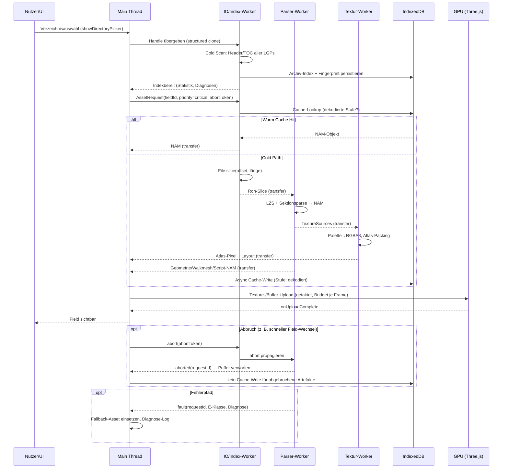
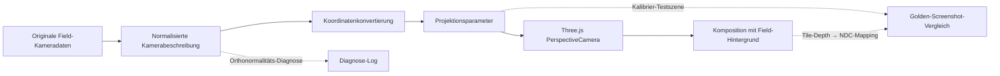
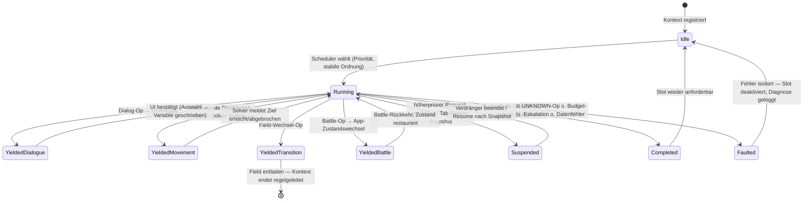
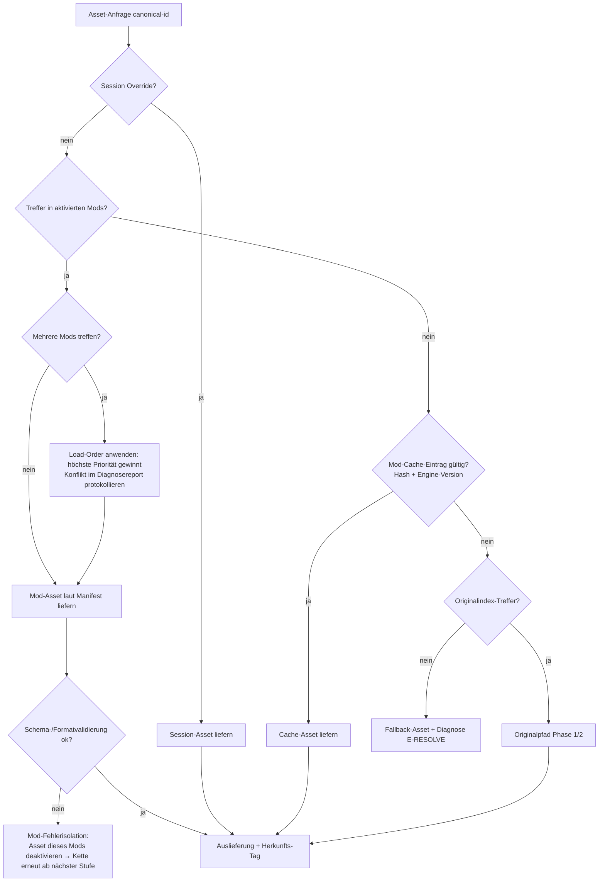

# WebMidgar — Technischer Masterplan

**Projekt:** Clean-Room-Reimplementierung der technischen Laufzeitumgebung von *Final Fantasy VII (PC, 1998)* im Browser.
**Rolle dieses Dokuments:** Verbindliche Architekturreferenz für alle Folgesessions. Kein Anwendungscode; ausschließlich Architektur, Verträge, Schemata, Entscheidungslogik und Validierungsstrategie.
**Rechtsrahmen:** Es werden keine Originalassets, Originaldialoge oder Bytecode-Dumps verteilt oder eingebettet. Alle Spieldaten stammen ausschließlich aus einer lokal vom Nutzer bereitgestellten, legal erworbenen Installation und verlassen den Browser nie. Formatwissen stammt aus öffentlich dokumentierter Community-Forschung (Qhimm Wiki, q-gears/ffvii-tools, Makou Reactor, TouphScript) und ist grundsätzlich als **zu verifizierende Referenz** zu behandeln.

**Legende der Aussagenklassen** (durchgängig im Dokument verwendet):

- 🟢 **Formatfakt** — mehrfach unabhängig dokumentiert, gilt als belastbar, wird dennoch durch Golden-Fixture-Tests abgesichert.
- 🔵 **Architekturentscheidung** — von uns getroffen, per ADR begründet, änderbar.
- 🟡 **Annahme / `Zu validieren`** — plausibel, aber versionsabhängig oder nur einfach belegt; muss vor Implementierung gegen echte Daten geprüft werden.
- 🔴 **Offene Forschungsfrage** — derzeit nicht ausreichend dokumentiert; benötigt eigene Untersuchung.

---

# Executive Summary

| Bereich | Zielentscheidung | Begründung | Hauptrisiko | Validierungsmaßnahme |
|---|---|---|---|---|
| Datenzugriff | File System Access API (`showDirectoryPicker`) mit persistierten Handles in IndexedDB; kein Upload, kein Server | Datensparsamkeit, Rechtssicherheit, Offline-Fähigkeit | Berechtigungsverlust zwischen Sessions; fehlende API in Firefox/Safari | Berechtigungs-Lebenszyklus-Testmatrix je Browser; Fallback-Pfad über `<input webkitdirectory>` (Read-once) |
| Archiv-Import | LGP-Archive werden **indexiert, nie vollständig entpackt**; Einträge werden lazy als Byte-Slices gelesen | `field.lgp`/`battle.lgp` sind zu groß für vollständige RAM-Haltung auf Mobilgeräten | Abweichende LGP-Varianten (Releases 1998/Steam/Re-Release) | Golden-Fixtures aus selbst erzeugten Mini-LGPs; Struktur-Fuzzing; Versions-Fingerprinting |
| Parsing | Alle Binärparser in dedizierten Web Workern; WASM optional nur für LZS-Dekompression und Texturkonvertierung | Main Thread darf nie durch Parsing blockieren; WASM erst nach Profiling | Transfer-Overhead und Kopierkosten zwischen Workern | Benchmark-Suite Transferable vs. SAB vs. Kopie; NFR-Budgets in Phase 2 |
| Rendering | Three.js mit strikter Trennung „normalisierte Runtime-Assets" ↔ „GPU-Ressourcen"; Field-Hintergrund als tiefensortierte Layer-Komposition | Originale Inszenierung (2D-Pre-Render + 3D-Figuren) muss pixelstabil reproduzierbar sein | Tiefenkomposition 2D/3D (Verdeckung von Figuren durch Hintergrund-Layer) | Kamera-/Kompositions-Referenzszenen mit selbst erstellten Fixture-Fields; visueller Regressionstest |
| Script-Engine | Deterministischer, tick-basierter Opcode-Interpreter mit kooperativem Yield-Modell und serialisierbarem Zustand | Save/Load, Replay, Debugging und Testbarkeit erfordern Determinismus | Unvollständig dokumentierte Opcode-Semantik (Priority-/Sync-Verhalten) | Differenzielle Validierung gegen Makou-Reactor-Disassembly-Semantik; Replay-Fixtures |
| Modding | Rein deklarative Mods (Manifest + Assets + Patches), deterministische Load-Order, keine Runtime-Codeausführung | Sicherheit, Reproduzierbarkeit, Browsersandbox | Ausdrucksstärke deklarativer Patches vs. Community-Erwartung (Script-Mods) | Schema-Validierung + Capability-Modell; spätere, isolierte Erweiterung evaluieren |
| Persistenz | IndexedDB als versionsgebundener Cache (Metadaten, dekodierte Assets, Mod-Daten, Savegames); Cache-Keys enthalten Quell-Hash + Parser-Version | Warm-Start < 2 s; Invalidierung muss deterministisch sein | Speicherquoten und Eviction durch den Browser | Quota-Monitoring, `navigator.storage.persist()`, degradierter Re-Import-Pfad |

---

# Phase 1: Dateiformat- und Binary-Parsing-Spezifikation

## Ziel

Belastbare, testbare Importarchitektur für alle benötigten Originaldaten. Jeder Parser ist ein **reiner, seiteneffektfreier Übersetzer** von Byte-Slices in versionierte, normalisierte Zwischenstrukturen („Normalized Asset Model", NAM). Kein Parser kennt Three.js, IndexedDB oder das UI.

## 1.1 LGP-Archive (`char.lgp`, `field.lgp`, `battle.lgp`)

### Containerstruktur (dokumentiertes Referenzmodell)

🟢 **Formatfakten** (Qhimm-Dokumentation, durch q-gears-Implementierung gestützt; jeweils per Fixture-Test abzusichern):

1. **Header:** 12 Byte Creator-Kennung (herstellerbezogene ASCII-Signatur, rechtsbündig aufgefüllt), gefolgt von einem 32-Bit-Little-Endian-Wert „Anzahl der Dateieinträge".
2. **TOC (Table of Contents):** Pro Eintrag ein Record fester Länge (🟢 27 Byte) mit: Dateiname (20 Byte, nullterminiert/nullgepolstert), absoluter Datenoffset (uint32), 1 Byte „Check-Code", 2 Byte „Conflict-Index".
3. **Lookup-Tabelle:** 🟢 Eine 2-stufige Hash-/Buckettabelle mit 30×30 Einträgen (indexiert über die ersten beiden Zeichen des Dateinamens in kanonisierter Form), pro Bucket Startindex und Anzahl im TOC. Zweck: O(1)-Namensauflösung ohne lineare TOC-Suche.
4. **Konflikttabellen:** 🟢 Optionaler Bereich für Einträge, deren 20-Byte-Kurzname kollidiert; die Disambiguierung erfolgt über einen Quellpfad-Diskriminator. 🟡 `Zu validieren`: In welchen der drei Zielarchive (`char`, `field`, `battle`) Konflikteinträge in freier Wildbahn tatsächlich vorkommen (dokumentiert primär für andere Archive) und wie die Original-Engine bei Konflikt-Index 0 vs. >0 auflöst.
5. **Datenbereich:** Pro Datei ein lokaler Vorsatz (🟢 20 Byte Name + uint32 Länge), unmittelbar gefolgt vom Payload. Der TOC-Offset zeigt auf diesen Vorsatz, nicht auf den Payload.
6. **Terminator:** 🟢 Abschließende ASCII-Signaturzeichenkette am Archivende. 🟡 `Zu validieren`: exakte Bytefolge und ob alle PC-Releases sie identisch schreiben (1998-Retail vs. Steam-Re-Release).

🔴 **Offene Forschungsfrage:** Semantik des 1-Byte-„Check-Codes" im TOC. Community-Quellen widersprechen sich (Prüfwert vs. Ordnungshinweis). Bis zur Klärung: einlesen, mitführen, **nicht** validierend verwenden.

### Namensnormalisierung (verbindlicher Vertrag)

🔵 **Architekturentscheidung:** Jede Assetreferenz im gesamten System läuft über einen **kanonischen Asset-Identifier**:

```text
canonical-id := lowercase(basename) 
                ohne Pfadanteile, 
                Codepage-bereinigt (nur [a-z0-9_.-]), 
                Namespace-Präfix: "lgp:<archivname>/<canonical-basename>"
Beispiel-Schema: lgp:char/<modellcontainer-name>.hrc
```

Regeln:
- Vergleich strikt case-insensitiv (die Original-Engine ist es faktisch auch; 🟡 `Zu validieren` für Grenzfälle mit Nicht-ASCII-Bytes in Namen).
- 20-Byte-Kürzung des Formats wird im Index **beibehalten**, nicht „repariert"; Mods adressieren dieselben Kurznamen.
- Konflikteinträge erhalten einen deterministischen Suffix-Diskriminator im kanonischen Namen (`#c<n>` nach Conflict-Index), damit die Auflösung reproduzierbar bleibt.

### Duplikat- und Konfliktauflösung

Entscheidungslogik (deterministisch, in dieser Reihenfolge):

1. Identischer Name, identischer Offset → ein Eintrag (TOC-Redundanz), Warnung „duplicate-toc".
2. Identischer Name, verschiedene Offsets, Conflict-Index vorhanden → beide behalten, Diskriminator anwenden; die **Konflikttabelle** bestimmt die Standardauflösung.
3. Identischer Name, verschiedene Offsets, **kein** Conflict-Index → letzter TOC-Eintrag gewinnt (🟡 Annahme über Original-Verhalten, `Zu validieren`), beide werden im Index als „shadowed" gelistet und im Diagnose-Report ausgewiesen.

### Integrität und Fehlertoleranz

🟢 Das Format enthält **keine dokumentierten Prüfsummen** über Payloads. Integritätssicherung erfolgt daher strukturell:

| Prüfung | Regel | Fehlerklasse |
|---|---|---|
| Header-Signatur | Kennung plausibel, Dateianzahl > 0 und < harte Obergrenze (z. B. 2^20) | `E-LGP-HDR` (fatal für dieses Archiv) |
| TOC-Konsistenz | Jeder Offset > TOC-Ende und < Dateigröße − Vorsatzlänge | `E-LGP-TOC` (Eintrag wird quarantänisiert) |
| Vorsatz-Kreuzcheck | Name im Datenvorsatz == TOC-Name (kanonisiert); Länge + Offset ≤ Dateigröße | `E-LGP-ENTRY` (Eintrag quarantänisiert) |
| Überlappung | Intervall-Sweep über alle (Offset, Länge): Überlappungen melden | `W-LGP-OVERLAP` (Warnung, Einträge bleiben nutzbar) |
| Terminator | Vorhanden/abweichend | `W-LGP-TERM` (nur Diagnose) |

Verhalten bei Beschädigung: **Quarantäne statt Abbruch.** Ein Archiv mit n defekten Einträgen bleibt mit n Löchern nutzbar; die Runtime erhält pro Loch ein typisiertes Fallback-Asset (Phase 5). Nur `E-LGP-HDR` macht das Archiv unbrauchbar → Nutzerdialog mit Re-Import-Angebot.

Release-Varianz: 🟡 `Zu validieren` — 1998-Retail, „Ultima"-Patches und Steam-Release unterscheiden sich in Archivinhalten (nicht zwingend im Containerformat). Der Importer erstellt beim ersten Scan einen **Versions-Fingerprint** (Dateigrößen + Einträgezahl + Hash der TOC-Bytes je Archiv) und ordnet ihn einer bekannten Release-Matrix zu; unbekannte Fingerprints laufen im „best effort"-Modus mit erhöhter Diagnostik.

### Indexstrategie ohne Vollentpackung

🔵 **Architekturentscheidung — dreistufiger Zugriff:**

1. **Cold Scan (einmalig pro Quelle):** Streaming-Lesen nur von Header + TOC + Lookup + Konflikttabellen (wenige hundert KB) → persistenter **Archiv-Index** in IndexedDB: `{canonicalId → {archiv, offset, länge, flags}}`, geschlüsselt unter dem Quell-Fingerprint.
2. **Lazy Slice Read:** Assetzugriff = `File.slice(offset+vorsatz, offset+vorsatz+länge)` über das FSA-Handle; es wird nie mehr gelesen als der Eintrag.
3. **Optionaler Warm Cache:** Häufig genutzte, kleine Einträge (Skelette, RSDs) wandern dekodiert in IndexedDB (Phase 2, Cache-Stufenmodell).

Damit ist die RAM-Obergrenze des Imports unabhängig von der Archivgröße.

### Formatmatrix

| Format | Containerstruktur | Indexierungsstrategie | Validierung | Fehlerbehandlung | Browser-Repräsentation |
|---|---|---|---|---|---|
| LGP | Header + TOC + Lookup + Konflikttabellen + Datenblöcke + Terminator | Persistenter Offset-Index; Lookup-Tabelle wird verifiziert, aber eigener Index ist maßgeblich | Strukturprüfungen s. o.; kein Payload-Checksum vorhanden | Eintrags-Quarantäne; nur Header-Fehler fatal | Index in IndexedDB; Payload als lazy `Blob.slice` |
| LZS-komprimierte Einträge (Field u. a.) | 🟢 uint32 komprimierte Länge + LZSS-Strom (4-KB-Fenster, Steuerbits) | Keine eigene; Dekompression on demand im Worker | Erwartete vs. tatsächliche Ausgabelänge; Fensterunterläufe | `E-LZS-STREAM` → Asset defekt, Fallback | Dekompression → `ArrayBuffer` (transferable) |
| Field-Container (Eintrag in `field.lgp`) | 🟢 Zeigertabelle auf 9 Sektionen, jede Sektion mit uint32-Längenvorsatz | Sektionsgrenzen beim ersten Zugriff indexiert | Zeiger monoton, innerhalb Puffer; Sektionsanzahl == 9 (🟡 PC-spezifisch, `Zu validieren` je Release) | Sektionsweise Quarantäne (z. B. Field ohne Encounter-Sektion bleibt begehbar) | Sektions-Slices als getrennte NAM-Objekte |
| `.hrc` (Skeletthierarchie) | 🟢 **Textformat**: Headerblock, Skelettname, Bone-Anzahl, Bone-Records (Name, Parent, Länge, Ressourcenliste) | Kein Index nötig (KB-Bereich) | Zeilengrammatik; Parent-Referenzen müssen existieren; azyklisch | `E-HRC-GRAMMAR` / `E-HRC-CYCLE` → Modell-Fallback | NAM-`Skeleton` (s. 1.2) |
| `.rsd` (Ressourcenbeschreibung) | 🟢 **Textformat**: Signaturzeile, Schlüssel=Wert-Zeilen (Polygonmodell-, Material-, Gruppen-, Texturreferenzen) | Kein Index nötig | Pflichtschlüssel vorhanden; referenzierte Dateien im Archiv auflösbar | Fehlende Textur → Platzhaltertextur, kein Abbruch | NAM-`ResourceBinding` |
| `.p` (Polygonmodell) | 🟢 Binär: Header mit Zählern, Pools (Vertices, Normalen, UV, Vertexfarben, Polygonfarben, Kanten), Polygonrecords, Gruppen, Renderstate-Blöcke, Bounding-Volumen | Kein Index nötig (Einzelmodell) | Zähler × Recordgröße == Poolgrößen; Indizes in Bounds | Degradierte Teilnutzung: defekte Gruppe wird ausgelassen | NAM-`MeshSource` |
| `.a` (Feld-Animation) | 🟡 Binär: Header (Bone-Anzahl, Frame-Anzahl), pro Frame Wurzeltranslation + Rotationsfolge pro Bone; genaue Winkelkodierung `Zu validieren` (PC-Variante) | Kein Index nötig | Bone-Anzahl == Skelett-Bone-Anzahl (Toleranzregel s. Fehlerklasse) | Bone-Mismatch: Clamp/Pad + Warnung (Original toleriert Abweichungen, 🟡 `Zu validieren`) | NAM-`AnimationClipSource` |
| `.tex` | 🟢 Binär: großer Header (Format-/Flag-Felder, Bittiefe, Palettenanzahl), Palettenblock, Pixeldaten | Kein Index nötig | Headerfelder konsistent (Breite×Höhe×BPP == Datenlänge); Palettenindizes < Palettengröße | `E-TEX-*` → Platzhaltertextur | NAM-`TextureSource` → GPU-Pfad Phase 2 |
| `.tim` (PSX-Herkunft) | 🟢 PSX-Standardtexturformat (Header, optionaler CLUT-Block, Pixelblock) | Nur relevant für Cross-Version-Tooling | Standardvalidierung | Wie `.tex` | Wie `.tex` |
| `.bsx`/PSX-Battle-Container | 🔴 Nur teildokumentiert; **nicht MVP-relevant** (PC nutzt eigene Battle-Formate) | — | — | — | — |
| Battle-Modelle/-Szenen (PC, `battle.lgp`) | 🟡 Eigenständige binäre Konvention (Skelett-, Geometrie-, Animations-Container mit Suffixkonvention je Dateinamensschema); Details `Zu validieren` | Offset-Index wie LGP-üblich | Wie `.p`-Familie | Wie `.p`-Familie | Post-MVP; gleiche NAM-Zieltypen |

🔵 **Abgrenzung:** `.tim`/`.bsx` sind PSX-Formate. Die PC-Version speichert Field-Hintergründe **nicht** als TIM, sondern in den Sektionen des Field-Containers (Palette + Tile-Map + Hintergrunddaten). WebMidgar behandelt TIM/BSX als optionale Importquellen für Werkzeuge/Vergleichstests, nicht als Runtime-Pfad des MVP.

## 1.2 3D-, Skeleton- und Ressourcenformate

### `.hrc` — Skeletthierarchie

Fachliches Modell:
- 🟢 Flache Liste von Bone-Records; Hierarchie entsteht durch benannte Parent-Referenz („root" als Wurzelmarker). Ein Bone trägt: Namen, Parent-Namen, skalare **Bone-Länge**, Anzahl + Namen zugeordneter RSD-Ressourcen (0..n; Bones ohne Ressourcen sind reine Gelenke).
- 🟢 Das Format enthält **keine Rotationen**: Die Rest-/Bindpose ist implizit „alle Rotationen neutral, Translation = Bone-Länge entlang der konventionellen Bone-Achse"; jede sichtbare Pose stammt aus Animationsdaten. 🟡 `Zu validieren`: welche lokale Achse als Bone-Längsachse gilt (Konvention der Original-Engine) — kritisch für die Bindpose-Rekonstruktion.

Ziel-NAM `Skeleton`:

| Feld | Typ (Schema-Ebene) | Bedeutung |
|---|---|---|
| `id` | canonical-id | Quellidentität |
| `bones[]` | Record | `name`, `parentIndex` (−1 = Wurzel), `length`, `resourceRefs[]` (canonical-ids der RSDs) |
| `topologyHash` | Hash | Für Animation-Kompatibilitätsprüfung |
| `diagnostics[]` | strukturiert | Grammatik-/Referenzwarnungen |

Invarianten: azyklisch; `parentIndex < index` nach topologischer Sortierung (Parser sortiert um und hinterlegt Originalreihenfolge für Animationszuordnung — 🟡 `Zu validieren`, ob Animationsframes in Dateireihenfolge oder Hierarchiereihenfolge adressieren; Testfixture zwingend).

### `.p` — Geometrie

Fachliche Zerlegung (🟢 Grundstruktur, 🟡 Felddetails):
- **Pools:** Positionen, Normalen, Texturkoordinaten, Vertexfarben, Polygonfarben, Kantenliste.
- **Polygonrecords:** Dreiecke mit getrennten Indizes in Positions- und Normalenpool (Indextrennung ist formatgegeben und muss beim Übergang zu GPU-tauglichen, vereinheitlichten Vertexstreams aufgelöst werden → „Index-Flattening" mit Deduplikation).
- **Gruppen:** Partitionieren Polygonbereiche; tragen Texturzuordnung/Texturiert-Flag und verweisen auf Renderstate-Blöcke.
- **Renderstate-Blöcke:** 🟡 Blöcke fester Größe mit Flags für u. a. Beleuchtung, Blending-Modus, Cull-Verhalten; exakte Bitbelegung `Zu validieren` (Qhimm-Tabellen vorhanden, aber versionssensibel). Der Parser überführt nur die **abgesicherten** Flags in semantische Enum-Werte (`opaque | additive | subtractive | average`, `lit | unlit`, `cullBack | cullNone`) und führt den Rohblock als Diagnose-Anhang mit.
- **Bounding-Volumen:** wird gelesen, aber die Runtime berechnet eigene Bounds (Vertrauensgrundsatz: abgeleitete Daten schlagen gespeicherte).

Transformationskette (abstrakt, verlustarm dokumentiert):

```text
Rohbytes (.p Slice)
 → Strukturparse (Pools/Records, Bounds-Check)
 → Semantikpass (Gruppen auflösen, Renderstates mappen, Farben normalisieren)
 → Index-Flattening (vereinheitlichter Vertexstream, Deduplikation, Neuindizierung)
 → NAM-MeshSource (typisierte Arrays, Submesh-Liste je Gruppe, Materialschlüssel)
 → [Phase 2] GPU-Adapter: NAM-MeshSource → BufferGeometry-Äquivalent + Materialauflösung
```

### `.rsd` — Ressourcenbindung

- 🟢 Textformat mit Signaturzeile und Schlüssel-Wert-Paaren: Verweis auf das Polygonmodell (historisch über eine Alt-Dateiendung, die auf die tatsächliche `.p`-Datei abzubilden ist — 🟢 dokumentierte Namenskonvention, im Parser als Mapping-Regel hinterlegt), Material-/Gruppenverweise (🟡 auf PC weitgehend funktionslos, `Zu validieren`), Texturanzahl + Texturnamensliste.
- NAM-`ResourceBinding`: `{meshRef, textureRefs[] (geordnet!), legacyFields}`. Die **Reihenfolge** der Texturliste ist semantisch (Gruppen indizieren hinein) und wird unverändert konserviert.

### Modell-Kompositionsvertrag

Ein „FieldModel" entsteht ausschließlich über: `Skeleton (hrc) → je Bone: ResourceBindings (rsd) → je Binding: MeshSource (p) + TextureSources (tex)`. Diese Komposition ist eine Runtime-Operation (Phase 2), **kein** Parserwissen — Parser bleiben formatlokal.

## 1.3 2D- und Texturformate

### `.tex`

🟢 Kernstruktur: umfangreicher Festformat-Header (u. a. Versionsfeld, Farbtiefe, Palettenanzahl/-größe, Bild-Dimensionen, Colorkey-/Transparenzfelder), danach Palettenblock, danach Pixeldaten (palettenindiziert oder direktfarbig).

Verbindliche Dekodierregeln:

| Aspekt | Regel | Klasse |
|---|---|---|
| Palettenfarben | Byteordnung des Palettenblocks wird gegen Referenzbilder verifiziert (🟡 dokumentierte BGRA-Ordnung `Zu validieren`) | 🟡 |
| Mehrfachpaletten | Header kann >1 Palette deklarieren; Palettenwahl ist Aufrufkontext (z. B. Modellvariante). NAM konserviert **alle** Paletten. | 🟢/🟡 |
| Transparenz | Zwei Mechanismen getrennt modellieren: (a) Colorkey über referenzierten Palettenindex, (b) Alphaverhalten aus Headerflags. Priorität und Interaktion 🟡 `Zu validieren`. | 🟡 |
| Ausgabeformat | Dekodierung immer nach RGBA8; niemals verlustbehaftete Zwischenschritte | 🔵 |

### Field-Hintergrund (PC: Sektionen Palette + Tile-Map + Background des Field-Containers)

Fachmodell (🟢 Grundzüge, 🟡 Details):
- Hintergrund = Menge von **Tiles** fester Kachelgröße, die auf Quell-Atlasseiten verweisen (Seiten-ID + Quellkoordinate + Palettenverweis) und Zielkoordinaten + **Tiefenwert** + **Layer-ID** + Blendmodus tragen.
- Layer-Klassen: Basis-Layer (statisch), zustandsgeschaltete Layer (per Script ein-/ausblendbar, z. B. Türen/Lichter), Effekt-Layer mit Blending (additiv/subtraktiv/mittelnd), Parallax-/Scroll-Sonderfälle. 🟡 Exakte Layeranzahl und Sonderregeln je Layer `Zu validieren`.
- Tiefenwerte der Tiles definieren die Verdeckungsordnung gegenüber 3D-Figuren (→ Phase 3 Komposition).

NAM-`FieldBackground`: `{atlasPages[] (RGBA8, aus Palette+Pixeldaten zusammengesetzt), tiles[] {layer, srcPage, srcXY, dstXY, depth, blend, paletteRef, stateGroup}, stateGroups[]}`.

### GPU-Zielentscheidungen

🔵 **Architekturentscheidungen:**
- Standardpfad: dekodierte RGBA8-Daten als `DataTexture`-Äquivalent mit `NearestFilter` (authentischer Look, keine Palettensäume), kein Mipmapping für Field-Hintergründe.
- Komprimierte GPU-Formate (BC/ETC/ASTC via KTX2-Transcoding) sind **Mod-/HD-Pfad**, nicht Originalpfad: Palettentexturen sind klein; Transcoding-Artefakte + Aufwand lohnen nur für HD-Ersatztexturen.
- Atlas-Strategie: Hintergrund-Tiles werden pro Field in wenige große Atlanten gepackt (Ziel ≤ 4 Texturen/Field), um Drawcalls zu begrenzen.

Speicherbudget & Entsorgung (Detailmodell in Phase 2): Texturen sind refcounted; Field-Wechsel dekrementiert alle field-gebundenen Referenzen; GPU-Freigabe erfolgt deterministisch beim Erreichen von 0 über die Dispose-Kette des Renderers.

## 1.4 Field-Daten

Extraktions- und Normalisierungsmodell je Sektion (Sektionsnummern folgen der dokumentierten PC-Konvention, 🟢 Grundstruktur / 🟡 Feldebene):

| Field-Bestandteil | Extraktion | Normalisiertes Ziel (NAM) | Kernvalidierung |
|---|---|---|---|
| Script-/Dialogsektion | Entitätenliste, pro Entität feste Anzahl Script-Slots (🟡 dokumentiert: bis zu 32, `Zu validieren`), Bytecode-Spannen, Dialogtext-Tabelle in Originaltextkodierung | `FieldScriptSet` {entities[], scriptSpans[], stringTable (dekodiert über Clean-Room-Zeichentabelle)} — Bytecode wird **referenziert**, nicht dupliziert | Spannen disjunkt & in Sektion; String-Offsets gültig |
| Model-Loader | Liste der im Field genutzten Modellcontainer + Animationszuordnungen + Skalierungs-/Lichtparameter | `FieldModelManifest` | Referenzen in `char.lgp` auflösbar |
| Kamerasektion | 🟢 Achsvektoren (drei 3er-Vektoren, Festkomma), Translationsvektor, Zoom-/Brennweitenwert; ggf. mehrere Kameras | `FieldCameraSet` (normalisierte Beschreibung, Phase 3) | Orthonormalität der Achsen in Toleranz; Zoom > 0 |
| Walkmesh | 🟢 Dreiecksliste (16-Bit-Koordinaten) + Zugänglichkeitsliste (pro Kante Nachbardreieck oder Sperrmarke) | `Walkmesh` {triangles[], adjacency[], derived: Kantenlängen, Ebenengleichungen} | Adjazenz symmetrisch; Indizes in Bounds; degenerierte Dreiecke markiert |
| Palette + Tile-Map + Background | s. 1.3 | `FieldBackground` | Atlas-Referenzen vollständig |
| Encounter | Zonen-/Ratenmodell für Zufallskämpfe | `EncounterTable` (MVP: geparst, ungenutzt) | Wertebereiche |
| Trigger/Gateway | 🟢 Gateways (Liniensegmente mit Ziel-Field, Zielposition, Zieldreieck), Trigger-Volumen (Hintergrund-Statusschaltung), Field-Skalierungsfaktor, Kamerarange | `FieldTriggers` {gateways[], triggers[], fieldScale, cameraRange} | Ziel-Field-IDs gegen Field-Verzeichnis prüfbar |

**Field-Übergangsmodell:** Ein Gateway referenziert Ziel-Field per ID; die Auflösung ID→Archiveintrag erfolgt über eine beim Cold Scan aufgebaute Field-Verzeichnistabelle (🟡 `Zu validieren`: Quelle der ID-Zuordnung auf PC — Namenskonvention vs. separate Tabelle).

## 1.5 Import-Validierungsmatrix (Phase-1-Abschluss)

| Artefakt | Strukturtest | Semantiktest | Referenztest | Fehlerklasse | Recovery-Strategie |
|---|---|---|---|---|---|
| LGP-Index | Header/TOC/Lookup-Konsistenz, Überlappungs-Sweep | Lookup-Tabelle reproduzierbar aus TOC | Stichproben-Slices lesbar | `E-LGP-*`, `W-LGP-*` | Eintrags-Quarantäne; nur Header fatal |
| LZS-Strom | Längenvorsatz vs. Ausgabe | Fensterreferenzen nie vor Stromanfang | — | `E-LZS-STREAM` | Asset-Fallback, Eintrag markiert |
| Field-Container | 9 Zeiger monoton, Sektionslängen konsistent | Sektionsinhalte parsebar | Model-/Field-Referenzen auflösbar | `E-FLD-SEC<n>` | Sektionsweise Degradierung (Field ohne Encounter läuft; ohne Walkmesh → nicht betretbar, Diagnose) |
| Skeleton (.hrc) | Grammatik, Bone-Zahl | Azyklik, Parent-Existenz | RSDs auflösbar | `E-HRC-*` | Fallback-Modell (Kapsel-Platzhalter) |
| Binding (.rsd) | Pflichtschlüssel | Texturlistenreihenfolge konsistent | Mesh + Texturen auflösbar | `E-RSD-*` | Platzhaltertextur je fehlender Referenz |
| Mesh (.p) | Zähler×Recordgröße, Indexbounds | Gruppenpartition lückenlos | Texturindizes < Bindingliste | `E-P-*` | Defekte Gruppe auslassen |
| Animation (.a) | Header vs. Datenlänge | Bone-Zahl vs. Skelett (Toleranzregel) | Skelett-topologyHash | `E-ANIM-*` | Clip verworfen → Idle-Fallback |
| Textur (.tex) | Header vs. Datenlänge | Palettenindizes in Bounds | — | `E-TEX-*` | Magenta-Platzhalter (Debug) / neutraler Platzhalter (Release) |
| Walkmesh | Indexbounds, Adjazenzsymmetrie | Keine degenerierten Startdreiecke | Gateway-Zieldreiecke existieren | `E-WM-*` | Field nicht betretbar statt Crash |
| Scriptsektion | Spannen/Offsets | Opcode-Vorvalidierung (bekannte Längen) | Entity↔Model-Zuordnung | `E-SCR-*` | Entität scriptlos (statisch) statt Field-Ausfall |

**Teststrategie-Grundsatz (gilt für alle Parser):** Golden Fixtures sind **selbst erzeugte Minimaldaten** (eigener LGP-Schreiber, eigener Field-Composer im Testwerkzeug), nie Originaldaten im Repo. Originaldaten-Validierung läuft ausschließlich lokal beim Nutzer als opt-in „Diagnose-Scan" mit aggregiertem, asset-freiem Report.

---

# Phase 2: Clientseitige Pipeline und Browser-Runtime-Architektur

## Ziel

Eine Browser-Runtime, deren Renderschleife **nie** durch Archiv-I/O, Dekompression, Parsing oder Texturdekodierung blockiert wird. Alles Schwere läuft in Workern; der Main Thread konsumiert nur fertige, GPU-nahe Strukturen.

## 2.1 Threading- und Worker-Topologie

🔵 **Topologie-Entscheidung:** Ein kleiner, fester Worker-Satz mit klaren Verantwortlichkeiten statt eines generischen Thread-Pools — deterministischer, debugbarer, und die Lastprofile der Stufen sind heterogen.

| Rolle | Verantwortlichkeit | Erhält | Liefert | Kardinalität |
|---|---|---|---|---|
| **Main Thread** | UI, Three.js-Rendering, Game-Loop-Takt, Interpreter-Tick (leichtgewichtig, s. Phase 4), Eingabe | fertige NAM-/GPU-nahe Objekte | Asset-Anfragen, Abbruchsignale | 1 |
| **IO/Index-Worker** | FSA-Handle-Verwaltung, Cold Scan, LGP-Index, Slice-Reads, Versions-Fingerprint | Verzeichnis-Handle (strukturiert klonbar), Anfragen `(canonicalId, priority, abortToken)` | Roh-Slices als Transferable | 1 (einziger Ort mit FSA-Zugriff) |
| **Parser-Worker** | LZS-Dekompression (optional WASM), alle Binär-/Textparser → NAM | Roh-Slices (transferiert) | NAM-Objekte (typisierte Arrays, transferiert) | 1–2 (Feature-Detection: `hardwareConcurrency`) |
| **Textur-Worker** | Palette→RGBA8, Atlas-Packing, optional KTX2-Transcoding (Mod-Pfad) | NAM-`TextureSource`/Background-Tiles | fertige Pixelblöcke + Atlas-Layout (transferiert) | 1 |
| **Script-Prep-Worker** | Bytecode-Vorvalidierung, Sprungziel-Tabellen, statische Analyse (erreichbare Spans, Dialogindex) | Scriptsektions-Slices | `PreparedScript`-Strukturen | 1 (lazy gestartet) |
| **Service Worker** | App-Shell-Caching (eigene Assets, nie Spieledaten), COOP/COEP-Header-Strategie falls Hosting sie nicht setzt (🟡 `Zu validieren`: SW-basierte Header-Injektion je Zielbrowser) | — | — | 1 |
| **Shared Worker** (optional) | Mehr-Tab-Koordination: Index-Sharing, Schreibsperre auf IndexedDB-Cache | — | — | 0–1; ❗nicht überall verfügbar → rein additiv |

**Kommunikationsvertrag:** Alle Worker-Nachrichten sind versionierte, diskriminierte Records `{v, kind, requestId, abortToken?, payload}`. Antworten referenzieren `requestId`. Kein Worker sendet unangefordert außer `progress`- und `fault`-Ereignissen.

### Sequenzdiagramm: Vom Verzeichnis bis zur GPU



**Abbruchsemantik (verbindlich):** Jede Anfrage trägt einen `abortToken`. Abbruch ist **kooperativ** (Prüfpunkte zwischen Parse-Etappen), garantiert aber: keine Cache-Writes, keine GPU-Uploads, keine NAM-Auslieferung nach Abbruchbestätigung. Ein Field-Wechsel bricht alle Anfragen der alten Field-Generation über einen **Generationszähler** ab (Antworten alter Generationen werden am Main Thread verworfen, selbst wenn der Abbruch sie nicht mehr erreichte).

## 2.2 Speicher- und Cache-Modell

### Ownership-Regeln (verbindlich)

| Ressource | Owner | Übergaberegel |
|---|---|---|
| Roh-Slice (`ArrayBuffer`) | erzeugender Worker bis zum `postMessage`-Transfer | **immer** Transferable; nach Transfer detached — kein Doppelzugriff möglich (by design) |
| NAM-Objekte | Empfänger (Main) | typisierte Arrays transferiert; NAM ist danach **immutable by convention** (eingefroren) |
| `SharedArrayBuffer` | nur für zwei definierte Kanäle: (a) Fortschritts-/Abbruch-Flags (Atomics), (b) optionaler Streaming-Dekoderpuffer | niemals für NAM-Nutzdaten — Determinismus- und Debugbarkeitsgrund 🔵 |
| GPU-Ressourcen | Renderer-Registry (einzige Stelle, die `dispose` aufruft) | Erzeugung nur über Registry; jede GPU-Ressource hat genau einen NAM-Ursprung + Refcount |
| IndexedDB-Records | DB-Schicht | Schreiben nur append/replace unter versioniertem Key; nie in-place-Mutation |

**Cross-Origin Isolation:** `SharedArrayBuffer` erfordert COOP/COEP. 🔵 Entscheidung: Die Architektur ist **SAB-optional** — der Standardpfad nutzt Transferables; SAB aktiviert nur Komfortfunktionen (feingranulare Abbruch-Flags via `Atomics`, Streaming-Dekompression). Damit läuft WebMidgar auch ohne Cross-Origin-Isolation vollständig, nur mit gröberer Abbruchgranularität (NFR „degradierter Betrieb").

### Cache-Stufen

```text
S0  Metadaten            Archiv-Index, Fingerprints, Field-Verzeichnis     IndexedDB, klein, immer warm
S1  Rohbytes             LZS-dekomprimierte Sektionen (optional)           IndexedDB, budgetiert
S2  Dekodierte Assets    NAM-Objekte (Geometrie, Walkmesh, RGBA-Atlanten)  IndexedDB + In-Memory-LRU
S3  GPU-Ressourcen       Texturen, Buffer                                  VRAM, refcounted, Field-generationsgebunden
```

Regeln:
- **Cache-Key-Schema:** `{sourceFingerprint}/{parserVersion}/{canonicalId}/{stufe}` — eine Parserkorrektur invalidiert automatisch nur die betroffene Stufe (Versionssprung), nie den Quellindex.
- **Eviction:** S2-In-Memory: LRU mit Bytebudget; S2-IndexedDB: Budget + LRU über `lastAccess`-Feld, Lazy-Sweep; S3: Refcount + Field-Generation (Wechsel gibt alles Field-Gebundene frei; persistente Assets — Party-Modelle, UI — sind generationsfrei markiert).
- **VRAM-Budget:** heuristisches Budget nach Gerätekasse (Desktop-Default und Mobile-Default, konfigurierbar); Registry führt Schätzgrößen je Ressource; Überschreitung → aggressivste Freigabe zuerst (größte, am längsten unbenutzte, generationsfremde).
- **Speicherdruck:** Reaktion auf Freigabe-Signale (`document.visibilitychange`, ggf. `performance.memory`-Heuristik 🟡 nur Chromium): S1 vollständig räumen, S2-Memory halbieren, laufende Prefetches abbrechen.
- **Tab-Suspendierung:** Vor `freeze`/`hidden`: Interpreterzustand + Spielzustand als Snapshot nach IndexedDB (Auto-Resume). GPU-Verlust (`webglcontextlost`): Registry kann **alle** S3-Ressourcen deterministisch aus S2 rekonstruieren — S3 ist per Definition ableitbar, nie einzige Quelle.
- **Persistenz-Härtung:** `navigator.storage.persist()` anfragen; Quota via `estimate()` überwachen; bei Eviction durch den Browser ist der Cold-Path stets funktionsfähig (Cache ist Beschleuniger, nie Voraussetzung).

## 2.3 Asset-Schnittstelle (Import ↔ Runtime ↔ Rendering)

Versionierter Vertrag; jede Zeile ist eine eigenständige Assetklasse mit stabiler Schnittstelle:

| Assetklasse | Quellformat | Normalisierte Runtime-Repräsentation | Rendering-Ziel | Cache-Key | Invalidierungsregel |
|---|---|---|---|---|---|
| `ArchiveIndex` | LGP | Offset-/Konflikt-Index + Fingerprint | — | `fp/pv/lgp:<name>/S0` | Quelldatei-Größe oder mtime geändert → Rescan |
| `FieldBundle` | Field-Container | Sektions-NAMs gebündelt (Script, Kamera, Walkmesh, Background, Trigger, Manifest) | — (Kompositwurzel) | `fp/pv/field:<id>/S2` | Parserversion einer Teilsektion |
| `FieldBackground` | Palette+TileMap+BG-Sektionen | Atlanten (RGBA8) + Tile-Liste + StateGroups | Layer-Quads mit Depth-Write, NearestFilter | `…/bg/S2`, GPU: `…/S3` | Mod-Override auf Background-Ebene |
| `Walkmesh` | Walkmesh-Sektion | Dreiecke + Adjazenz + abgeleitete Ebenen | Debug-Overlay (optional) | `…/wm/S2` | Parserversion |
| `FieldCameraSet` | Kamerasektion | Normalisierte Kamerabeschreibung (Phase 3) | PerspectiveCamera-Parameter | `…/cam/S2` | Parserversion |
| `Skeleton` | .hrc | Bone-Baum + topologyHash | Bone-Hierarchie (Object3D-Äquivalent) | `fp/pv/lgp:char/<id>/S2` | Parserversion |
| `MeshSource` | .p | vereinheitlichte Vertexstreams + Submeshes | BufferGeometry-Äquivalent | analog | Parserversion |
| `TextureSource` | .tex | RGBA8 + Palettenvarianten + Transparenzsemantik | DataTexture-Äquivalent | analog | Palettenwahl ist **kein** neuer Key (Varianten im NAM) |
| `AnimationClipSource` | .a | Keyframe-Spuren je Bone (normalisierte Winkel) | AnimationClip-Äquivalent | analog | topologyHash-Wechsel des Skeletts |
| `PreparedScript` | Scriptsektion | validierte Spans + Sprungtabellen + Stringindex | — (Interpreter-Input) | `…/scr/S2` | Interpreter-Bytecode-Tabellenversion |
| `FallbackAsset` | — (eingebaut) | typisierte Platzhalter je Klasse | je Klasse | statisch | nie |

Vertragsregeln: (1) Runtime konsumiert **nur** diese Klassen, nie Rohformate. (2) Jede Klasse trägt `schemaVersion`; Migrationsregel: Nichtlesbar → Cache-Miss → Reparse (nie In-place-Migration). (3) Rendering-Schicht erhält Assets ausschließlich über die GPU-Registry (Refcount-Garantie).

## 2.4 Nichtfunktionale Anforderungen (messbar)

| Metrik | Desktop-Ziel | Mobile-Ziel | Messmethode |
|---|---|---|---|
| Max. Main-Thread-Task durch Engine-Arbeit | ≤ 8 ms pro Task; Long Tasks (>50 ms) = 0 im Steady State | ≤ 12 ms; Long Tasks = 0 | `PerformanceObserver('longtask')`, CI-Trace |
| Frame-Budget GPU-Upload | ≤ 2 ms/Frame (Uploads getaktet/gestückelt) | ≤ 4 ms/Frame | Instrumentierte Upload-Queue |
| Time-to-First-Field (Cold: Erstimport inkl. Scan) | ≤ 10 s | ≤ 25 s | Marker Verzeichniswahl → erster gerenderter Field-Frame |
| Time-to-First-Field (Warm: Index+S2-Cache) | ≤ 2 s | ≤ 4 s | dito |
| Field-Wechsel (Warm) | ≤ 500 ms | ≤ 1200 ms | Gateway-Trigger → erster Frame des Ziel-Fields |
| Asset-Latenz Einzelmodell (Cold/Warm) | ≤ 300 ms / ≤ 50 ms | ≤ 800 ms / ≤ 120 ms | Request→NAM-Auslieferung |
| JS-Heap Steady State (ein Field + Party) | ≤ 256 MB | ≤ 128 MB | Heap-Sampling in Soak-Test |
| VRAM-Schätzbudget | ≤ 512 MB | ≤ 128 MB | GPU-Registry-Buchführung |
| Degradierter Betrieb ohne SAB | volle Funktion; Abbruchlatenz ≤ 1 Parse-Etappe | dito | Feature-Flag-Testlauf |
| Mindestanforderung | WebGL2, FSA API oder Fallback-Import, IndexedDB, Worker+Module-Worker | dito | Feature-Detection-Gate mit klarer Nutzerdiagnose |

🟡 `Zu validieren`: Mobile-Zahlen sind Setzungen und werden nach erstem Geräteprofiling (mittleres Android-Gerät, iOS Safari) nachjustiert; Safari-Besonderheiten (FSA-API-Teilabdeckung, Worker-Module-Support-Historie) benötigen eine eigene Kompatibilitätsmatrix.

**Messstand S20 (2026-08-10):** Alle Desktop-Zeilen sind gemessen und eingehalten — Belege, Etappenaufteilung und die eine verfehlte Variante (ungestückelter GPU-Upload, siehe ADR-021) im [NFR-Messbericht](NFR-BERICHT-S20.md). Die Mobile-Spalte ist unverändert **ungemessen** (ADR-019). Die automatisierten Läufe liegen in `tools/nfr-run` (Sollwerte als Daten, Fake-Installation, Soak) und `tools/realdata-scan/src/nfr-desktop.rdtest.ts`.

---

# Phase 3: Field-System, Kameraprojektion und Walkmesh-Mathematik

## Ziel

Die originale Field-Inszenierung — vorgerenderter 2D-Hintergrund, fest platzierte Kamera, 3D-Figuren auf einem Walkmesh — technisch glaubwürdig und pixelstabil in Three.js abbilden.

## 3.1 Koordinaten- und Transformationskonventionen

🔵 **Verbindliche Festlegungen** (jede mit Validierungspflicht gegen Referenzszenen markiert):

| Aspekt | Festlegung | Status |
|---|---|---|
| Quellsystem (Field/Walkmesh) | Dreidimensionale Ganzzahlkoordinaten; Höhenachse ist die dritte Komponente. 🟡 `Zu validieren`: dokumentierte Konvention deutet auf ein System, in dem die Höhenachse **nicht** der Three.js-Y-Achse entspricht und die Händigkeit von Three.js abweicht | 🟡 |
| Zielsystem | Three.js-Standard: rechtshändig, +Y oben, −Z Blickrichtung | 🔵 |
| Konvertierung | **Eine einzige, zentrale Konvertierungsfunktion** (Achsentausch + ggf. Vorzeichenflip) für alle Datenpfade (Walkmesh, Kamera, Modelle, Trigger). Verbot lokaler Ad-hoc-Flips in einzelnen Subsystemen — der klassische Fehlerherd solcher Ports | 🔵 |
| Einheiten | Field-Einheiten bleiben intern erhalten (keine Meter-Normierung); nur die Renderskala wird global gesetzt. Modelle werden über den Field-Skalierungsfaktor aus der Triggersektion relativ skaliert (🟡 Semantik des Faktors `Zu validieren`: dokumentiert als Divisor der Modellgröße je Field) | 🟡 |
| Rotationen | Quellrotationen (Animationen) sind Eulerwinkel mit formatgegebener Achsreihenfolge (🟡 Reihenfolge und Vorzeichen `Zu validieren` per Fixture „bekannte Pose"). Interne Repräsentation: Quaternionen unmittelbar nach dem Parsen; Euler existiert nur an der Formatgrenze | 🔵/🟡 |
| Pivots | Bone-Pivot am Bone-Ursprung, Kindversatz entlang der Bone-Längsachse um Bone-Länge (s. Phase 1 `.hrc`); Modell-Wurzelpivot am Walkmesh-Kontaktpunkt (Bodenkontakt), 🟡 Wurzeloffset `Zu validieren` | 🟡 |

**Validierungsszene „Achsenkreuz":** Ein selbst gebautes Fixture-Field mit bekanntem, asymmetrischem Walkmesh + eine bekannte Kamerapose müssen nach Konvertierung eine erwartete Referenzprojektion ergeben (goldene Screenshot-Prüfung). Diese Szene ist der einzige zulässige „Beweis" für die Konvertierungsfunktion.

## 3.2 Kamera-Projektion

### Normalisierte Kamerabeschreibung

Aus der Kamerasektion wird eine geräteunabhängige Beschreibung extrahiert:

- Rotationsmatrix **R** aus drei gespeicherten Achsvektoren (Festkomma; 🟢 dokumentierter Normierungsfaktor 4096 = 1.0, 🟡 je Release `Zu validieren`). Orthonormalisierung mit Toleranzprüfung (Gram-Schmidt bei Abweichung > ε, Diagnose-Warnung).
- Translationsvektor **t** (gespeicherte Kameratranslation im Quellsystem).
- Kameraweltposition: **C = −Rᵀ · t** (klassische View-Matrix-Inversion; Skalierung des Festkommaformats vorher anwenden).
- Zoomwert **z** (Brennweite in Pixeln bezogen auf das historische Renderraster).

### Projektionsparameter

🟢/🟡 Das historische Renderraster beträgt 320×240 (PSX-Ursprung 320×224 ist für die PC-Feldkameras nicht maßgeblich — 🟡 `Zu validieren`, welche vertikale Basis die PC-Daten tatsächlich kalibriert; beides als Hypothese in der Kalibrier-Testszene prüfen). Daraus:

**Vertikales FOV:**

$$\theta_v = 2 \cdot \arctan\!\left(\frac{H_{ref}/2}{z}\right), \quad H_{ref} \in \{240, 224\} \;(\text{Kalibrierentscheidung})$$

**Aspect:** Die Originalinszenierung ist auf 4:3 komponiert. Verbindliche Darstellung im modernen Viewport:

- Aspect der `PerspectiveCamera` bleibt **fest 4:3** (Bildkreis der Originalkamera), unabhängig vom Fenster.
- Einpassung ins Fenster per **Letterboxing/Pillarboxing**: Skalierung des 4:3-Framebuffers auf die größte passende Fläche, Rest schwarz. 🔵 Kein Stretching, kein FOV-Aufweiten — beides zerstörte die 2D/3D-Deckung, weil der Hintergrund nur den originalen Bildausschnitt abdeckt.
- Optionaler „Widescreen-Mod-Pfad" (Phase 5): nur mit erweiterten Hintergrunddaten sinnvoll; Architektur hält den Bildausschnitt daher als Parameter, nicht als Konstante.

**Near/Far:** Aus Field-Bounding-Volumen abgeleitet (Near = max(ε, minDist·k), Far = maxDist·k'), nie hart kodiert — Field-Größen variieren stark; Ziel ist maximale Tiefenpufferauflösung für die Tile-Depth-Komposition.

**Hintergrund-Komposition (Kern der Glaubwürdigkeit):** Hintergrund-Tiles werden als Screen-Space-Quads im originalen 4:3-Raster gerendert und schreiben **pro Tile den formatgegebenen Tiefenwert** in den Z-Buffer (normiert auf denselben Near/Far-Bereich wie die 3D-Szene; Abbildungsfunktion Tile-Depth → NDC-Depth ist Teil der Kalibrierung, 🟡 `Zu validieren` gegen Verdeckungs-Referenzfälle: Figur hinter Geländer, Figur vor Tür). Damit verdecken Vordergrund-Tiles die 3D-Figuren exakt wie im Original, ohne Sortier-Sonderfälle.



## 3.3 Walkmesh und Bewegung

### Datenmodell

```text
Walkmesh
├─ triangles[]   : 3 Vertices (konvertierte Koordinaten), präberechnete Ebenengleichung (n, d),
│                  2D-Projektionskante für Punkt-in-Dreieck (Grundrissebene)
├─ adjacency[]   : je Dreieck 3 Einträge: Nachbardreieck-ID | BLOCKED
│                  (🟢 Sperrmarke im Format; 🟡 zusätzliche Zugangsbits `Zu validieren`)
├─ derived
│  ├─ edgeIndex  : Kante → (triA, triB) für O(1)-Nachbarschaft
│  ├─ spatialGrid: Uniform Grid über Grundriss für Startdreieck-Suche O(1) statt O(n)
│  └─ degenerate : markierte Nulldreiecke (vom Solver ignoriert)
```

### Bewegungs-Solver (Entscheidungslogik, kein Code)

1. **Punkt-in-Dreieck:** Baryzentrische Koordinaten in der Grundrissprojektion; innen gdw. alle drei Koordinaten ≥ −ε_b (Toleranz gegen Kantenflattern).
2. **Höhenermittlung:** Höhe aus der Ebenengleichung des aktiven Dreiecks am Grundrisspunkt (exakte Interpolation auf geneigten Flächen; keine Vertex-Mittelung).
3. **Schrittintegration:** Gewünschte Verschiebung wird im Grundriss angesetzt; verlässt der Zielpunkt das aktive Dreieck, wird die geschnittene Kante bestimmt (parametrischer Kantenschnitt, kleinstes t):
   - Kante hat Nachbar → Übertritt: Restverschiebung im Nachbardreieck fortsetzen (iterativ, harte Obergrenze an Übertritten pro Tick gegen Endlosschleifen an degenerierten Fächern).
   - Kante ist BLOCKED → **Sliding**: Verschiebung auf die Kantenrichtung projiziert, Rest erneut integriert (max. 2 Slide-Iterationen pro Tick, dann Stopp — Originalverhalten „an Wand entlangrutschen").
4. **Entity-Kollision:** Zylinder-Approximation je Entity (Radius aus Modellmanifest, 🟡 `Zu validieren`); Kollisionsauflösung nur gegen als solide markierte Entities; Auflösung im Grundriss vor der Walkmesh-Integration, damit Sliding einheitlich greift.
5. **Trigger/Gateways:** Liniensegment-Querung im Grundriss (Vorzeichenwechsel des Segment-Seitentests zwischen zwei Ticks) → Gateway-Ereignis mit Ziel-Field/-Position/-Dreieck; Trigger-Volumen als 2D-Bereichstest mit Betreten-/Verlassen-Flanken (schalten Background-StateGroups und Script-Events).
6. **Line-of-Sight** (für „Talk"-Interaktionen): Grundriss-Strahl gegen BLOCKED-Kanten zwischen Akteur und Ziel; erste Sperrkante bricht ab. 🟡 `Zu validieren`, ob das Original LoS überhaupt geometrisch prüft oder rein über Distanz + Facing arbeitet — bis dahin: Distanz+Facing als Default, LoS als Option.
7. **Numerik:** Alle Toleranzen zentral definiert (ε_b baryzentrisch, ε_e Kantenschnitt, ε_h Höhen-Snap); Koordinaten bleiben in Field-Einheiten (Ganzzahlursprung) → Fließkommafehler bleiben weit unter ε; deterministische Reihenfolge aller Iterationen (Voraussetzung für Replay, Phase 4).
8. **Debug-Visualisierung:** Walkmesh-Overlay (Dreiecke, BLOCKED-Kanten hervorgehoben), aktives Dreieck, letzte Slide-Kante, Trigger-/Gateway-Segmente, LoS-Strahlen — alles über die normale Renderpipeline zuschaltbar.

### Akzeptanzkriterien Bewegung

| Fall | Kriterium |
|---|---|
| **Ebene Fläche** | Geradlinige Sollbewegung über ≥ 20 Dreiecke: resultierender Pfad weicht < ε_e von der Ideallinie ab; Höhe konstant ± ε_h; 0 Übertrittsfehler in 10.000 randomisierten Läufen (Property-Test mit festem Seed) |
| **Steigung** | Auf geneigter Ebene bekannter Neigung entspricht die interpolierte Höhe an 1.000 Zufallspunkten exakt der Ebenengleichung (Fehler < ε_h); Bewegungsgeschwindigkeit im Grundriss bleibt konstant (keine unbeabsichtigte Hangbremse — 🟡 Originalverhalten `Zu validieren`, Kriterium ggf. anpassen) |
| **Kantenübergang** | Übertritt zwischen zwei Dreiecken erzeugt keinen Höhen- oder Positionssprung > ε; Sliding an BLOCKED-Kante hält die Position stets im Walkmesh (Punkt-in-Dreieck-Invariante nach jedem Tick); Eck-Fall (zwei BLOCKED-Kanten) führt zum Stillstand, nie zum Durchtunneln — verifiziert per adversarialem Fixture („Spitzkeil", „Nadelöhr", degeneriertes Dreieck) |

---

# Phase 4: Opcode-Script-Engine und Event-Architektur

## Ziel

Ein sicherer, deterministischer, unterbrechbarer Interpreter für Field-Events. Der Interpreter führt den **im Nutzerdatenbestand vorhandenen** Bytecode aus; WebMidgar definiert nur die Ausführungssemantik (Clean-Room: Semantiktabellen werden aus öffentlicher Dokumentation und Verhaltensbeobachtung abgeleitet, nie aus Original-Disassembly des Engine-Codes).

## 4.1 Opcode-Taxonomie

Kein Bytecode-Dump; stattdessen referenzierbare Kategorien. Jede Kategorie erhält im Projekt eine eigene Semantik-Spezifikationsseite mit Einzeloperationen, Operandenschemata und Testfixtures.

| Kategorie | Semantik | Beispiele für Runtime-Wirkung | Yield-Verhalten | Abhängigkeiten | Validierungsquelle |
|---|---|---|---|---|---|
| Dialog & Auswahl | Fenster öffnen/positionieren, Text rendern, Auswahl einholen, Fenster schließen | UI-Layer zeigt Dialogbox; Auswahlresultat landet in Scriptvariable | **blockierend**: yield bis Bestätigung/Auswahl; parallele Scripts laufen weiter | Stringtabelle, UI-Subsystem, Variablenbänke | Qhimm-Opcode-Doku; Makou-Reactor-Semantik; eigene Fixture-Dialoge |
| Entity: Bewegung & Animation | Gehen/Laufen zu Ziel, Drehen, Animationswechsel, Sichtbarkeit, Platzierung auf Dreieck | Solver-Aufträge (Phase 3), Animationsmixer-Steuerung | teils blockierend (bis Ziel erreicht), teils fire-and-forget; beide Varianten existieren formatgegeben 🟡 | Walkmesh-Solver, Animationssystem, Model-Manifest | dito + Verhaltensvergleich in Referenzfields |
| Kamera & Bildsteuerung | Kamerawechsel/-fahrt, Scrollen des Bildausschnitts, Fades, Shake | Kamerabeschreibung interpolieren; Post-Effekte (Fade-Layer) | Fahrten blockierend oder parallel (Varianten) 🟡 | FieldCameraSet, Renderer | dito |
| Field-/Map-Übergang | Sprung zu Ziel-Field mit Zielposition/-richtung | Field-Wechsel-Pipeline (Phase 2 Abbruch + Ladepfad) | **blockierend + kontextbeendend**: laufende Kontexte des Fields werden regelgeleitet beendet/suspendiert 🟡 `Zu validieren` | IO-Pipeline, Spielzustand | dito |
| Variablen, Flags & Inventar | Lesen/Schreiben von Variablenbänken (global/field-lokal/temporär), Bitflags, Item-/Gil-/Party-Operationen | Spielzustand mutiert; bedingte Verzweigungen | nicht blockierend | SaveState-Modell | Doku der Bankstruktur 🟡 (`Zu validieren`: exakte Bank-Scopes) |
| Audio-Trigger | Musikwechsel, SFX, Lautstärke/Pan | Audio-Subsystem-Kommandos (WebAudio) | überwiegend nicht blockierend; einzelne Warteformen 🟡 | Audio-Assets (Post-MVP-Formatpfad) | dito |
| Battle- & Minigame-Übergang | Kampf mit Encounter-ID starten; Minigame-Einstieg | Zustandsmaschinenwechsel der Gesamt-App; Rückkehrpunkt sichern | **blockierend + suspendierend** (Field-Zustand wird eingefroren und restauriert) | SaveState, Battle-Modul (Post-MVP: Stub mit definiertem Rückkehrvertrag) | dito |
| Kontrollfluss & Synchronisation | Bedingte/unbedingte Sprünge, Warten (Ticks), Script-Anforderung an andere Entitäten mit Prioritätsstufen, gegenseitiges Warten | Steuerung der Kontexte; Inter-Entity-Koordination | Wait: blockierend um n Ticks; Request-Varianten: synchron/asynchron formatgegeben | Scheduler, Event-Queue | dito; **kritischste Kategorie** für Determinismus 🔴 Feinsemantik der Prioritätsverdrängung |
| Spezial/System | Partyverwaltung, Menüaufrufe, Savepoints, Sonderfunktionen | UI-/Zustandsoperationen | gemischt | diverse | dito; Restkategorie mit „unbekannt"-Eimern, die diagnostiziert statt geraten werden |

🔵 **Unbekannt-Politik:** Nicht spezifizierte Opcodes werden als `UNKNOWN(op, operandLen?)` behandelt: Wenn die Operandenlänge aus der Längentabelle bekannt ist → überspringen + Telemetrie-Zähler; sonst → Kontext-Fault (kontrolliert, s. 4.3). Niemals stilles Raten.

## 4.2 Interpreter-Zustandsmodell

```text
FieldRuntime
├─ globalState        : Variablenbänke (global), Party, Inventar, Fortschrittsflags
├─ fieldState         : field-lokale Bänke, Background-StateGroups, Entity-Platzierungen
├─ contexts[]         : ScriptContext je Entität × aktivem Script-Slot
│   ├─ entityId, slotId, priority
│   ├─ ip              (Instruktionszeiger, Offset in PreparedScript-Span)
│   ├─ callStack[]     (Rücksprungoffsets; formatgegebene Maximaltiefe 🟡 `Zu validieren`)
│   ├─ waitState       (None | Ticks(n) | Dialogue(id) | Movement(target) | CameraMove
│   │                    | Transition | Battle | Sync(otherContext) )
│   ├─ localTemp[]     (kontexttemporäre Werte)
│   └─ faultInfo?      (strukturierte Fehlerdiagnose)
├─ eventQueue         : eingehende Script-Requests {targetEntity, slot, priority, mode: sync|async}
├─ scheduler          : deterministische Auswahl: stabile Ordnung (entityIndex, slotIndex),
│                       Prioritätsverdrängung nach formatgegebener Regel 🟡
└─ tickCounter        : monotone Logikzeit (Basis aller Waits und des Replays)
```

**Deterministische Tick-Grenzen:** 🔵 Die Logik läuft mit fester Tickrate (Kalibrierziel: 30 Ticks/s, 🟡 `Zu validieren` gegen Original-Timing von Waits und Bewegungsgeschwindigkeiten), entkoppelt vom Renderframe (Accumulator-Muster). Pro Tick führt jeder lauffähige Kontext Instruktionen bis zu (a) einem Yield-Punkt oder (b) dem **Instruktionsbudget** pro Kontext und Tick aus (Sicherheitslimit gegen Endlosschleifen ohne Yield); Budgetüberschreitung → Kontext wird zwangs-geyieldet + Telemetrie; wiederholte Überschreitung → Fault. Reihenfolge der Kontextausführung ist streng stabil → identische Eingaben + identischer Datenbestand ⇒ identischer Zustandsverlauf.

**Serialisierung (Save/Load-fähig):** Der gesamte `FieldRuntime`-Zustand ist ein reiner Datenbaum (keine Closures, keine Promises im Zustand — Yield-Zustände sind **Daten**, s. `waitState`). Snapshot = strukturiertes Klonen + Schemaversion; Restore validiert gegen `PreparedScript`-Hash (Script geändert → definierte Migrationsregel: ip-Reset des betroffenen Kontexts + Warnung). Savegame-Vertrag: `{schemaVersion, sourceFingerprint, globalState, fieldId, fieldState, contexts (nur wait-/ip-relevanter Kern), tickCounter}`.

## 4.3 Unterbrechbare Event-Pipeline



Präzisierung der Wiederaufnahme:
- **Dialog:** Der Dialog-Op schreibt eine UI-Anfrage-ID in `waitState`; das UI-Subsystem beantwortet über die Event-Queue (`DialogueResolved{requestId, choice}`). Der Interpreter selbst besitzt keine UI-Kenntnis — nur der Vertrag existiert.
- **Kamerafahrt/Bewegung:** Solver/Kamerasystem melden Zielerreichung als Tick-synchrones Ereignis; Wiederaufnahme geschieht **am Tickanfang** (nie mitten im Tick) — Determinismusregel.
- **Field-Wechsel:** Transition friert zunächst alle Kontexte ein („Transition-Fence"), wartet auf Fade/Ladepfad, beendet dann die Field-Kontexte und startet die Init-Slots des Ziel-Fields in formatgegebener Reihenfolge (🟡 Init-/Main-Slot-Startreihenfolge `Zu validieren` — sichtbare Auswirkungen auf Türen/Spawns).
- **Battle:** Vollständiger `FieldRuntime`-Snapshot vor Übergang; Rückkehr restauriert und injiziert das Battle-Ergebnis als Variablen gemäß Vertragstabelle.

## 4.4 Debuggability

| Fähigkeit | Architektur |
|---|---|
| Opcode-Tracing | Ringpuffer je Kontext `{tick, ip, opKategorie, operandsDigest, stateDelta-Digest}`; Off-Modus kostenneutral (Trace-Hook ist No-op-fähig) |
| Event-Timeline | Globale, tick-indizierte Ereignisliste (Requests, Yields, Resumes, Faults, Trigger); exportierbar als strukturiertes JSON **ohne Originaltexte** (Dialoge nur als IDs/Hashes — keine Preisgabe geschützter Inhalte) |
| Breakpoints | Auf (entityId, slotId, ip-Offset) und auf Kategorie (z. B. „vor jedem Field-Wechsel"); Anhalten = Kontext → Suspended + Debugger-UI-Benachrichtigung; Einzelschritt = 1 Instruktion, 1 Tick oder bis nächster Yield |
| Deterministisches Replay | Aufzeichnung = Eingabestrom (Tick, Eingabe) + Start-Snapshot + sourceFingerprint; Wiedergabe muss bitidentischen Zustandsverlauf liefern (Hash über Zustands-Digest je n Ticks). Replays sind die primären Regressionstests des Interpreters |
| Fehlerdiagnostik | `faultInfo` strukturiert: Kategorie, ip, Kontext-Digest, letzte n Trace-Einträge; Anzeige und Export stets asset-frei (Digests statt Inhalte) |

---

# Phase 5: Modding-System und Erweiterbarkeit

## Ziel

Transparente, sichere, deterministische Fan-Mods ohne Veränderung der Originalarchive und ohne Runtime-Codeausführung.

## 5.1 Override-Pipeline

Prioritätskette (höchste zuerst) — jede Asset-Auflösung durchläuft exakt diese Kette:

```text
Session Override            (Entwickler-/Debug-Ersetzung, flüchtig)
→ aktivierte Mod-Pakete     (deterministische Load-Order, letzter Aktiver gewinnt je Asset — s. Konfliktregel)
→ persistenter Mod-Cache    (IndexedDB-Ablage bereits importierter Mod-Assets)
→ Originaldaten-Index       (LGP-/Field-Index aus Phase 1)
→ Fehler-/Fallback-Asset    (typisierter Platzhalter je Assetklasse)
```



Verbindliche Regeln:
- **Identität:** Mods adressieren Assets ausschließlich über die kanonischen IDs aus Phase 1 (`lgp:field/<name>`, `field:<id>/bg`, …). Namensnormalisierung ist dieselbe Funktion wie im Importer — eine Implementierung, zwei Nutzer.
- **Load-Order:** explizit, nutzergeordnet, persistiert; keine implizite Alphabetik. Jede Auflösung trägt ein **Herkunfts-Tag** (`origin: mod:<id>@<version> | original | fallback`) — sichtbar im Diagnose-Overlay („Warum sehe ich dieses Asset?").
- **Invalidierung:** Manifest deklariert pro Asset einen Inhalts-Hash; Cache-Key = `{modId}/{modVersion}/{assetHash}/{engineCompatVersion}` → Mod-Update invalidiert exakt die geänderten Assets.
- **Aktivierung/Deaktivierung/Rollback ohne Neustart:** Auflösungs-Registry ist generationsbasiert (wie Field-Generationen in Phase 2): Umschalten erzeugt neue Resolver-Generation; bereits geladene Szenenassets werden markiert und beim nächsten Field-Wechsel (oder auf Wunsch sofort per Szenen-Reload) neu aufgelöst. Sofort-Hot-Swap ist für Texturen technisch sinnvoll (Registry tauscht GPU-Ressource unter stabiler Asset-ID), für Scripts/Walkmesh **bewusst nicht** (nur an Field-Grenzen — Determinismus- und Zustandssicherheit).

## 5.2 Mod-Manifest und Content-Schemas

Manifest-Wurzel (Schema-Ebene):

| Feldname | Typ | Pflicht | Bedeutung | Validierungsregel |
|---|---|---|---|---|
| `manifestVersion` | semver-string | ja | Schema-Version des Manifests | bekannte Major-Version; sonst Migrationspfad/Fehler |
| `id` | string (reverse-DNS empfohlen) | ja | global eindeutige Mod-ID | `[a-z0-9.-]{3,64}`; Kollision → Fehler beim Import |
| `version` | semver-string | ja | Mod-Version | gültiges semver |
| `name`, `description`, `authors[]` | string(s) | ja/nein/nein | Anzeige | Längenlimits; kein HTML |
| `engineCompat` | semver-range | ja | kompatible Engine-Versionen | Range parsebar; Engine prüft bei Aktivierung |
| `dependencies[]` | {id, versionRange} | nein | benötigte Mods | Zyklenfrei; Auflösung vor Aktivierung |
| `conflicts[]` | {id, versionRange?} | nein | deklarierte Unverträglichkeiten | Aktivierung beider → Nutzerentscheid mit Warnung |
| `capabilities[]` | enum-Liste | ja | angeforderte Wirkbereiche: `texture-override`, `model-override`, `background-override`, `script-patch`, `dialogue-replace`, `field-add` | nur deklarierte Bereiche dürfen im Inhalt vorkommen; Verstoß → Import-Fehler |
| `assets[]` | Override-Record | nein | Asset-Ersetzungen | s. u. |
| `patches[]` | Patch-Record | nein | Field-/Script-Patches | s. u. |
| `dialogues[]` | Dialog-Record | nein | Textersetzungen | s. u. |
| `integrity` | {algo, hashes} | ja | Hashes aller Inhaltsdateien | vollständig; Abweichung → Import-Fehler |

Override-Record (`assets[]`):

| Feldname | Typ | Pflicht | Bedeutung | Validierungsregel |
|---|---|---|---|---|
| `target` | canonical-id | ja | zu ersetzendes Asset | Schema-gültige ID; Existenz im Original **nicht** erforderlich (`field-add`-Capability erlaubt Neues) |
| `source` | Pfad im Mod-Paket | ja | Ersatzdatei | im Paket vorhanden; Hash in `integrity` |
| `format` | enum (`png`, `ktx2`, `gltf-subset`, `native-tex`, …) | ja | Quellformat des Ersatzes | Format je Assetklasse zugelassen (Matrix in Engine-Doku); HD-Texturen: Größenlimits + Seitenverhältnisregel (ganzzahliges Vielfaches des Originals 🟡 Kalibrierentscheidung) |
| `variant` | string | nein | z. B. Palettenvariante | bekannter Variantenschlüssel |

Patch-Record (`patches[]`) — **deklarativ, kein Code**:

| Feldname | Typ | Pflicht | Bedeutung | Validierungsregel |
|---|---|---|---|---|
| `field` | field-id | ja | Ziel-Field | auflösbar oder per `field-add` neu |
| `anchor` | {entity, slot, ipOffset} \| benannter Ankertyp | ja | Patch-Position | Anker muss eindeutig matchen; sonst Patch inaktiv + Diagnose (nie „ungefähr anwenden") |
| `operation` | enum (`replace-span`, `insert-before`, `insert-after`, `disable-span`) | ja | Wirkung | Spans nur innerhalb validierter Grenzen aus `PreparedScript` |
| `payload` | deklarative Op-Liste (taxonomie-basierte Mnemonics, keine Rohbytes) | ja | neuer Inhalt | nur spezifizierte Kategorien; Assembler der Engine erzeugt Bytecode — Mod liefert nie Binärcode |
| `guardHash` | hash | ja | Hash des originalen Zielspans | Mismatch (andere Spielversion) → Patch inaktiv + Diagnose |

Dialog-Record (`dialogues[]`): `{field, dialogueIndex, textKey → Ersetzungstext, locale}`; Validierung: Index existiert, Kodierung auf Zielzeichensatz abbildbar, Längen-/Umbruchprüfung gegen Fenstermetrik (Warnung, kein Fehler).

## 5.3 Sicherheits- und Kompatibilitätsmodell

- **Kein Runtime-Code:** Mods enthalten ausschließlich Daten + deklarative Patches. Es gibt bewusst keinen Plugin-JS-Pfad im Kern (🔵 ADR-007); sollte er je kommen, dann nur als isolierter Worker mit expliziter Capability-UI — außerhalb dieses Plans.
- **Schema-Validierung:** vollständige strukturelle Validierung beim Import (nicht erst bei Nutzung); Fehler sind mod-lokal und benennen Datei + Feld.
- **Ressourcenlimits:** je Mod deklarierte und durch Engine erzwungene Budgets (Gesamtbytes, Texturmaximalgrößen, Patchanzahl je Field); Überschreitung → Aktivierung verweigert mit konkreter Diagnose.
- **Fehlerisolation:** Laufzeitfehler eines Mod-Assets deaktivieren **das Asset**, nicht den Mod; wiederholte Fehler eskalieren zur Mod-Deaktivierung mit Report. Die Original-Kette bleibt immer als Fallback intakt.
- **Diagnostik:** „Mod-Doktor"-Ansicht: je Mod Kompatibilitätsstatus (engineCompat, guardHash-Trefferquote, Konflikte, Budget), je Asset Herkunfts-Tag und letzte Fehler.
- **Manifest-Migration:** Major-Versionen des Manifestschemas erhalten dokumentierte Migrationsregeln; Engine liest n und n−1, Import konvertiert n−1 → n einmalig in den Mod-Cache.

---

# Querschnittskapitel

## Architekturentscheidungen (ADR-Register)

| ADR | Entscheidung | Alternativen | Konsequenzen | Status |
|---|---|---|---|---|
| ADR-001 | LGP-Archive werden indexiert und per Slice gelesen, nie vollentpackt | Vollextraktion in IndexedDB; Vollextraktion in RAM | Konstanter RAM-Footprint; FSA-Handle muss langlebig verwaltet werden; Re-Grant-UX nötig | Akzeptiert |
| ADR-002 | Alle Parser laufen in Workern; Main Thread konsumiert nur NAM | Parsen im Main Thread mit Zeitscheiben; alles in einem Worker | Klare NFR-Erfüllbarkeit; Nachrichtenverträge als Zusatzaufwand | Akzeptiert |
| ADR-003 | SAB-optionale Architektur (Transferables als Standardpfad) | SAB verpflichtend (COOP/COEP erzwingen) | Läuft auf jedem Hosting; Abbruch etwas gröber ohne SAB | Akzeptiert |
| ADR-004 | Normalized Asset Model (NAM) als einzige Schnittstelle zwischen Import und Runtime | Direktes Parsen in Three.js-Objekte | Testbarkeit ohne GPU; doppelte Repräsentation (NAM + GPU) kostet Speicher — durch Cache-Stufen kontrolliert | Akzeptiert |
| ADR-005 | Hintergrundkomposition über per-Tile-Depth-Write im 4:3-Framebuffer mit Letterboxing | Sortierte Sprite-Layer ohne Z-Buffer; 3D-Rekonstruktion des Hintergrunds | Originalgetreue Verdeckung ohne Sonderfälle; erfordert Depth-Kalibrierung (Risiko R2) | Akzeptiert |
| ADR-006 | Deterministischer Fixed-Tick-Interpreter mit serialisierbarem Zustand; Waits/Yields als Daten | Frame-gekoppelte Ausführung; Promise-/Coroutine-basierter Interpreter | Replay/Save/Debug trivial korrekt; Semantiktreue des Original-Timings muss kalibriert werden | Akzeptiert |
| ADR-007 | Mods rein deklarativ, kein Runtime-Code; Script-Patches als taxonomie-basierte Mnemonics mit guardHash | JS-Plugin-API; Rohbyte-Patches | Sicherheit + Versionstoleranz; geringere Ausdrucksstärke als Code-Mods | Akzeptiert |
| ADR-008 | Cache-Keys enthalten Quell-Fingerprint + Parser-Version; Migration = Reparse statt In-place | Datenmigration je Schemaänderung | Einfachheit, Korrektheit; gelegentliche Reparse-Kosten nach Updates | Akzeptiert |
| ADR-009 | Eine zentrale Koordinatenkonvertierung; Verbot lokaler Achsen-Flips | Subsystemlokale Konvertierung | Der historisch häufigste Portierungsfehler wird strukturell ausgeschlossen | Akzeptiert |
| ADR-010 | **Kein WASM** — weder für LZS noch für Texturkonvertierung. Entschieden in S20 anhand des Realdaten-Lastprofils: beide Kandidaten machen 79,4 % der Wechselarbeit aus, aber diese Arbeit kostet nur 2,0 % des 500-ms-Budgets (p95 10,12 ms über 702 Fields). Neubewertungsbedingungen in [ADR-S20-HAERTUNG.md](ADR-S20-HAERTUNG.md) | WASM-first für alle Parser; WASM nur für die Hotspots | Eine Toolchain, ein LZS-Dekoder im Produktpfad; die Option bleibt an messbare Auslöser gebunden | **Verworfen** |
| ADR-011 | Battle-System ist Post-MVP; Battle-Opcode liefert definierten Stub-Vertrag (sofortige Rückkehr mit konfigurierbarem Ergebnis) | Battle im MVP | Spielbarer Field-Kern früher erreichbar; Story-Progression durch Stub möglich | Akzeptiert |
| ADR-012 | Audio (AKAO-abgeleitete Formate) Post-MVP; Audio-Opcodes werden geparst und als Ereignisse geloggt | Audio im MVP | Scope-Kontrolle; Timeline zeigt Audio-Trigger bereits für spätere Integration | Akzeptiert |
| ADR-019 | Mobile-NFRs bleiben ungemessen (kein Referenzgerät); R7 offen | Zahlen aus Emulation ableiten | Ehrliche Lücke statt Scheinmessung; Nachhol-Auslöser benannt | Akzeptiert (Restrisiko) |
| ADR-020 | R9 nur innerhalb V8 belegt (Node 22, Chromium 148, Chromium 151); Firefox/WebKit ungeprüft — inkl. Fixpoint-Härtungsplan | Freigabe ohne Cross-Engine-Nachweis | Ursachenklasse behoben (Winkelquantisierung, sqrt statt hypot); Restexposition benannt | Akzeptiert (Restrisiko) |
| ADR-021 | GPU-Uploads werden gestückelt: Atlasseiten nie in einem `texImage2D`, sondern in Streifen ≤ 2048 × 256 je Frame | Ganze Seite je Upload | Frame-Budget von 2 ms wird eingehalten (1,0 ms p95 statt 5,4 ms); Bildaufbau über bis zu 8 Frames | Akzeptiert |
| ADR-022 | R5-Matrix aus einer Installation (57 Archive, 5 registrierte Fingerprints) statt aus einer Community-Beta | Beta abwarten | Trennschärfe in beide Richtungen belegt; Stichprobe der Größe 1 bleibt Restrisiko bis 1.0 | Akzeptiert (Restrisiko) |
| ADR-023 | GPU-Registry existiert als Messmodell in `tools/nfr-run`, nicht in der Renderschicht | Registry vorziehen, bevor es GPU-Ressourcen gibt | Lebenszyklus belegt (500/500 Erwerbe/Freigaben, exakte Rückkehr auf 0); Promotion mit der Renderer-Integration | Akzeptiert (Restrisiko) |

## Risiken und offene Forschung

| Priorität | Risiko / offene Frage | Auswirkung | Verifikationsmethode | Entscheidungsfrist |
|---|---|---|---|---|
| P0 | R1: Kontrollfluss-/Prioritätssemantik der Script-Requests (synchron/asynchron, Verdrängung) nur teildokumentiert 🔴 | Falsche Eventreihenfolge → sichtbar falsches Spielverhalten, Softlocks | Fixture-Scripts mit bekannten Sollabläufen; Verhaltensvergleich mit Original + Makou-Reactor-Semantikanalyse | Vor Interpreter-Grundgerüst (Roadmap S6) |
| P0 | R2: Tile-Depth → NDC-Kalibrierung und FOV-Basis (240 vs. 224) 🟡 | Figuren werden falsch verdeckt / Kamera passt nicht auf Hintergrund | Kalibrier-Testszenen; Parametersuche gegen goldene Referenzfälle in mehreren Fields | Vor Kamera-Kalibrierung (S4) |
| P0 | R3: FSA-API-Berechtigungslebenszyklus (Persistenz von Handles, Re-Grant-Verhalten je Browser/Version) 🟡 | Kernversprechen „lokal, bequem" bricht; schlechte Wiedereinstiegs-UX | Browser-Testmatrix (Chromium/Edge/Brave; Firefox/Safari-Fallbackpfad) | Vor S1 |
| P1 | R4: `.a`-Winkelkodierung und Bone-Adressierungsreihenfolge 🟡 | Animationen deformiert | „Bekannte Pose"-Fixtures; Sichtprüfung + Gelenkwinkel-Asserts | Vor Modell-Rendering |
| P1 | R5: Release-Varianz (1998 vs. Steam) in Field-Containern und Archiven 🟡 → **geschlossen per ADR-022** | Parser bricht auf Nutzervarianten | **S20 gemessen:** 57 Archive einer Installation, 0 fatal, 0 Quarantäne, 5 registrierte Release-Fingerprints, 52 unbekannte Varianten alle im best-effort-Pfad nutzbar ([R5-Matrix](R5-FINGERPRINT-MATRIX.md)) | Rest bis 1.0: drei unabhängige Installationen |
| P1 | R6: Renderstate-Bitbelegung in `.p`/`.tex` (Blending, Colorkey-Interaktion) 🟡 | Falsche Transparenzen, Artefakte | A/B-Referenzszenen je Flag; konservative Defaults | Vor Field-Polish |
| P2 | R7: IndexedDB-Quota/Eviction auf Mobilgeräten → **offen, geschlossen per ADR-019** | Warm-Cache-Versprechen bricht | Desktop-Kontingent gemessen (17.075 MB, belegt 1,08 MB, `persisted()=false`); mobil kein Referenzgerät, `persist()` bewusst nicht angefordert | Vor Mobile-Beta bzw. erstem mobilen Diagnosebericht |
| P2 | R8: Walkmesh-Sonderfälle (degenerierte Dreiecke, Fächer, doppelte Kanten) in realen Fields | Klemmer/Durchtunneln | Property-Tests + Diagnose-Scan über alle Fields der Nutzerinstallation (lokal) | Vor S5-Abschluss |
| P2 | R9: Deterministik über Browser hinweg 🟢 **für V8**, sonst geschlossen per ADR-020 | Replays nicht portabel | **S20 gemessen und gehärtet:** Chromium 151 wich ab (`Math.atan2` unterscheidet sich zwischen V8-Ständen); Richtungswinkel quantisiert, `hypot`→`sqrt`; danach identisch über Node 22, Chromium 148, Chromium 151 ([R9-Bericht](R9-CROSSBROWSER.md)) | Firefox/WebKit vor Replay-Feature-Freigabe (S26) |
| P3 | R10: Mod-Ökosystem erwartet mächtigere Patches als deklarativ möglich | Adoptionsrisiko des Mod-Systems | Community-Review des Patch-Schemas anhand realer Mod-Fallstudien | Nach MVP |

## Test- und Validierungsstrategie

| Ebene | Gegenstand | Methode |
|---|---|---|
| Unit: Binärparser | Jede Formatgrenze | Golden Fixtures aus **selbst erzeugten Minimaldaten** (eigener LGP-Writer, Field-Composer, TEX-Synthesizer im Testwerkzeug); Roundtrip-Eigenschaften (schreiben→parsen→Vergleich) |
| Robustheit | Beschädigte/abweichende Daten | Struktur-Fuzzing (mutierte Fixtures): Parser darf nie werfen außer typisierten Fehlerklassen; Quarantäne-Verhalten wird asserted |
| Formatabweichung | Release-Varianz | Fingerprint-getriebene Testprofile; „unbekannte Variante"-Pfad mit erhöhter Diagnostik wird explizit getestet |
| Integration: Worker | Nachrichtenverträge, Abbruch, Transfer | Vertragstests je `kind`; Abbruch-Injektion an jedem Prüfpunkt; Assertion „nie Auslieferung nach Abort-Ack"; Detachment-Checks für Transferables |
| Speicher | Lecks, Refcounts | Soak-Test: 500 Field-Wechsel-Zyklen → Heap- und GPU-Registry-Buchführung müssen auf Baseline zurückkehren; Registry-Invariante „S3 stets aus S2 rekonstruierbar" per Context-Loss-Simulation |
| Kamera/Komposition | Projektion + Depth-Mapping | Referenzszenen (Fixture-Fields) mit Golden-Screenshots; Pixel-Diff mit Toleranzschwelle; Kalibrierparameter als Testartefakt versioniert |
| Walkmesh | Solver-Korrektheit | Property-Tests (feste Seeds): Invarianten „immer im Mesh", „kein Tunneln", „Höhe = Ebenengleichung"; adversariale Fixtures (Spitzkeil, Nadelöhr, degeneriert) |
| Interpreter | Determinismus + Semantik | Replay-Digests (bitidentisch, cross-browser); Fixture-Scripts je Opcode-Kategorie mit Soll-Zustandsverläufen; Budget-/Fault-Eskalation getestet |
| Modding | Kette + Konflikte | Auflösungs-Matrixtests (Session/Mod/Cache/Original/Fallback × Treffer/Fehler); Load-Order-Permutationstests (deterministisch gleiches Ergebnis bei gleicher Order); guardHash-Mismatch-Pfad |
| E2E | Time-to-First-Field, NFRs | Automatisierter Lauf gegen synthetische Volldaten (generierte „Fake-Installation" in Fixture-Größe) + manueller NFR-Lauf gegen echte lokale Daten im Diagnosemodus |

---

# Abschluss: Roadmap für Folgesessions

Priorisierte, voneinander unabhängige Sub-Prompts. Reihenfolge = Abbau der größten technischen Unsicherheit zuerst.

### S1 — LGP-Indexer & FSA-Zugriffsschicht

| Feld | Inhalt |
|---|---|
| Ziel | IO/Index-Worker mit FSA-Handle-Verwaltung, Cold Scan, persistentem Archiv-Index, Slice-Reader, Fingerprinting |
| Voraussetzungen | ADR-001/002/003/008; Phase-1-LGP-Spezifikation; Fixture-LGP-Writer im Testwerkzeug |
| Betroffene Module | `packages/io` (FSA, Slices), `packages/formats-lgp`, `packages/cache` (S0), Testwerkzeug `tools/fixture-gen` |
| Akzeptanzkriterien | Index über Fixture-LGPs bitkorrekt (TOC/Lookup/Konflikte); Quarantäneverhalten laut Validierungsmatrix; Rescan bei Quelländerung; Warm-Start liest Index < 100 ms; alle `E-LGP-*`-Pfade getestet |
| Nicht-Ziele | Kein Parsing von Payload-Formaten; kein UI außer minimaler Diagnoseliste |
| Prompt | „Implementiere gemäß WEBMIDGAR-MASTERPLAN.md Phase 1.1 und Phase 2.1/2.2 den IO/Index-Worker: FSA-Verzeichniswahl, LGP-Cold-Scan (Header, TOC, Lookup, Konflikttabellen), persistenter Archiv-Index in IndexedDB unter Quell-Fingerprint, Lazy-Slice-Reader mit Abort-Token, typisierte Fehlerklassen mit Eintrags-Quarantäne. Baue zuerst `tools/fixture-gen` mit einem eigenen LGP-Writer für Golden Fixtures (inkl. Konflikt- und Defekt-Fixtures). Keine Originaldaten im Repo. Teste alle Fehlerklassen der Import-Validierungsmatrix." |

### S2 — Field-Container-Parser & Validierungs-Framework

| Feld | Inhalt |
|---|---|
| Ziel | LZS-Dekoder + Field-Sektionszerlegung (9 Sektionen) + NAM-Typen für Walkmesh, Kamera, Trigger; sektionsweise Degradierung |
| Voraussetzungen | S1 (Slices); Phase-1.4-Spezifikation; Fixture-Field-Composer |
| Betroffene Module | `packages/formats-field`, `packages/formats-lzs`, `packages/nam`, `tools/fixture-gen` (Field-Composer) |
| Akzeptanzkriterien | Roundtrip Fixture-Field → NAM verlustfrei für Walkmesh/Kamera/Trigger; LZS-Fuzzing wirft nur typisierte Fehler; Field mit defekter Einzelsektion liefert degradiertes, nutzbares `FieldBundle`; Adjazenzsymmetrie-Check aktiv |
| Nicht-Ziele | Kein Background-Rendering; keine Script-Ausführung (nur Span-Indexierung) |
| Prompt | „Implementiere gemäß Masterplan Phase 1.4/1.5 den Field-Container-Parser: LZS-Dekompression (mit Fenster-Unterlauf-Validierung), 9-Sektionen-Zerlegung mit Zeigervalidierung, NAM-Typen `Walkmesh`, `FieldCameraSet`, `FieldTriggers`, `FieldScriptSet` (nur Spans + Stringindex). Erweitere `tools/fixture-gen` um einen Field-Composer. Implementiere sektionsweise Quarantäne (`E-FLD-SEC<n>`) und die zugehörigen Tests inkl. Fuzzing." |

### S3 — Worker-Pipeline & Cache-Gerüst

| Feld | Inhalt |
|---|---|
| Ziel | Nachrichtenverträge, Parser-/Textur-Worker-Gerüst, Abbruch-/Generationssemantik, Cache-Stufen S0–S2, NFR-Instrumentierung |
| Voraussetzungen | S1, S2; Phase-2-Spezifikation vollständig |
| Betroffene Module | `packages/pipeline` (Verträge, Scheduler), `packages/cache` (S1/S2, Eviction), `packages/telemetry` |
| Akzeptanzkriterien | Sequenz aus dem Phase-2-Diagramm läuft gegen Fixtures; Abbruch-Injektionstests: nie Auslieferung/Cache-Write nach Abort-Ack; Long-Task-Messung im Steady State = 0; LRU-Eviction unter künstlichem Budget nachweisbar; SAB-freier Pfad vollständig funktionsfähig |
| Nicht-Ziele | Kein Rendering; keine echten Texturdekoder (Stub genügt) |
| Prompt | „Implementiere gemäß Masterplan Phase 2 die Worker-Pipeline: versionierte Nachrichtenverträge, Request/Abort mit Generationszähler, Cache-Stufen S0–S2 mit Key-Schema `{fingerprint}/{parserVersion}/{id}/{stufe}`, LRU/Budget-Eviction, Telemetrie für Long Tasks und Latenzen. SAB nur als optionaler Abbruchkanal hinter Feature-Flag. Vertrags- und Abbruch-Injektionstests verpflichtend." |

### S4 — Kamera-Kalibrierung & Hintergrund-Komposition

| Feld | Inhalt |
|---|---|
| Ziel | Normalisierte Kamera → PerspectiveCamera; 4:3-Framebuffer mit Letterboxing; Tile-Depth-Komposition; Kalibrier-Testszenen |
| Voraussetzungen | S2 (Kamera-NAM), S3 (Pipeline); ADR-005/009; Fixture-Fields mit bekannter Geometrie |
| Betroffene Module | `packages/render-field` (Kamera, Background-Layer, Depth-Mapping), `packages/convert` (zentrale Koordinatenkonvertierung), `tools/calibration` |
| Akzeptanzkriterien | Achsenkreuz-Referenzszene trifft Golden-Screenshot (Pixel-Diff unter Schwelle); FOV-Basis-Entscheid (240/224) durch Kalibrierlauf dokumentiert; Verdeckungsfälle „Figur hinter/vor Tile" korrekt; Fensterresize erhält Komposition exakt (nur Letterbox skaliert) |
| Nicht-Ziele | Keine Animationen; kein Interpreter; Modelle dürfen Platzhalter sein |
| Prompt | „Implementiere gemäß Masterplan Phase 3.1/3.2: die zentrale Koordinatenkonvertierung (einzige Flip-Stelle, ADR-009), Kamerarekonstruktion (R aus Achsvektoren, C = −Rᵀ·t, FOV aus Zoom mit konfigurierbarer Basis 240/224), 4:3-Offscreen-Komposition mit Letterboxing und per-Tile-Depth-Write. Baue `tools/calibration` mit Golden-Screenshot-Vergleich und dokumentiere die Kalibrierentscheidungen als versionierte Testartefakte." |

### S5 — Walkmesh-Solver-Prototyp

| Feld | Inhalt |
|---|---|
| Ziel | Bewegungs-Solver (Punkt-in-Dreieck, Höheninterpolation, Kantenübertritt, Sliding, Trigger/Gateway-Erkennung) + Debug-Overlay |
| Voraussetzungen | S2 (Walkmesh-NAM), S4 (Renderpfad für Overlay); Phase-3.3-Spezifikation |
| Betroffene Module | `packages/walkmesh` (Solver, Grid), `packages/render-field` (Debug-Overlay) |
| Akzeptanzkriterien | Alle drei Akzeptanzfälle aus Phase 3.3 (Ebene, Steigung, Kantenübergang) bestehen; Property-Tests mit festen Seeds grün; adversariale Fixtures (Spitzkeil, Nadelöhr, degeneriert) ohne Tunneln/Klemmen; Gateway-Querung feuert exakt einmal je Übertritt |
| Nicht-Ziele | Keine Script-Anbindung; Steuerung darf Test-Gamepad/Tastatur-Stub sein |
| Prompt | „Implementiere gemäß Masterplan Phase 3.3 den Walkmesh-Solver mit zentral definierten Toleranzen, iterativem Kantenübertritt mit Obergrenze, 2-Pass-Sliding, Uniform-Grid-Startsuche, Trigger-/Gateway-Flankenerkennung und zuschaltbarem Debug-Overlay. Property-Tests (Invarianten: immer im Mesh, kein Tunneln, Höhe = Ebenengleichung) und die drei Akzeptanzfälle sind Pflicht." |

### S6 — Interpreter-Grundgerüst

| Feld | Inhalt |
|---|---|
| Ziel | Deterministischer Fixed-Tick-Interpreter: Kontexte, Scheduler, Wait/Yield-Zustände als Daten, Event-Queue, Serialisierung, Tracing; Opcode-Kategorien Kontrollfluss + Variablen + Dialog-Stub |
| Voraussetzungen | S2 (`FieldScriptSet`), Phase-4-Spezifikation; R1-Forschungsnotiz (Request-Prioritätssemantik) als lebendes Dokument |
| Betroffene Module | `packages/interpreter` (Kern, Scheduler, Serde), `packages/interpreter-debug` (Trace, Timeline, Breakpoints), `tools/fixture-gen` (Script-Fixtures) |
| Akzeptanzkriterien | Replay-Digest bitidentisch über 10.000 Ticks (zwei Läufe, zwei Chromium-Versionen); Snapshot→Restore mitten im Yield verlustfrei; Instruktionsbudget-Eskalation getestet; UNKNOWN-Op-Politik umgesetzt; Fixture-Scripts für Kontrollfluss-Sollverläufe grün |
| Nicht-Ziele | Keine vollständige Opcode-Abdeckung; Kamera-/Battle-/Audio-Ops nur als geloggte Stubs |
| Prompt | „Implementiere gemäß Masterplan Phase 4.2/4.3 das Interpreter-Grundgerüst: Fixed-Tick-Scheduler mit stabiler Kontextordnung, `waitState` als serialisierbare Daten, Event-Queue mit Prioritätsregeln (Semantiklücken als `Zu validieren`-Hooks kapseln, nicht raten), Snapshot/Restore mit Script-Hash-Guard, Ringpuffer-Tracing und Replay-Aufzeichnung. Setze zunächst nur Kontrollfluss-, Variablen- und Dialog-Stub-Kategorien um; alles andere als UNKNOWN-Politik laut Plan." |

### S7 (nachgelagert) — Modell-Kette `char.lgp` (`hrc`/`rsd`/`p`/`tex`/`a`)

| Feld | Inhalt |
|---|---|
| Ziel | Komplette Modellkomposition bis zur animierten Figur auf dem Walkmesh |
| Voraussetzungen | S1, S3, S4, S5; R4-Klärung (`.a`-Kodierung) über „Bekannte Pose"-Fixture |
| Betroffene Module | `packages/formats-model`, `packages/render-actor` |
| Akzeptanzkriterien | Fixture-Skelett + Fixture-Animation ergeben mathematisch erwartete Gelenk-Weltposen (Assert auf Matrizen, nicht nur Optik); Index-Flattening verlustfrei; defekte Gruppe degradiert laut Matrix |
| Nicht-Ziele | Battle-Modelle; Gesichts-/Sonderanimationssysteme |
| Prompt | „Implementiere gemäß Masterplan Phase 1.2/1.3 die Modellkette: hrc/rsd/p/tex/a-Parser → NAM → GPU-Adapter, Bindpose-Rekonstruktion laut Bone-Längen-Konvention, Animationsbindung über topologyHash. Erst `tools/fixture-gen` um Skelett-/Animations-Fixtures mit bekannten Sollposen erweitern; Gelenkposen werden numerisch asserted." |

---

*Ende des Masterplans. Alle 🟡/🔴-Markierungen sind vor der jeweils zugeordneten Roadmap-Session aufzulösen oder als bewusstes Restrisiko im ADR-Register zu dokumentieren.*


